# TissueMiner: an R-tutorial to visualize cell dynamics in 2D tissues
Raphael Etournay  
25 November 2015  


# Introduction to TissueMiner and the R-language

* **Prerequisite:** it is assumed in this tutorial that 
    + time-lapses have been processed using the TissueMiner automated workflow [here](https://github.com/mpicbg-scicomp/tissue_miner)


* **We provide three processed time-lapses** corresponding to 3 wild-type *Drosophila* pupal wings. [Please, download them here](files.mpi-cbg.de). 

* **No programming skill required:** this tutorial will guide the user, without any previous knowledge in programming, through the main aspects of data manipulation and visualization using the R language. 

* **The power of an existing grammar** to manipulate and to visualize data. The open-source R language now provides very efficient and simple ways to handle important amount of tabular data, using a so called "grammar" of data manipulation (*dplyr* package) and visualization (*ggplot2* package) (ref Wickham). We found R to be ideal for querying our relational databases (*RSQLite* package), and to perform subsequent calculations and analyses for understanding tissue morphogenesis. Thus, the user keeps control of his data by learning a few verbs and the simple syntax of the grammar. This gives the advantage of full autonomy on the data that can manipulated without restriction. 

* **TissueMiner extends this grammar** to facilitate the visualization and quantification of cell dynamics during tissue morphogenesis

* **TissueMiner is compatible with the Python programming language**. We provide a Python-tutorial of TissueMiner [here](link)

* **High performance computing platform**. TissueMiner has been designed to be used in command-line in order to easily batch repetitive tasks and to run tasks on a high performance computing platform (cluster). 

* **A comprehensive HOWTO**. This tutorial progressively introduces the techniques of data manipulation and visualization for the user to learn how to master them. It is also organized as an *HOWTO* to visualize and quantify cell dynamics in 2D tissues, by a simple copy-paste of the code encapsulated in shaded grey boxes into a R-shell such as in [RStudio](https://www.rstudio.com/products/rstudio/). We strongly encourage the user to use RStudio or a similar software to conveniently run the R programs provide in TissueMiner.

* **TissueMiner can easily be extended** by the user to address project-specific questions

* **Tutorial layout**: the code is encapsulated in shaded grey boxes that delimit **code chunks**. The **results** are displayed immediately below in an open box in which all lines start with the ## sign. Within code chunks, **comments** are visible in green and are prefixed with at least a # sign. The comments indicate what the following code does. Here is an example:


```r
# This is a comment: the code below will print "Welcome to TissueMiner"
print("Welcome to TissueMiner")
```

```
## [1] "Welcome to TissueMiner"
```

## TissueMiner automated workflow
* Instructions to install and run the automated workflow can be found [here](https://github.com/mpicbg-scicomp/tissue_miner)
* Here is a list of important files that are generated by the automated workflow
    + The database: **(\<movie_name\>.sqlite)**
    + An extra table **(cellshapes.RData)** to represent cell contours by using anticlockwisely ordered cell vertices
    + An extra table **(./roi_bt/lgRoiSmoothed.RData)** to store cells in user-defined regions of interest
    + An extra table **(./topochanges/t1DataFilt.RData)** to store cell neighbor changes
    + An extra table **(./shear_contrib/triangles.RData)** to store triangles
    + Extra tables **(./shear_contrib/\<ROI_name\>/avgDeformTensorsWide.RData)** to store the calculated pure shear deformation of triangles and tissue for each region of interest
        

## Setup TissueMiner routines and Rstudio

### Download TissueMiner routines
#### Method 1

```bash
# Download TissueMiner (in your home folder):
# go to https://github.com/mpicbg-scicomp/tissue_miner
# click on 'Clone in Desktop' or 'Download ZIP'
```

**Open a terminal and execute the lines below**


```bash

# Set a path to the tissue_miner folder and export it to the global environement
echo "export TM_HOME=~/tissue_miner" >> .bash_profile
source .bash_profile

```

#### Method 2

**Open a terminal and execute the lines below**


```bash

# Set a path to install TissueMiner in your home folder (please use an absolute path)
echo "export TM_HOME=~/tissue_miner" >> .bash_profile
source .bash_profile

# If Git isn't installed yet, please install it
# On Ubuntu
sudo apt-get install git

# On MacOs
http://git-scm.com/download/mac

# download TissueMiner (require git to be installed)
git clone https://github.com/mpicbg-scicomp/tissue_miner.git ${TM_HOME}

```

### Rstudio installation
Please, follow the instructions [here](https://www.rstudio.com/products/rstudio/) to install RStudio desktop.

### Avconv installation

```bash
# install avconv (only needed for movie rendering)
# On Ubuntu
sudo apt-get install --assume-yes libav-tools
# On Mac, please visit
http://ffmpegmac.net/
or
http://superuser.com/questions/568464/how-to-install-libav-avconv-on-osx

```

## Load TissueMiner routines in Rstudio
* **Please modify the paths (first chunk below) according to your data location**
* **Always execute the code below before running the analysis**

***


```r
# Define path to all processed movies: TO BE EDITED BY THE USER
movieDbBaseDir="/media/junk/Raphael_RawData/ownCloud/MovieRepository_DB"
# movieDbBaseDir="/Users/retourna/ownCloud/DB"

# Define a working directory where to save the analysis: TO BE EDITED BY THE USER
outDataBaseDir="/tmp/output"
```

***


```r
# Set up path to the TissueMiner code
# This command requires that the global environment TM_HOME is defined in the .bash_profile
scriptsDir=Sys.getenv("TM_HOME")

# CAUTION on MACOS: install xquartz if not yet installed
# http://www.xquartz.org/

# Load TissueMiner libraries
source(file.path(scriptsDir, "commons/TMCommons.R"))
source(file.path(scriptsDir, "db/movie_rotation/RotationFunctions.R"))
source(file.path(scriptsDir, "commons/BaseQueryFunctions.R"))
source(file.path(scriptsDir, "commons/TimeFunctions.R"))
source(file.path(scriptsDir, "config/flywing_tm_config.R"))

# Load a R library
library("zoo")

# Set up working directory
mcdir(outDataBaseDir)

# Set general theme for graphs: more specific tuning must be done for each graph
theme_set(theme_bw())
theme_update(panel.grid.major=element_line(linetype= "dotted", color="black", size=0.2),
             panel.border = element_rect(size=0.3,color="black",fill=NA),
             axis.ticks=element_line(size=0.2),
             axis.ticks.length=unit(0.1,"cm"),
             legend.key = element_blank()
)

# Hardwire isotropic deformation color scheme
isotropColors <- c("division"="orange",
                   "extrusion"="turquoise",
                   "cell_area"="green",
                   "sumContrib"="blue",
                   "tissue_area"="darkred")

# hardwire the movie color scheme
movieColors <- c("WT_1"="blue",
          "WT_2"="darkgreen",
          "WT_3"="red"
)
```

***

## R: the basics

Many books or web sites describe the R language, and we only introduce the necessary knowledge to understand this tutorial.
We recommend of few references that have been useful to us:

* The art of R programming
* The R cookbook
* The R graphics cookbook
* [https://www.rstudio.com/resources/cheatsheets/](https://www.rstudio.com/resources/cheatsheets/)

### Variable assignment and simple instructions


```r
# assign a number to the variables x and y
x <- 2
y <- 3
# display the result of x + y
x + y
```

```
## [1] 5
```

```r
# is x equal y?
x==y
```

```
## [1] FALSE
```

```r
# is x different from y?
x!=y
```

```
## [1] TRUE
```

```r
# is x superior to y? 
x>y
```

```
## [1] FALSE
```

```r
# is x inferior to y?
x<y
```

```
## [1] TRUE
```

***

### A vector is a series of values. 

```r
# assign a vector to x and to y:
x <- c(4,3,2)
y <- c(1,2,3)
# assign a bolean vector to z:
z <- c(TRUE,FALSE,TRUE)
# display the result of x + y (element-wise addition):
x + y
```

```
## [1] 5 5 5
```

```r
# display the result of x + y + z (z is automatically coerced to integers)
x + y + z
```

```
## [1] 6 5 6
```

***

### Named vectors
In some cases, it is convenient to name each element of the vector. Such a vector is useful to store configuration parameters.

```r
# assign a named vector to x:
x <- c("movie1"="red", "movie2"="blue", "movie3"="green")
# display the content of x
x
```

```
##  movie1  movie2  movie3 
##   "red"  "blue" "green"
```

***

### Tabular data: dataframe
Tabular data that we obtain from the relational database are stored in a table refereed to as *dataframe* in the R language. This tutorial essentially shows how to manipulate dataframes in order to perform calculations and prepare the data for plotting. A dataframe is composed of columns that correspond to vectors of identical length.

```r
# Assign a data frame to x:
x <- data.frame(frame=c(1,2,3), cell_area=c(20,22,24))
# display the content of x:
x
```

```
##   frame cell_area
## 1     1        20
## 2     2        22
## 3     3        24
```

```r
# display the number of lines in x:
nrow(x)
```

```
## [1] 3
```

```r
# display the 2 first rows of x:
head(x, n=2)
```

```
##   frame cell_area
## 1     1        20
## 2     2        22
```

```r
# display the 2 last rows of x:
tail(x, n=2)
```

```
##   frame cell_area
## 2     2        22
## 3     3        24
```

***

## How to query a relational database ?

### Open a connection to the database

* Database format: SQLite
* Open a connection to one database: **openMovieDb()** function using the RSQLite package
* The name of the time-lapse is used to identify the corresponding database
* The SQLite connection is assigned to a variable called "db".


```r
# Define path to all time-lapses
# movieDbBaseDir <- "/media/project_raphael@fileserver/movieSegmentation"
# Define path a particular time-lapse called "WT_25deg_111102"
movieDir <- file.path(movieDbBaseDir, c("WT_1"))

# Connection to the DB stored in the "db" variable
db <- openMovieDb(movieDir)
```


```r
# Close the connection
dbDisconnect(db)
```

***

### Query the database using the SQL language

* **Simplicity of the SQL language:** only three words ***select***, ***from***, and ***where*** are sufficient to perform database queries: one can ***select*** the desired columns ***from*** a given table ***where*** the rows of a given column fulfill a user defined criterium.
* A SQL query results in a table or dataframe that we assign to a variable in the R language
* More complicated SQL queries are possible, but we will instead use the grammar of data manipulation provided in R to manipulate the dataframes in the computer memory.


```r
# Use the built-in "dbGetQuery" function to query the database
# Write SQL statements in quotes
# Assign the resulting data frame to the "cellProperties" variable
cellProperties <- dbGetQuery(db, "select cell_id, frame, area from cells")

# show first lines of the table
head(cellProperties)
```

```
##   cell_id frame area
## 1   10000     0    0
## 2   10000     1    0
## 3   10000     2    0
## 4   10000     3    0
## 5   10000     4    0
## 6   10000     5    0
```

```r
# Filter out the margin cell (id 10000) around the tissue
cellProperties <- dbGetQuery(db, "select cell_id, frame, area from cells
                                  where cell_id!=10000") 
```


```r
# Select all columns of a table
allCellProperties <- dbGetQuery(db, "select * from cells where cell_id!=10000")
```


***

## Manipulate large data sets using a grammar of data manipulation

* Here, we briefly introduce the main verbs and the syntax of the grammar of data manipulation supplied by the dplyr package. In practice, just **a single operator and about 5 verbs only are sufficient to effectively manipulate data**. We also encourage the user to download the Rstudio cheat sheet [here](http://www.rstudio.com/resources/cheatsheets/) in which the grammar is summarized.

* Simply stated, this grammar allows the user to **chain a series of operations** by using the pipe operator **%>%**. In each step of the chain, every intermediate result is taken as an input for the next operation. Each type of operation on dataframes is identified by a verb. 

* This grammar also allows the user to chain other built-in R-functions or custom ones.

In the present tutorial, we mainly use the following few verbs:

Functions | Description | Package
--------------|-------------|-------------
**dbGetQuery** | query a SQLite database and returns a dataframe | RSQLite
**mutate** | perform calculations on columns by adding or modifying existing ones | dplyr
**summarize** | compute summary statistics | dplyr
**group_by** (**ungroup**) | subsets data into chunks prior to a mutate or a summarize operation | dplyr
**filter** | parse data on row content | dplyr
**select** | parse data on column names | dplyr
**arrange** | order values of desired columns | dplyr
**inner_join** | merge two data frames by intersecting user-defined columns | dplyr
**melt** or **gather** | gather columns into rows |reshape2/dplyr
**dcast** or **spread** | spread rows into columns | reshape2/dplyr

***

* This grammar can be easily extended by the user and can be used in combination with important TissueMiner functions for visualizing and quantifying cell dynamics in 2D-living tissues:

Functions | Description | Project
--------------|-------------|-------------
**print_head** | head the current table with the row number | TissueMiner
**dt.merge** | fast merging of two dataframes, possibility to suffix column names | TissueMiner
**openMovieDb** | open a connection to a movie database | TissueMiner
**multi_db_query** | aggregate data into one dataframe | TissueMiner
**coarseGrid** | assign grid elements to cell positions | TissueMiner
**smooth_tissue** | average quantities in time using a moving window | TissueMiner
**align_movie_start** | align movies at earliest common developmental time | TissueMiner
**chunk_time_into_intervals** | undersample time for local time averaging | TissueMiner
**synchronize_frames** | find closest frame to user-defined time intervals | TissueMiner
**mqf_* functions** | set of multi-query functions to quantify cell dynamics | TissueMiner


***

### Learning the grammar on an example
**Aim:** calculate the average cell area in square microns as function of time in hours from start of time-lapse recording. 


**Howto:**

* use the **dbGetQuery()** function to input a dataframe to start the chain of operations
* use the **%>%** operator to chain operations
* manipulate the input dataframe using the *dplyr* grammar 


```r
# We query the DB to get cell area and pipe the resulting table the next function
avgCellArea <- dbGetQuery(db, "select cell_id, frame, area from cells") %>%
  # remove the huge artificial margin cell around the tissue
  filter(cell_id!=10000) %>%
  # convert pixel to squared microns knowing that 1px = 0.207 micron
  mutate(area_real=(0.207)^2*area) %>%
  # indicate that the next function must be applied frame-wise 
  group_by(frame) %>%
  # calculate the average area in each frame of the time-lapse
  summarize(area_avg=mean(area_real)) %>%
  # cancel grouping
  ungroup() %>%
  # bring time in seconds into the current table by matching the frame number
  inner_join(dbGetQuery(db, "select * from frames"), by="frame") %>%
  # convert time to hours
  mutate(time_h=round(time_sec/3600, 1)) %>%
  # remove the unecessary columns
  select(-c(frame, time_sec)) %>%
  # order time chronologically
  arrange(time_h)
```

***

### Extending the grammar
For convenience, we built a custom **print_head()** function to display the first lines of the current dataframe, without affecting the data content. The **print_head()** function can therefore be placed wherever needed in the chain of operations:


```r
# Here, is again example 1, but we display the first and last steps using print_head()
avgCellArea <- dbGetQuery(db, "select cell_id, frame, area from cells") %>% 
  print_head() %>%
  filter(cell_id!=10000) %>% 
  mutate(area_real=(0.207)^2*area) %>% 
  group_by(frame) %>% 
  summarize(area_avg=mean(area_real)) %>% 
  ungroup() %>% 
  inner_join(dbGetQuery(db, "select * from frames"), by="frame") %>% 
  mutate(time_h=round(time_sec/3600, 1)) %>% 
  select(-c(frame, time_sec)) %>% 
  arrange(time_h) %>% print_head()
```

```
##   cell_id frame area
## 1   10000     0    0
## 2   10000     1    0
## 3   10000     2    0
## 4   10000     3    0
## 5   10000     4    0
## 6   10000     5    0
## [1] 297009
## Source: local data frame [6 x 2]
## 
##   area_avg time_h
##      (dbl)  (dbl)
## 1 30.22410    0.0
## 2 29.97649    0.1
## 3 29.69180    0.2
## 4 29.61170    0.2
## 5 29.01291    0.3
## 6 28.71245    0.4
## [1] 201
```

***

### Vectorized conditional statement (ifelse)
The R language provides a vectorized **ifelse()** function that we can then use in combination with the dplyr grammar. The vectorized **ifelse()** function takes 3 arguments corresponding to the condition (if), the consequent (then), and the alternative (else).


```r
# Here, is an example in which we display each intermediate step
cell <- dbGetQuery(db, "select cell_id, frame, area, elong_xx, elong_xy from cells") %>% 
  # additional column isMarginCell to flag the margin cell as "true"
  mutate(isMarginCell=ifelse(cell_id==10000, TRUE, FALSE)) %>% print_head()
```

```
##   cell_id frame area elong_xx elong_xy isMarginCell
## 1   10000     0    0        0        0         TRUE
## 2   10000     1    0        0        0         TRUE
## 3   10000     2    0        0        0         TRUE
## 4   10000     3    0        0        0         TRUE
## 5   10000     4    0        0        0         TRUE
## 6   10000     5    0        0        0         TRUE
## [1] 297009
```

***

### Modify table layout into wide or long formats

#### Wide to long format: the melt() or gather() function.
The  melt() (or gather()) function creates two columns: 

* one 'variable' column listing variable names 
* one 'value' column with their corresponding value.

Both **melt()** and **gather()** are equivalent, gather() being the newest implementation from the dplyr package.


```r
# Example 1: 
# by default, melt() only gathers numerical data into a pair of {variable, value} columns
longFormat <- melt(cell) %>% print_head()
```

```
##   isMarginCell variable value
## 1         TRUE  cell_id 10000
## 2         TRUE  cell_id 10000
## 3         TRUE  cell_id 10000
## 4         TRUE  cell_id 10000
## 5         TRUE  cell_id 10000
## 6         TRUE  cell_id 10000
## [1] 1485045
```

```r
# by default, gather() gathers all columns
longFormat <- gather(cell) %>% print_head()
```

```
##       key value
## 1 cell_id 10000
## 2 cell_id 10000
## 3 cell_id 10000
## 4 cell_id 10000
## 5 cell_id 10000
## 6 cell_id 10000
## [1] 1782054
```

```r
# Of note, the two columns {cell_id, frame} uniquely define each cell in frame 
# Therefore, to keep consistent data, the frame column should not be gathered

# Example 2: specify which columns to gather into {variable, value} columns
longFormat <- melt(cell, measure.vars = c("area","elong_xx","elong_xy","isMarginCell")) %>%
  print_head()
```

```
##   cell_id frame variable value
## 1   10000     0     area     0
## 2   10000     1     area     0
## 3   10000     2     area     0
## 4   10000     3     area     0
## 5   10000     4     area     0
## 6   10000     5     area     0
## [1] 1188036
```

```r
# Or
longFormat <- gather(cell, variable, value, c(area,elong_xx,elong_xy,isMarginCell)) %>%
  print_head()
```

```
##   cell_id frame variable value
## 1   10000     0     area     0
## 2   10000     1     area     0
## 3   10000     2     area     0
## 4   10000     3     area     0
## 5   10000     4     area     0
## 6   10000     5     area     0
## [1] 1188036
```

```r
# Example 3: specify which columns shouldn't be gathered (equivalent to example 2)
longFormat <- melt(cell, id.vars =  c("cell_id","frame")) %>% print_head()
```

```
##   cell_id frame variable value
## 1   10000     0     area     0
## 2   10000     1     area     0
## 3   10000     2     area     0
## 4   10000     3     area     0
## 5   10000     4     area     0
## 6   10000     5     area     0
## [1] 1188036
```

```r
# Or
longFormat <- gather(cell, variable, value, -c(cell_id,frame)) %>% print_head()
```

```
##   cell_id frame variable value
## 1   10000     0     area     0
## 2   10000     1     area     0
## 3   10000     2     area     0
## 4   10000     3     area     0
## 5   10000     4     area     0
## 6   10000     5     area     0
## [1] 1188036
```

***

#### Lond to wide format: the dcast() or spread() function
The  dcast() (or spread()) function creates as many columns as variable names contained in the 'variable' column and lists the corresponding values. Both **dcast()** and **spread()** are equivalent, spread() being the newest implementation from the tidyr package.


```r
# The melt operation is reversible (the row identifiers must be uniquely defined),
# but booleans area coerced into numeric format
# Using dcast(), cell_id and frame are the row identifiers,
# wherease the variable column is spread into column names
example <- cell %>% print_head() %>%
  melt(id.vars =  c("cell_id","frame")) %>% print_head() %>%
  dcast(cell_id+frame~variable, value.var="value") %>% print_head()
```

```
##   cell_id frame area elong_xx elong_xy isMarginCell
## 1   10000     0    0        0        0         TRUE
## 2   10000     1    0        0        0         TRUE
## 3   10000     2    0        0        0         TRUE
## 4   10000     3    0        0        0         TRUE
## 5   10000     4    0        0        0         TRUE
## 6   10000     5    0        0        0         TRUE
## [1] 297009
##   cell_id frame variable value
## 1   10000     0     area     0
## 2   10000     1     area     0
## 3   10000     2     area     0
## 4   10000     3     area     0
## 5   10000     4     area     0
## 6   10000     5     area     0
## [1] 1188036
##   cell_id frame area elong_xx elong_xy isMarginCell
## 1   10000     0    0        0        0            1
## 2   10000     1    0        0        0            1
## 3   10000     2    0        0        0            1
## 4   10000     3    0        0        0            1
## 5   10000     4    0        0        0            1
## 6   10000     5    0        0        0            1
## [1] 297009
```

```r
# Or
example <- cell %>% print_head() %>%
  gather(variable, value, -c(cell_id,frame)) %>% print_head() %>%
  spread(variable,value) %>% print_head()
```

```
##   cell_id frame area elong_xx elong_xy isMarginCell
## 1   10000     0    0        0        0         TRUE
## 2   10000     1    0        0        0         TRUE
## 3   10000     2    0        0        0         TRUE
## 4   10000     3    0        0        0         TRUE
## 5   10000     4    0        0        0         TRUE
## 6   10000     5    0        0        0         TRUE
## [1] 297009
##   cell_id frame variable value
## 1   10000     0     area     0
## 2   10000     1     area     0
## 3   10000     2     area     0
## 4   10000     3     area     0
## 5   10000     4     area     0
## 6   10000     5     area     0
## [1] 1188036
##   cell_id frame area elong_xx elong_xy isMarginCell
## 1   10000     0    0        0        0            1
## 2   10000     1    0        0        0            1
## 3   10000     2    0        0        0            1
## 4   10000     3    0        0        0            1
## 5   10000     4    0        0        0            1
## 6   10000     5    0        0        0            1
## [1] 297009
```


***

## Visualize complex data sets using a grammar of graphics 

* Here, we briefly introduce the main verbs and the syntax of the grammar of data **visualization** supplied by the ggplot2 package. In practice, just a single operator and a few visual marks are sufficient to effectively plot data. We also encourage the user to download the corresponding Rstudio cheat sheet [here](http://www.rstudio.com/resources/cheatsheets/) regarding data visualization with ggplot2.

* Simply stated, this grammar allows the user to **chain multiple graphical layers to construct a graph** by using the plus operator **+**, thereby improving the clarity of the code for complex graphs.


Some geometrical layers (common types of graphs):

Function | Description | Package or project
---------|-------------|-------------------
**ggplot** | map data to graph elements (axes, colors, etc...)| ggplot2
**geom_point** | plot  data as points | ggplot2
**geom_line** | join the points by lines | ggplot2
**geom_segment** | plot a segment (nematic tensor or cell bond) | ggplot2
**geom_polygon** | plot a polygon (cell contour) | ggplot2
**render_frame** | plot data onto one movie image | TissueMiner
**render_movie** | plot data onto every movie image and make a movie |TissueMiner

Some complementary scaling layers:

Function | Description | Package or project
---------|-------------|-------------------
**scale\_x\_continuous** | to control the x axis rendering | ggplot2
**scale_color_gradientn** | to use a gradient of colors when rendering the data | ggplot2


Saving a graph in the desired format (raster or vector graphics)

Function | Description | Package or project
---------|-------------|-------------------
**ggsave2** | save plots  | TissueMiner (using ggplot2)


**Example:**

**Aim:** plot the average cell area in square microns as function of time in hours from start of time-lapse recording:

* use the **ggplot()** function
* ggplot's first argument is the dataframe containing the data to be plotted
* ggplot's **aes()** function: to map the data to the system of coordinates


```r
# Show the first rows of the previously calculated avgCellArea data frame:
head(avgCellArea)
```

```
## Source: local data frame [6 x 2]
## 
##   area_avg time_h
##      (dbl)  (dbl)
## 1 30.22410    0.0
## 2 29.97649    0.1
## 3 29.69180    0.2
## 4 29.61170    0.2
## 5 29.01291    0.3
## 6 28.71245    0.4
```

```r
# Map the data to the system of coordinates using ggplot
ggplot(avgCellArea, aes(x = time_h, y = area_avg)) +
  # plot the average area as a line using geom_line
  geom_line() +
  # add a title
  ggtitle("Average cell area as function of time")
```

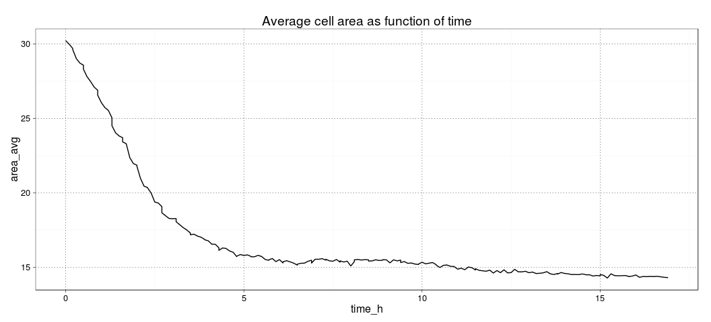 


* save the graph with **ggsave2()**


```r
# Save the plot as svg for editing in Inkscape
ggsave2(width=14, unit="in", outputFormat="svg")
```

```
## [1] "Average cell area as function of time.svg"
```

***

## Apply the R-grammar to visualize cells

* Cells can be rendered as polygons using the vertices ordered anti-clockewisely around each cell. Vertices ordering is performed in the automated TissueMiner workflow.
* The ordered list of vertices around each cell is stored in the *cellshapes.RData* table in the same folder as the database file.
* The **geom_polygon()** function is used to represent cells as polygons on the original image.


```r
# Load data into the 'cellshapes' variable
cellshapes <- locload(file.path(movieDir, "cellshapes.RData")) %>% print_head()
```

```
## Source: local data frame [6 x 5]
## 
##   frame cell_id    x_pos    y_pos bond_order
##   (int)   (int)    (dbl)    (dbl)      (dbl)
## 1     0   10001 169.7774 594.0230          1
## 2     0   10001 172.9576 596.8312          2
## 3     0   10001 195.2315 584.4266          3
## 4     0   10001 197.1037 582.3065          4
## 5     0   10001 181.3949 555.2282          5
## 6     0   10001 162.7414 561.3964          6
## [1] 1741016
```

***

### Example 1: plot cells as polygons in the Cartesian system


```r
ggplot(cellshapes %>% filter(frame==70)) +
  # plot cells as polygons:
  geom_polygon(aes(x_pos, y_pos, group=cell_id),color="green",fill="white", size=0.3) +
  # X and Y axes must have the same scale:
  coord_equal() +
  # add a title "Pupal wing cells represented as polygons in Cartesian system" 
  ggtitle("Pupal wing cells represented as polygons in Cartesian system")
```

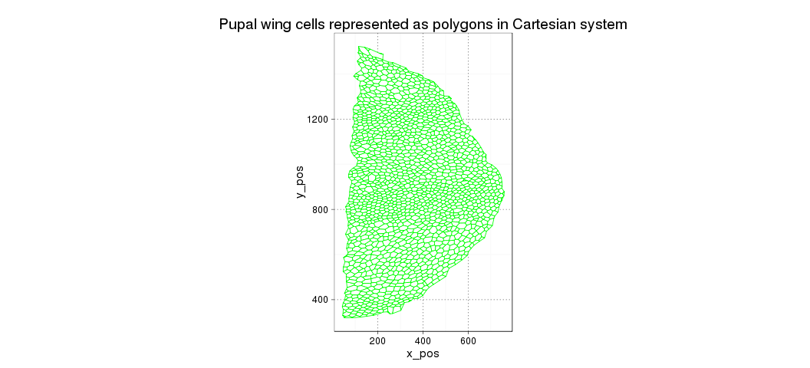 

***

### Example 2: plot cells as polygons in the image coordinate system


```r
ggplot(cellshapes %>% filter(frame==70)) +
  geom_polygon(aes(x_pos, y_pos, group=cell_id),color="green",fill="white", size=0.3) + 
  coord_equal() +
  # In an image coordinate system, the Y-axis is pointing downwards. We flip the Y-axis:
  scale_y_continuous(trans = "reverse") +
  ggtitle("Pupal wing cells represented as polygons in image coordinate system")
```

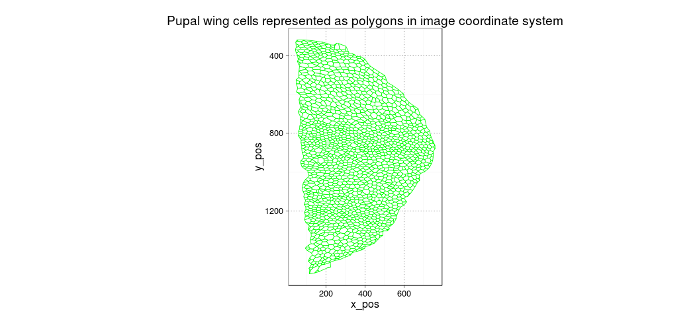 

***

### Example 3: plot cells and vertices


```r
ggplot(cellshapes %>% filter(frame==70)) +
  geom_polygon(aes(x_pos, y_pos, group=cell_id),color="green",fill="white", size=0.3) +
  # plot each vertex as a point:
  geom_point(aes(x_pos, y_pos),color="red", size=0.4) + 
  coord_equal() +
  scale_y_continuous(trans = "reverse") +
  ggtitle("Pupal wing cells and vertices")
```

 

***

### Example 4: overlay cells and vertices on the image

We can now overlay cells and vertices on the wing image. To do so, we built a dedicated **render_frame()** function that loads the specified frame of the time-lapse. This function takes the cell contour table and a desired frame as input variables. The **render_frame()** function returns the first layers of the graph that consists of a raster image of the wing and additional specifications such as the Y-axis flipping - **scale_y_continuous(trans = "reverse")** - and the iso-scaling of the X and Y axes - **coord_equal()**. 


```r
# Plot cells and vertices on the original image
cellshapes %>%
  # add overlay image (! connection to DB required !):
  render_frame(70) +
  geom_polygon(aes(x_pos, y_pos, group=cell_id), color="green",fill=NA, size=0.2) + 
  geom_point(aes(x_pos, y_pos),color="red", size=0.4) +
  ggtitle("Cells and vertices overlaid on the image")
```

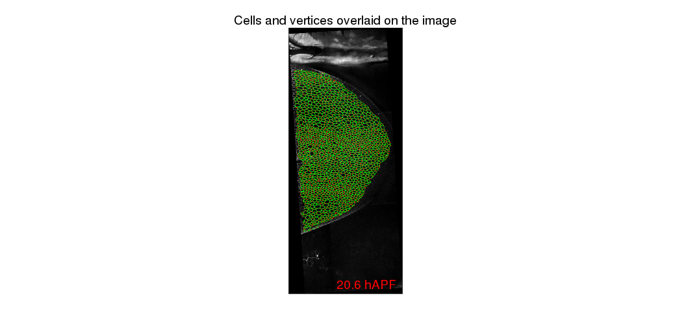 

***

## Further reading: the render_frame() function

Please, read the current definition of the **render_frame()** function at the [following location](https://github.com/mpicbg-scicomp/tissue_miner/blob/master/commons/MovieFunctions.R)

***

## Working with regions of interest (ROIs)

* By default TissueMiner creates two regions of interest:
    + **raw**: this ROI corresponds to all tracked cells contained in the DB
    + **whole_tissue**: this ROI corresponds to the largest population of cells that is visible throughout the movie. It's a subset of **raw** obtained by the lineage-browser algorithm that is part of the automated workflow of TissueMiner

* Other regions of interest can be manually defined by the user in Fiji ([see Manual](link)). Of note, these additional ROIs are only taken into account if they were defined **before** running the automated workflow.  

The automated workflow includes routines to browse the cell lineage and to follow ROIs in time once defined on a given image of the time-lapse. Please note that cells in contact with the margin are discarded because the segmentation and tracking quality isn't optimum near the margin.

**Example: Visualize cells in selected ROIs**

```r
# Load tracked ROIs: 
lgRoiSmoothed <- locload(file.path(movieDir, "roi_bt/lgRoiSmoothed.RData")) %>%
  print_head() %>%
  filter(roi %in% c("distInterL2-L3", "distL3", "distInterL3-L4")) 
```

```
##              roi cell_id
## 1 distInterL2-L3   11612
## 2 distInterL2-L3   11613
## 3 distInterL2-L3   14997
## 4 distInterL2-L3   10106
## 5 distInterL2-L3   14998
## 6 distInterL2-L3   10010
## [1] 2303
```

```r
# Load cell shapes for plotting on the wing
cellshapes <- locload(file.path(movieDir, "cellshapes.RData"))

# Merge ROI with cell polygonal definition
cellshapesWithRoi <- cellshapes %>%
  dt.merge(lgRoiSmoothed, by="cell_id", allow.cartesian=T) %>%
  arrange(frame, cell_id, bond_order) ## .. because merge messes up the ordering

# Plot  ROI on the wing
render_frame(cellshapesWithRoi, 200) + 
  geom_polygon(aes(x_pos, y_pos, fill=roi, group=cell_id), alpha=0.5) +
  scale_fill_manual(values=c("distInterL2-L3"="darkgreen",
                             "distL3"="yellow",
                             "distInterL3-L4"="red"))
```

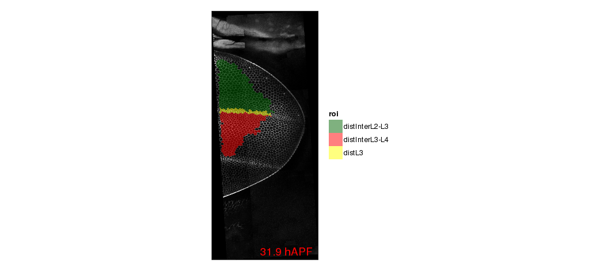 
 
***

## Make videos 
**Videos are helpful to visualize the time evolution of patterns**

Here, we use a parallelized loop over all frames of the time-lapse. The well-known avconv (formerly ffmpeg) program to create videos must be installed on your computer, please, visit [http://ffmpegmac.net/](http://ffmpegmac.net/) for Mac users or simply "sudo apt-get install libav-tools" on Ubuntu-Linux. 

* To simplify the procedure of creating videos, we built a dedicated function **render_movie()** that takes a list of ggplot layers as an input argument.
* Please, read the current definition of the **render_movie()** function [here](https://github.com/mpicbg-scicomp/tissue_miner/blob/master/commons/MovieFunctions.R).

```r
# Make a video of the ROIs on the wing
render_movie(cellshapesWithRoi, "bt_bhfix_peeled.mp4", list(
          geom_polygon(aes(x_pos, y_pos, fill=roi, group=cell_id),  alpha=0.5),
          scale_fill_manual(values=c("distInterL2-L3"="darkgreen",
                             "distL3"="yellow",
                             "distInterL3-L4"="red"))))
```


***

## A TissueMiner library to visualize cell dynamics

TissueMiner provide a set of tools to quantify and visualize cell dynamics at different spatial scales.
These tools are all prefixed with 'mqf' as they perform multiple queries to the pre-processed data obtained with the TissueMiner automated workflow. Their common features are:

* aggregate data from one selected movie into a dataframe for immediate visualization
* include ROI definitions
* include developmental time

Mandatory argument: a path to a selected movie directory

Optional arguments: to control selected ROIs and other parameters that are specific to some subsets of mqf functions

### Fine-grained analyses

* mqf_fg_* functions generate fine-grained data (cellular scale) that
    + are mapped to all ROIs by default
    + include bond, cell or triangle contours for plotting
    + perform an automatic scaling of nematics for an optimal display on the original image

mqf_fg_* functions | Description 
--------------|-------------
***mqf_fg_nematics_cell_elong*** | get cell elongation nematics from the DB 
***mqf_fg_unit_nematics_CD*** | calculate cell division unit nematics 
***mqf_fg_unit_nematics_T1*** | calculate cell neighbor change unit nematics 
***mqf_fg_cell_area*** | get cell area from the DB 
***mqf_fg_triangle_properties*** | get calculated triangle state properties 
***mqf_fg_bond_length*** | get bond length and positions from the DB 
***mqf_fg_cell_neighbor_count*** | calculate cell neighbor number from the DB 
***mqf_fg_dev_time*** | get developmental time from the configuration file 

***

### Coarse-grained analyses: per frame and by ROIs

* The **mqf_cg_roi_* functions**:
    + perform spatial (by ROI) and temporal (kernSize option) averaging of quantities
    + perform an automatic scaling of nematics for an optimal display on the original image

mqf_cg_roi_* functions | Description 
--------------|-------------|-------------
***mqf_cg_roi_cell_count*** | count cell number 
***mqf_cg_roi_cell_area*** | coarse-grain cell area 
***mqf_cg_roi_cell_neighbor_count*** | average cell neighbor count 
***mqf_cg_roi_polygon_class*** | average and trim cell polygon class 
***mqf_cg_roi_triangle_elong*** | coarse-grain cell elongation using triangles as a proxy 
***mqf_cg_roi_rate_CD*** | average cell division rate 
***mqf_cg_roi_rate_T2*** | average extrusion rate 
***mqf_cg_roi_rate_T1*** | average neighbor change rate 
***mqf_cg_roi_rate_isotropic_contrib*** | coarse-grain **isotropic** tissue deformation and its cellular contributions 
***mqf_cg_roi_rate_shear*** | coarse-grain **anisotropic** tissue deformation and its cellular contributions 
***mqf_cg_roi_nematics_cell_elong*** |  coarse-grain cell elongation nematics by ROI 
***mqf_cg_roi_unit_nematics_CD*** | coarse-grain division unit nematics
***mqf_cd_roi_unit_nematics_T1*** | coarse-grain neighbor change unit nematics 

***

### Coarse-grained analyses: per frame and by square-grid elements

* The **mqf_cg_grid_* functions**:
    + perform spatial (by grid element) and temporal (kernSize option) averaging of quantities
    + perform an automatic scaling of nematics for an optimal display on the original image

mqf_cg_grid_* functions | Description | Source data
--------------|-------------|-------------
***mqf_cg_grid_nematics_cell_elong*** | coarse-grain cell elongation nematics | DB
***mqf_cg_grid_unit_nematics_CD*** | coarse-grain division unit nematics | DB
***mqf_cg_grid_unit_nematics_T1*** | coarse-grain neighbor change unit nematics | DB

***

# Visualize patterned cell behaviors on the tissue

## Bond length pattern

To render cell bonds one must get bonds and their respective positions. Here, is an example in which different related tables must be joined together to pool the relevant data to be plotted:

* 3 connected tables from the relational database to be considered: **bonds**, **directed_bonds** and **vertices**
* By joining those 3 tables one can generate a new table containing the bonds with their respective vertices and length
* A bond is represented by drawing a segment between its two vertices
* Bond length is mapped onto a color gradient scale for a color-coded visualization


For the sake of clarity, we built a dedicated **mqf_fg_bond_length()** function to get bond properties along with bond positions for plotting. Please, read its definition [here](https://github.com/mpicbg-scicomp/tissue_miner/blob/master/commons/BaseQueryFunctions.R).

***

### Get and manipulate data for plotting

```r
# we use the movieDir variable defined above
bond_with_vx <- mqf_fg_bond_length(movieDir, "raw") %>% print_head()
```

```
##   movie frame cell_id bond_id vertex_id.2 vertex_id.1   x_pos.1   y_pos.1   x_pos.2   y_pos.2 bond_length roi time_sec timeInt_sec time_shift
## 1  WT_1     0   10000      14          17          25  98.06311 1342.9089  91.39899 1316.2707     34.8701 raw        0         287      54000
## 2  WT_1     0   10000      30          13          38 110.51102 1414.2745  92.36590 1396.3648     37.6569 raw        0         287      54000
## 3  WT_1     0   10000      47          49          54  61.60697  610.7607  59.43731  575.8280     50.0122 raw        0         287      54000
## 4  WT_1     0   10000      59           1          63  71.71761  757.4160  57.94920  713.1844     54.2843 raw        0         287      54000
## 5  WT_1     0   10000      67          40          69  90.12213 1231.1863  84.95824 1196.4395     37.8995 raw        0         287      54000
## 6  WT_1     0   10000      97           9          80 126.86432 1548.5189 106.66105 1529.7352     32.5563 raw        0         287      54000
##   dev_time
## 1       15
## 2       15
## 3       15
## 4       15
## 5       15
## 6       15
## [1] 888369
```

***

### Plot the color-coded bond-length pattern

```r
bond_with_vx %>%
  render_frame(70) + 
  # bonds are represented by segments using geom_segment
  geom_segment(aes(x=x_pos.1, y=y_pos.1, xend=x_pos.2, yend=y_pos.2,
                   color=bond_length), # Here bond_length values are mapped to the color
               size=0.3, lineend="round") +
  # we overwrite the default color map by a custom rainbow palette
  scale_color_gradientn(name="bond_length",
                        colours=c("black", "blue", "green", "yellow", "red"),
                        limits=c(0,quantile(bond_with_vx$bond_length, probs = 99/100)),
                        na.value = "red") +
  ggtitle("Color-coded pattern of bond length")
```

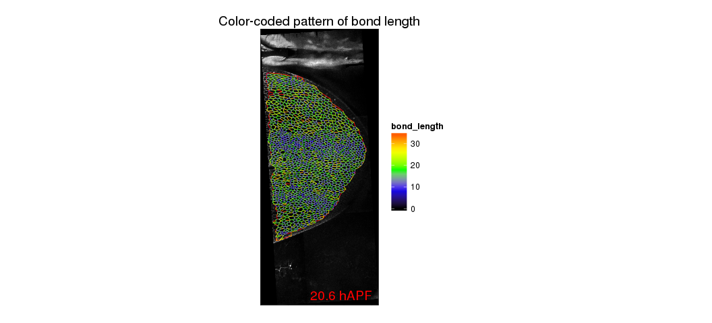 

***

### Make a video of the color-coded bond-length pattern

```r
# Here use the render_movie function
render_movie(bond_with_vx, "BondLengthPattern.mp4", list(
  geom_segment(aes(x=x_pos.1, y=y_pos.1,xend=x_pos.2, yend=y_pos.2,color=bond_length), 
               size=0.3, lineend="round") ,
  scale_color_gradientn(name="bond_length",
                        colours=c("black", "blue", "green", "yellow", "red"),
                        limits=c(0,quantile(bond_with_vx$bond_length, probs = 99/100)),
                        na.value = "red") # outliers are red
))
```

***

## Cell area 

### Get and manipulate the data for plotting

* Using the **TissueMiner grammar**, one can get all cell properties and cell contours in one step

```r
cellArea <- mqf_fg_cell_area(movieDir, rois = c("raw"), cellContour = T)
```

* **Alternatively**, one can do each step separately. Here, we don't add ROI definition (faster).


```r
# Send a SQL query to get cell area in each frame
cellArea <- dbGetQuery(db,"select cell_id, frame, area from cells where cell_id!=10000") %>%
  # add cell polygons into it
  dt.merge(locload(file.path(movieDir, "cellshapes.RData")),
           by = c("frame", "cell_id")) %>%
  # order vertices around the cell contour for ploting cells as polygons
  arrange(cell_id, frame, bond_order) 
```

***

### Plot the color-coded cell area pattern

```r
cellArea %>%
  render_frame(50) + 
  # we now map cell area values to a color palette: fill=area
  geom_polygon(aes(x_pos, y_pos, group=cell_id, fill=area), alpha=0.7) + 
  scale_fill_gradientn(name="area (px)",
                       colours=c("black", "blue", "green", "yellow", "red"),
                       limits=c(0,quantile(cellArea$area, probs = 99.9/100)),
                       na.value = "red") +
  ggtitle("Cell area pattern")
```

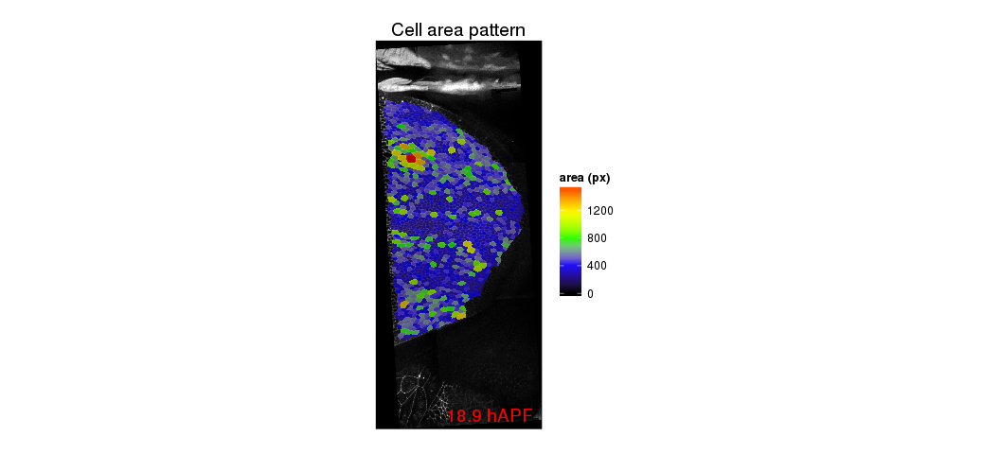 

***

### Make a video of the cell area pattern

```r
render_movie(cellArea, "CellAreaPattern.mp4", list(
  geom_polygon(aes(x_pos, y_pos, group=cell_id, fill=area)),
  scale_fill_gradientn(name="area (px)",
                       colours=c("black", "blue", "green", "yellow", "red"),
                       limits=c(0,quantile(cellArea$area, probs = 99.9/100)),
                       na.value = "red")
))
```

***

### Subset the data data by ROIs

```r
# We now select the blade ROI that we defined using the draw_n_get_ROIcoord.ijm Fiji macro.
cellArea <- mqf_fg_cell_area(movieDir, rois = c("raw"), cellContour = T)


whole_tissue_roi <- locload(file.path(movieDir, "roi_bt/lgRoiSmoothed.RData")) %>% 
  filter(roi=="whole_tissue") %>% print_head() 
```

```
##            roi cell_id
## 1 whole_tissue   10000
## 2 whole_tissue   12984
## 3 whole_tissue   12985
## 4 whole_tissue   10009
## 5 whole_tissue   10100
## 6 whole_tissue   12996
## [1] 1248
```

```r
cellAreaInROI <- cellArea %>%
  # A inner-join operation intersects the data
  dt.merge(whole_tissue_roi, by = "cell_id") 
```

***

### Plot the color-coded cell area pattern in the 'whole_tissue' ROI

```r
cellAreaInROI %>%
  render_frame(150) + 
  # we now map cell area values to a color palette: fill=area
  geom_polygon(aes(x_pos, y_pos, group=cell_id, fill=area)) + 
  scale_fill_gradientn(name="area (px)",
                       colours=c("black", "blue", "green", "yellow", "red"),
                       limits=c(0,quantile(cellAreaInROI$area, probs = 99.9/100)),
                       na.value = "red") +
  ggtitle("Cell area pattern in blade")
```

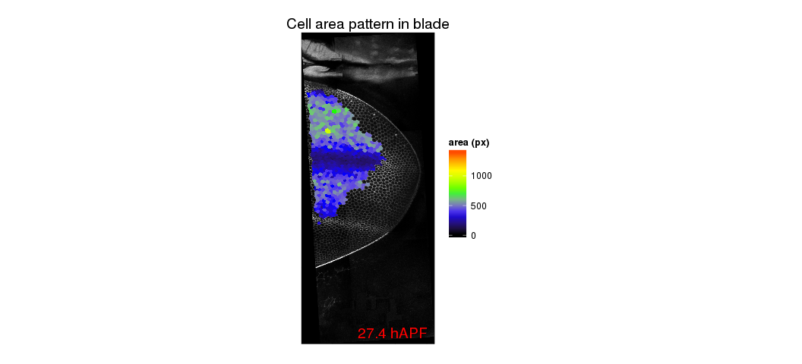 


***

## Cell elongation (nematic norm)

### Get and manipulate the data for plotting

* Using the **TissueMiner grammar**, one can get all cell properties and cell contours in one step


```r
cellShapesElong <- mqf_fg_nematics_cell_elong(movieDir, "raw", cellContour = T)
```

* **Alternatively**, one can do each step separately. This way, one can easily filter desired cell properties


```r
# Send a SQL query to get the cell elongation tensor in each frame
cellShapesElong <- dbGetQuery(db,"select cell_id, frame, elong_xx, elong_xy from cells 
                                  where cell_id!=10000") %>%
  # calculate the norm of the elongation tensor (vectorized operation = on columns)
  mutate(norm=sqrt(elong_xx^2+elong_xy^2)) %>%
  # add cell vertices for cell rendering as polygons
  dt.merge(locload(file.path(movieDir, "cellshapes.RData")),
           by = c("frame", "cell_id")) %>%
  # order vertices around the cell contour
  arrange(cell_id, frame, bond_order) %>% print_head()
```

```
##   frame cell_id    elong_xx   elong_xy      norm    x_pos    y_pos bond_order
## 1     0   10001 -0.05983052 0.05619121 0.0820801 169.7774 594.0230          1
## 2     0   10001 -0.05983052 0.05619121 0.0820801 172.9576 596.8312          2
## 3     0   10001 -0.05983052 0.05619121 0.0820801 195.2315 584.4266          3
## 4     0   10001 -0.05983052 0.05619121 0.0820801 197.1037 582.3065          4
## 5     0   10001 -0.05983052 0.05619121 0.0820801 181.3949 555.2282          5
## 6     0   10001 -0.05983052 0.05619121 0.0820801 162.7414 561.3964          6
## [1] 1741016
```

***

### Plot the color-coded cell elongation pattern

```r
cellShapesElong %>%
  render_frame(70) +
  # we now map cell elongation values to a color palette: fill=elongNorm
  geom_polygon(aes(x_pos, y_pos, group=cell_id, fill=norm)) + 
  scale_fill_gradientn(name="elongation",
                       colours=c("black", "blue", "green", "yellow", "red"),
                       limits=c(0,1),
                       na.value = "red") +
  ggtitle("Cell elongation pattern")
```

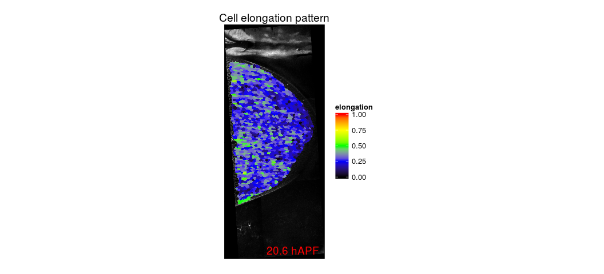 

***

### Make a video of the cell elongation pattern

```r
render_movie(cellShapesElong, "CellElongationPattern.mp4", list(
  geom_polygon(aes(x_pos, y_pos, group=cell_id, fill=elongNorm)),
  scale_fill_gradientn(name="elongation",
                       colours=c("black", "blue", "green", "yellow", "red"),
                       limits=c(0,quantile(cellShapesElong$elongNorm, probs = 99.9/100)),
                       na.value = "red")
))
```


***

## Cell elongation nematics (fine-grained)

### Get and manipulate the data for plotting

* Using the **TissueMiner grammar**, one can get cell elongation nematics for plotting in one step

* The **get_nematics_DBelong()** does the following:
    + it retrieves elongation nematics from the database. 
    + it calculates nematic angle and norm.
    + it scales nematics for display on the image (automatic scaling by default)

* Please, read the **get_nematics_DBelong()** definition [here](https://github.com/mpicbg-scicomp/tissue_miner/blob/master/commons/NematicQueryFunctions.R)


```r
cellElongNematics <- mqf_fg_nematics_cell_elong(movieDir, "raw") %>% print_head()
```

```
##   movie frame cell_id center_x  center_y    elong_xx    elong_xy roi       phi       norm displayFactor       x1        y1       x2        y2
## 1  WT_1     0   10001 176.6084  576.1622 -0.05983052  0.05619121 raw 1.1937758 0.08208010      23.39504 176.2549  575.2695 176.9618  577.0549
## 2  WT_1     0   10002 385.9889  886.4995  0.08673475 -0.14837206 raw 5.7622877 0.17186385      23.39504 384.2452  887.5000 387.7327  885.4990
## 3  WT_1     0   10003 327.4648  370.4730  0.37676579  0.14726708 raw 0.1863062 0.40452447      23.39504 322.8147  369.5965 332.1148  371.3495
## 4  WT_1     0   10004 388.1289 1169.4440 -0.12988771 -0.07802883 raw 4.9828710 0.15152331      23.39504 387.6553 1171.1520 388.6024 1167.7360
## 5  WT_1     0   10005 645.8316  803.9370 -0.05909506  0.02020352 raw 1.4060842 0.06245324      23.39504 645.7118  803.2163 645.9514  804.6576
## 6  WT_1     0   10006 587.7388  683.9815  0.12153256 -0.12856982 raw 5.8764212 0.17691908      23.39504 585.8382  684.8003 589.6395  683.1627
##   time_sec timeInt_sec time_shift dev_time
## 1        0         287      54000       15
## 2        0         287      54000       15
## 3        0         287      54000       15
## 4        0         287      54000       15
## 5        0         287      54000       15
## 6        0         287      54000       15
## [1] 296808
```

***

### Plot the elongation nematics on each cell

* We plot nematics as segments on the original image


```r
cellElongNematics %>% 
  # crop a the image by defining squareRoi
  render_frame(120, squareRoi=rbind(c(100,400),c(1000,1500))) +
  # plot nematics as segments
  geom_segment(aes(x=x1,y=y1,xend=x2,yend=y2),
               size=1, alpha=0.7, lineend="round", color="red", na.rm=T) +
  ggtitle("Cell elongation pattern")
```

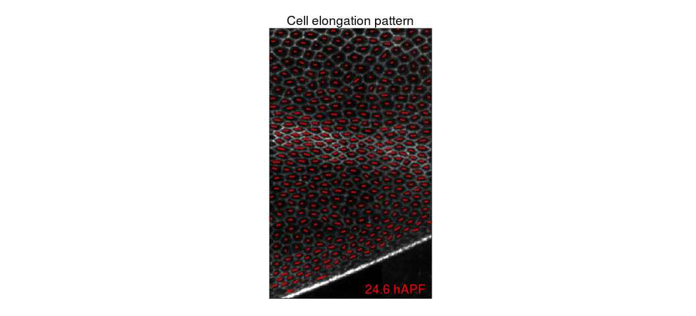 


***

## Cell elongation nematics (coarse-grained)

### Get and manipulate the data for plotting

* TissueMiner provides a **coarseGrid()** function to map cell positions to each element of a square grid. The user can find its definition [here](https://github.com/mpicbg-scicomp/tissue_miner/blob/master/commons/RoiCommons.R).

* TissueMiner provides more specific routines using this **coarseGrid()** function to average nematics in space and time. Concerning cell elongtation, the **get_nematics_DBelong_cg()** TissueMiner function allows the user to directly get coarse-grained nematics that are automatically scaled for display on the original image. The display factor can also be manually defined.

* The **get_nematics_DBelong_cg()** from the TissueMiner grammar does the following:
    + it assigns grid elements to cells and get the cell elongation tensors from the database. 
    + it averages nematics in each grid element.
    + it scales nematics for display on the image (automatic scaling by default)

* Please, read the **get_nematics_DBelong_cg()** definition [here](https://github.com/mpicbg-scicomp/tissue_miner/blob/master/commons/NematicQueryFunctions.R)


```r
cellElongNematicsCG <- mqf_cg_grid_nematics_cell_elong(movieDir, gridSize = 96) %>%
  print_head()
```

```
##   movie frame xGrid yGrid roi cgExx_smooth cgExy_smooth       phi       norm       x1       y1       x2       y2 time_sec timeInt_sec time_shift
## 1  WT_1     0   145   433 raw   0.05120609  0.076291150 0.4898333 0.09188255 133.6416 426.9440 156.3584 439.0560        0         287      54000
## 2  WT_1     0   145   529 raw  -0.10856375  0.131458662 1.1305478 0.17049184 134.8213 507.3930 155.1787 550.6070        0         287      54000
## 3  WT_1     0   145   625 raw   0.04950161  0.074881265 0.4933399 0.08976421 133.9243 619.0448 156.0757 630.9552        0         287      54000
## 4  WT_1     0   145   721 raw   0.02862322  0.114182396 0.6625890 0.11771537 131.9985 710.8554 158.0015 731.1446        0         287      54000
## 5  WT_1     0   145   817 raw  -0.11986465 -0.001061374 4.7168162 0.11986935 144.9257 833.7925 145.0743 800.2075        0         287      54000
## 6  WT_1     0   145   913 raw  -0.07110204  0.059374383 1.2229185 0.09263270 140.5761 900.8003 149.4239 925.1997        0         287      54000
##   dev_time
## 1       15
## 2       15
## 3       15
## 4       15
## 5       15
## 6       15
## [1] 10477
```

***

### Plot coarse-grained cell elongation nematics
* We plot nematics as segments on the original image


```r
render_frame(cellElongNematicsCG, 1) +
  geom_segment(aes(x=x1, y=y1,xend=x2, yend=y2),
               size=2, lineend="round", color="red", na.rm=T)
```

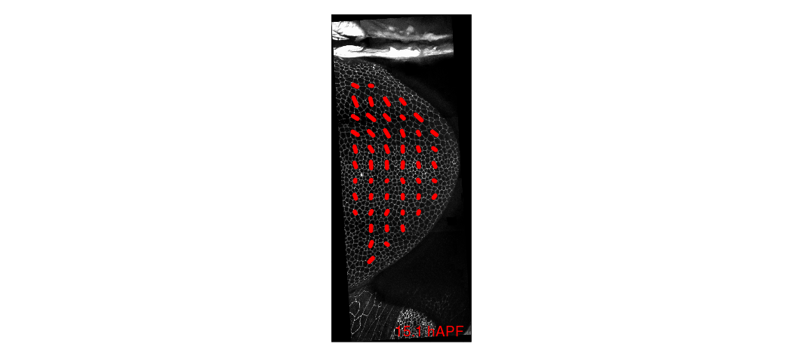 

***

### Make a video of the coarse-grained cell elongation nematic pattern

```r
render_movie(cellElongNematicsCG, "CellElongationNematicPattern.mp4", list(
  geom_segment(aes(x=x1, y=y1, xend=x2, yend=y2),
               size=2, lineend="round", color="red", na.rm=T)
))
```


***

## Cell packing geometry throughout the tissue

### Get and manipulate the data for plotting

* Using the **TissueMiner grammar**, one can get the cell neighbor count for plotting in one step

* The **get_cell_neighbor_count()** does the following:
    + it establishes all cell-cell contact from the database. 
    + it counts the number of cell-cell contact for each cell
    + it trims the neighbor count between 4 and 8 neighbors for display
    + it retrieves cell contours for display

* Please, read the **get_cell_neighbor_count()** definition [here](https://github.com/mpicbg-scicomp/tissue_miner/blob/master/commons/BaseQueryFunctions.R)


```r
cellPolygonClass <- mqf_fg_cell_neighbor_count(movieDir, "raw", cellContour = T)
```

***

### Plot the color-coded cell neighbor number

```r
# Define a discrete color palette of polygon class
polygonClassColors <- c("2"="black","3"="darkgrey", "4"="green",
                        "5"="yellow", "6"="grey", "7"="blue",
                        "8"="red", "9"="purple", ">9"="black")

cellPolygonClass %>%
  render_frame(70) +
  geom_polygon(aes(x_pos, y_pos, fill=as.character(polygon_class_trimmed),
                   group=cell_id),  alpha=0.7) +
  scale_fill_manual(name="polygon class", values=polygonClassColors, drop=F) +
  ggtitle("PolygonClassPattern")
```

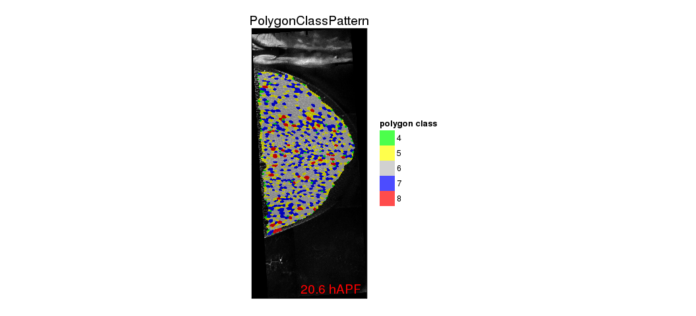 

***

### Make a video of the cell neighbor number

```r
# Define a discrete color palette of polygon class
polygonClassColors <- c("2"="black","3"="darkgrey", "4"="green",
                        "5"="yellow", "6"="grey", "7"="blue",
                        "8"="red", "9"="purple", ">9"="black")

render_movie(cellPolygonClass, "CellPackingPattern.mp4", list(
  geom_polygon(aes(x_pos, y_pos, fill=as.character(polygon_class_trimmed),
                   group=cell_id),  alpha=0.7),
  scale_fill_manual(name="polygon class", values=polygonClassColors, drop=F)
))
```


***

## Cumulative patterns of cell divisions

### Get and manipulate the data for plotting

```r
# limit generation to a more reasonable range
genColors =c("0"="white", "1" = "red", "2"="green", "3"="cyan", ">3"="magenta")

# Send a SQL query to get the cell lineage
cellsWithLin <- dbGetQuery(db, "select cell_id, lineage_group, generation 
                                from cell_histories") %>%
  # fix a generation cut off for a more reasonable range
  mutate(generation_cutoff=ifelse(generation>3, ">3", ac(generation))) %>%
  # add cell vertices for cell rendering as polygons
  dt.merge(locload(file.path(movieDir, "cellshapes.RData")), by = "cell_id") %>%
  arrange(frame, cell_id, bond_order) %>% print_head()
```

```
##   cell_id lineage_group generation generation_cutoff frame    x_pos    y_pos bond_order
## 1   10001          lg_2          0                 0     0 169.7774 594.0230          1
## 2   10001          lg_2          0                 0     0 172.9576 596.8312          2
## 3   10001          lg_2          0                 0     0 195.2315 584.4266          3
## 4   10001          lg_2          0                 0     0 197.1037 582.3065          4
## 5   10001          lg_2          0                 0     0 181.3949 555.2282          5
## 6   10001          lg_2          0                 0     0 162.7414 561.3964          6
## [1] 1741016
```

***

### Plot color-coded cell generations

```r
cellsWithLin %>%
  render_frame(70+80) + 
  geom_polygon(aes(x_pos, y_pos, fill=as.factor(generation_cutoff), group=cell_id), alpha=0.5) +
  scale_fill_manual(name="generation", values=genColors) +
  ggtitle("CellDivisionGeneration")
```

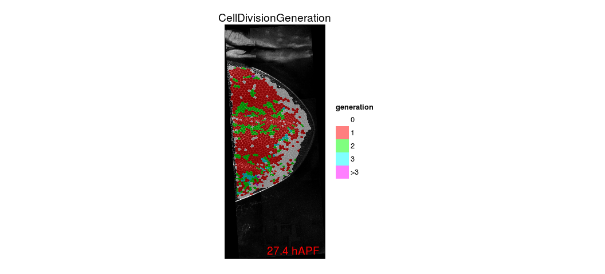 

***

### Make a video of the time evolution of the cell generation pattern

```r
# Define a discrete color palette of polygon class
render_movie(cellsWithLin, "CellGenerationPattern.mp4", list(
  geom_polygon(aes(x_pos, y_pos, fill=as.factor(generation_cutoff),
                   group=cell_id), alpha=0.5),
  scale_fill_manual(name="generation", values=genColors)
))
```

***


***

## Cell division orientation (unit nematics)

### Get and manipulate the data for plotting
* Using the **TissueMiner grammar**, one can get cell division unit nematics for plotting in one step

* The **get_unit_nematics_CD()** does the following:
    + it uses the cell center of mass of the daughter cells to calculate a unit nematic describing the division orientation
    + it scales nematics for display on the image (automatic scaling by default)

* Please, read the **get_unit_nematics_CD()** definition [here](https://github.com/mpicbg-scicomp/tissue_miner/blob/master/commons/NematicQueryFunctions.R)


```r
cdNematics <- mqf_fg_unit_nematics_CD(movieDir, rois = "raw", cellContour = T) %>%
  print_head()
```

```
##   frame cell_id movie mother_cell_id roi   normCDxx  normCDxy      phi center_x center_y       x1       y1       x2       y2 time_sec timeInt_sec
## 1     1   10201  WT_1          10200 raw -0.6039906 0.7969914 1.109648  511.151 1040.345 500.7408 1019.393 521.5613 1061.296      287         286
## 2     1   10201  WT_1          10200 raw -0.6039906 0.7969914 1.109648  511.151 1040.345 500.7408 1019.393 521.5613 1061.296      287         286
## 3     1   10201  WT_1          10200 raw -0.6039906 0.7969914 1.109648  511.151 1040.345 500.7408 1019.393 521.5613 1061.296      287         286
## 4     1   10201  WT_1          10200 raw -0.6039906 0.7969914 1.109648  511.151 1040.345 500.7408 1019.393 521.5613 1061.296      287         286
## 5     1   10201  WT_1          10200 raw -0.6039906 0.7969914 1.109648  511.151 1040.345 500.7408 1019.393 521.5613 1061.296      287         286
## 6     1   10201  WT_1          10200 raw -0.6039906 0.7969914 1.109648  511.151 1040.345 500.7408 1019.393 521.5613 1061.296      287         286
##   time_shift dev_time              variable    x_pos    y_pos bond_order
## 1      54000 15.07972 left_daughter_cell_id 495.0379 1023.686          1
## 2      54000 15.07972 left_daughter_cell_id 495.0937 1040.716          2
## 3      54000 15.07972 left_daughter_cell_id 501.3921 1045.334          3
## 4      54000 15.07972 left_daughter_cell_id 517.7395 1034.299          4
## 5      54000 15.07972 left_daughter_cell_id 518.9918 1022.199          5
## 6      54000 15.07972 left_daughter_cell_id 505.3969 1013.024          6
## [1] 14961
```

***

### Plot cell division unit nematics

```r
## Plot CD nematics on image #70 
cdNematics %>%
  render_frame(70, squareRoi=rbind(c(100,400),c(600,900))) + # x range and y range 
  geom_polygon(aes(x_pos, y_pos, group=cell_id),  alpha=0.5, fill="blue", color="grey") +
  geom_segment(aes(x=x1,y=y1,xend=x2,yend=y2),
               size=1, lineend="round", color="orange", na.rm=T) +
  ggtitle("Cell division unit nemtatic")
```

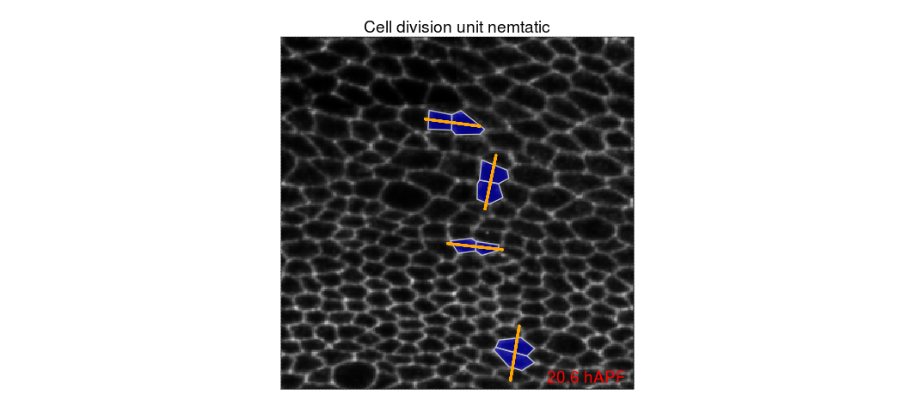 


***

## Coarse-grained cell division nematics with time averaging

### Get and manipulate the data for plotting

* Using the **TissueMiner grammar**, one can coarse-grain cell division unit nematics for plotting in one step

* The **get_unit_nematics_CD()** does the following:
    + it assigns grid elements to cells and calculate the cell division unit nematics
    + it averages nematics in each grid element.
    + it scales nematics for display on the image (automatic scaling by default)

* Please, read the **get_unit_nematics_CD()** definition [here](https://github.com/mpicbg-scicomp/tissue_miner/blob/master/commons/NematicQueryFunctions.R)


```r
cgCDnematicsSmooth <- mqf_cg_grid_unit_nematics_CD(movieDir, gridSize = 160, kernSize = 11)
```

***

### Plot the coarse-grained cell division nematics

```r
## Plot CD nematics on image #55
cgCDnematicsSmooth %>%
  render_frame(55) + 
  geom_segment(aes(x=x1, y=y1, xend=x2, yend=y2),
               size=2, alpha=0.7, lineend="round", color="orange", na.rm=T) +
  ggtitle("Coarse-grained cell division nemtatics")
```

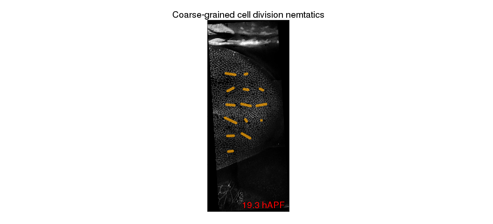 

***

### Make a video of the pattern of the coarse-grained cell division nematics

```r
# Define a discrete color palette of polygon class
render_movie(cgCDnematicsSmooth, "cgCDnematics.mp4", list(
  geom_segment(aes(x=x1, y=y1, xend=x2, yend=y2),
               size=1, alpha=0.7, lineend="round", color="orange", na.rm=T)
))
```


***

## Cell neighbor changes

### Get and manipulate the data for plotting


```r
# Load the detected changes in topology
topoChangeSummary  <- locload(file.path(movieDir, "topochanges/topoChangeSummary.RData")) %>%
  select(cell_id, frame, num_t1_gained, num_t1_lost, num_neighbors_t)

# Filter T1 transitions and bring cellshapes for plotting
csWithTopoT1 <- locload(file.path(movieDir, "cellshapes.RData")) %>%
  dt.merge(topoChangeSummary, allow.cartesian=TRUE) %>%
  filter(num_t1_gained>0 |  num_t1_lost>0) %>%
  mutate(t1_type=ifelse(num_t1_gained>0,
                        ifelse(num_t1_lost>0, "t1 gain and loss", "t1 gain"), "t1 loss")) %>%
  print_head()
```

```
##   frame cell_id    x_pos    y_pos bond_order num_t1_gained num_t1_lost num_neighbors_t t1_type
## 1     0   10001 169.7774 594.0230          1             0           1               7 t1 loss
## 2     0   10001 172.9576 596.8312          2             0           1               7 t1 loss
## 3     0   10001 195.2315 584.4266          3             0           1               7 t1 loss
## 4     0   10001 197.1037 582.3065          4             0           1               7 t1 loss
## 5     0   10001 181.3949 555.2282          5             0           1               7 t1 loss
## 6     0   10001 162.7414 561.3964          6             0           1               7 t1 loss
## [1] 239313
```

```r
## define t1 color attribute
T1cols <- create_palette(unique(csWithTopoT1$t1_type))
```

***

### Plot cells changing neighbors

```r
csWithTopoT1 %>% 
  render_frame(90) + 
  geom_polygon(aes(x_pos, y_pos, group=cell_id, fill=t1_type), alpha=0.5) +
  scale_fill_manual(values = T1cols, drop = FALSE) +
  ggtitle("Cell neighbor exchanges")
```

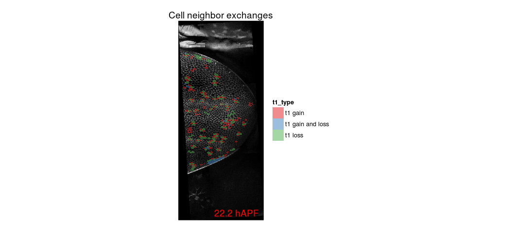 

### Make a video of cells changing neighbors

```r
# Define a discrete color palette of polygon class
render_movie(csWithTopoT1, "CellNeighborChangePattern.mp4", list(
  geom_polygon(aes(x_pos, y_pos, group=cell_id, fill=t1_type), alpha=0.5),
  scale_fill_manual(values = T1cols, drop = FALSE) 
))
```


***

## T1 orientation nematics (fine-grained)

### Get and manipulate the data for plotting

* Using the **TissueMiner grammar**, one can get T1 unit nematics for plotting in one step

* The **get_unit_nematics_T1()** does the following:
    + it uses the cell center of mass of cells gaining or losing contact to calculate a unit nematic 
    + it flips (90°) nematics of cells gaining contact so that all nematics would add up upon a T1 transition or cancel out if the T1 event is reversed
    + it scales nematics for display on the image (automatic scaling by default)

* Please, read the **mqf_unit_nematics_T1()** definition [here](https://github.com/mpicbg-scicomp/tissue_miner/blob/master/commons/BaseQueryFunctions.R)


```r
#t1nematics <- get_unit_nematics_T1(movieDir) %>% print_head()
t1nematics <- mqf_fg_unit_nematics_T1(movieDir, "raw", cellContour = T) %>% print_head()
```

```
##   frame cell_id movie type roi  unit_T1xx  unit_T1xy      phi center_x center_y      x1       y1       x2       y2 time_sec timeInt_sec time_shift
## 1     0   10001  WT_1 loss raw -0.6071794 -0.7945648 5.171534 167.5872 594.4095 162.403 604.8955 172.7713 583.9235        0         287      54000
## 2     0   10001  WT_1 loss raw -0.6071794 -0.7945648 5.171534 167.5872 594.4095 162.403 604.8955 172.7713 583.9235        0         287      54000
## 3     0   10001  WT_1 loss raw -0.6071794 -0.7945648 5.171534 167.5872 594.4095 162.403 604.8955 172.7713 583.9235        0         287      54000
## 4     0   10001  WT_1 loss raw -0.6071794 -0.7945648 5.171534 167.5872 594.4095 162.403 604.8955 172.7713 583.9235        0         287      54000
## 5     0   10001  WT_1 loss raw -0.6071794 -0.7945648 5.171534 167.5872 594.4095 162.403 604.8955 172.7713 583.9235        0         287      54000
## 6     0   10001  WT_1 loss raw -0.6071794 -0.7945648 5.171534 167.5872 594.4095 162.403 604.8955 172.7713 583.9235        0         287      54000
##   dev_time variable t1_type    x_pos    y_pos bond_order
## 1       15  cell_id    loss 169.7774 594.0230          1
## 2       15  cell_id    loss 172.9576 596.8312          2
## 3       15  cell_id    loss 195.2315 584.4266          3
## 4       15  cell_id    loss 197.1037 582.3065          4
## 5       15  cell_id    loss 181.3949 555.2282          5
## 6       15  cell_id    loss 162.7414 561.3964          6
## [1] 295272
##   frame cell_id movie type roi  unit_T1xx  unit_T1xy      phi center_x center_y      x1       y1       x2       y2 time_sec timeInt_sec time_shift
## 1     0   10001  WT_1 loss raw -0.6071794 -0.7945648 5.171534 167.5872 594.4095 162.403 604.8955 172.7713 583.9235        0         287      54000
## 2     0   10001  WT_1 loss raw -0.6071794 -0.7945648 5.171534 167.5872 594.4095 162.403 604.8955 172.7713 583.9235        0         287      54000
## 3     0   10001  WT_1 loss raw -0.6071794 -0.7945648 5.171534 167.5872 594.4095 162.403 604.8955 172.7713 583.9235        0         287      54000
## 4     0   10001  WT_1 loss raw -0.6071794 -0.7945648 5.171534 167.5872 594.4095 162.403 604.8955 172.7713 583.9235        0         287      54000
## 5     0   10001  WT_1 loss raw -0.6071794 -0.7945648 5.171534 167.5872 594.4095 162.403 604.8955 172.7713 583.9235        0         287      54000
## 6     0   10001  WT_1 loss raw -0.6071794 -0.7945648 5.171534 167.5872 594.4095 162.403 604.8955 172.7713 583.9235        0         287      54000
##   dev_time variable t1_type    x_pos    y_pos bond_order
## 1       15  cell_id    loss 169.7774 594.0230          1
## 2       15  cell_id    loss 172.9576 596.8312          2
## 3       15  cell_id    loss 195.2315 584.4266          3
## 4       15  cell_id    loss 197.1037 582.3065          4
## 5       15  cell_id    loss 181.3949 555.2282          5
## 6       15  cell_id    loss 162.7414 561.3964          6
## [1] 295272
```

***

### Plot the T1 nematics

```r
T1cols = c("gain"="red", "loss"="green", "gain_and_loss"="blue")

t1nematics %>% 
  render_frame(20, squareRoi=rbind(c(100,600),c(700,1100))) + #
  geom_polygon(aes(x_pos, y_pos, group=cell_id, fill=t1_type), alpha=0.5, color="grey") +
  scale_fill_manual(values = T1cols, drop = FALSE) +
  geom_segment(aes(x=x1,y=y1,xend=x2,yend=y2),
               size=1, alpha=0.7, lineend="round", color="red", na.rm=T)  +
  ggtitle("Cell neighbor exchanges")
```

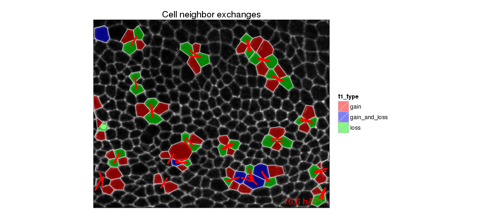 


***

## T1 orientation nematics (coarse-grained)

### Get and manipulate the data for plotting

* Using the **TissueMiner grammar**, one can coarse-grain T1 unit nematics for plotting in one step

* The **get_unit_nematics_T1_cg()** does the following:
    + it assigns grid elements to cells and calculate T1 unit nematics
    + it averages nematics in each grid element.
    + it scales nematics for display on the image (automatic scaling by default)

* Please, read the **get_unit_nematics_T1_cg()** definition [here](https://github.com/mpicbg-scicomp/tissue_miner/blob/master/commons/NematicQueryFunctions.R)


```r
cgT1nematics <- mqf_cg_grid_unit_nematics_T1(movieDir, rois="raw", gridSize = 160, kernSize = 11) %>%
  print_head()
```

```
##   movie frame xGrid yGrid roi cgT1xx_smooth cgT1xy_smooth phi norm scaledFact x1 y1 x2 y2 time_sec timeInt_sec time_shift dev_time
## 1  WT_1     0   241   561 raw            NA            NA  NA   NA    133.391 NA NA NA NA        0         287      54000       15
## 2  WT_1     0   241   721 raw            NA            NA  NA   NA    133.391 NA NA NA NA        0         287      54000       15
## 3  WT_1     0   241   881 raw            NA            NA  NA   NA    133.391 NA NA NA NA        0         287      54000       15
## 4  WT_1     0   241  1041 raw            NA            NA  NA   NA    133.391 NA NA NA NA        0         287      54000       15
## 5  WT_1     0   241  1201 raw            NA            NA  NA   NA    133.391 NA NA NA NA        0         287      54000       15
## 6  WT_1     0   241  1361 raw            NA            NA  NA   NA    133.391 NA NA NA NA        0         287      54000       15
## [1] 2730
```

***

### Plot the coarse-grained T1 nematics

```r
## Plot CD nematics on image #50
cgT1nematics %>%
  render_frame(50) + 
  geom_segment(aes(x=x1,y=y1,xend=x2,yend=y2),
               size=2, alpha=0.7, lineend="round", color="red", na.rm=T) +
  ggtitle("Coarse-grained T1 nemtatics")
```

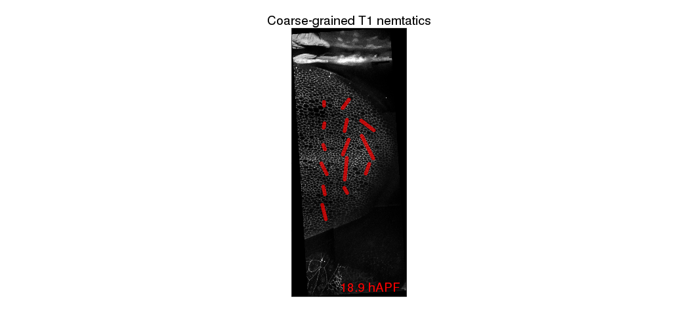 

***

### Make a video of the coarse-grained T1 nematics

```r
# Define a discrete color palette of polygon class
render_movie(cgT1nematics, "cgT1nematics.mp4", list(
  geom_segment(aes(x=x1,y=y1,xend=x2,yend=y2),
               size=1, alpha=0.7, lineend="round", color="red", na.rm=T)
))
```


***

## Comparing patterns between movies

### Movie frame synchronization

```r
movieDirs <- file.path(movieDbBaseDir, c("WT_1","WT_2","WT_3"))
syncMovies <- multi_db_query(movieDirs, mqf_fg_cell_area, rois="raw", cellContour=T) %>%
  synchronize_frames(900) %>% print_head()
```

```
## Source: local data frame [6 x 4]
## Groups: movie [1]
## 
##    movie interval_mid syncFrame dev_time
##   (fctr)        (dbl)     (dbl)    (dbl)
## 1   WT_1        53550         0 15.00000
## 2   WT_1        54450         2 15.15886
## 3   WT_1        55350         5 15.39155
## 4   WT_1        56250         8 15.62622
## 5   WT_1        57150        11 15.86092
## 6   WT_1        58050        14 16.09716
## [1] 200
##   movie frame cell_id  area center_x center_y roi time_sec timeInt_sec time_shift    x_pos    y_pos bond_order interval_mid dev_time max_interval
## 1  WT_1    21   10001 867.5 162.3585 536.0844 raw     5893         278      54000 141.6083 527.6415          1        59850 16.63721       114750
## 2  WT_1    21   10001 867.5 162.3585 536.0844 raw     5893         278      54000 148.8365 547.2311          2        59850 16.63721       114750
## 3  WT_1    21   10001 867.5 162.3585 536.0844 raw     5893         278      54000 157.2551 553.7217          3        59850 16.63721       114750
## 4  WT_1    21   10001 867.5 162.3585 536.0844 raw     5893         278      54000 185.3934 538.9490          4        59850 16.63721       114750
## 5  WT_1    21   10001 867.5 162.3585 536.0844 raw     5893         278      54000 186.2675 536.8909          5        59850 16.63721       114750
## 6  WT_1    21   10001 867.5 162.3585 536.0844 raw     5893         278      54000 169.3064 521.9135          6        59850 16.63721       114750
##   min_interval
## 1        53550
## 2        53550
## 3        53550
## 4        53550
## 5        53550
## 6        53550
## [1] 1602009
```

***

### Movie rendering

```r
# use zip option of render_movie() to combine movies in Fiji

movieDir <- file.path(movieDbBaseDir, c("WT_1"))
db <- openMovieDb(movieDir)

render_movie(syncMovies %>% filter(movie=="WT_1"),
             "WT_1_CellAreaPattern.mp4", list(
  geom_polygon(aes(x_pos, y_pos, group=cell_id, fill=area)),
  scale_fill_gradientn(name="area (px)",
                       colours=c("black", "blue", "green", "yellow", "red"),
                       limits=c(0,quantile(syncMovies$area, probs = 99.9/100)),
                       na.value = "red")
), createZip = T)
dbDisconnect(db)

movieDir <- file.path(movieDbBaseDir, c("WT_2"))
db <- openMovieDb(movieDir)
render_movie(syncMovies %>% filter(movie=="WT_2"), 
             "WT_2_CellAreaPattern.mp4", list(
  geom_polygon(aes(x_pos, y_pos, group=cell_id, fill=area)),
  scale_fill_gradientn(name="area (px)",
                       colours=c("black", "blue", "green", "yellow", "red"),
                       limits=c(0,quantile(syncMovies$area, probs = 99.9/100)),
                       na.value = "red")
), createZip = T)
dbDisconnect(db) 

movieDir <- file.path(movieDbBaseDir, c("WT_3"))
db <- openMovieDb(movieDir)
render_movie(syncMovies %>% filter(movie=="WT_3"),
             "WT_3_CellAreaPattern.mp4", list(
  geom_polygon(aes(x_pos, y_pos, group=cell_id, fill=area)),
  scale_fill_gradientn(name="area (px)",
                       colours=c("black", "blue", "green", "yellow", "red"),
                       limits=c(0,quantile(syncMovies$area, probs = 99.9/100)),
                       na.value = "red")  
), createZip = T)
dbDisconnect(db) 
```


***

# Comparing averaged quantities between movies and ROIs

## General principles:

**CAUTION**: Tissue orientation matters for nematic components. Indeed, nematic tensors are symmetric traceless tensors that are characterized by 2 components projected onto the x and y axis of the Cartesian system. In order to compare nematics amongst different time-lapse one has to make sure that the tissues have a similar orientation with respect to the x and y axes. In the workflow, one has the possibility to rotate the images along with the data [see Manual](link) to obtain visually comparable time-lapse. 

**CAUTION**: Cumulative quantities are strongly influenced by the developmental time. Therefore, movies must be aligned in time prior to comparison between movies. We have aligned the three WT wing movies in time by aligning the peaks of their respective average cell elongation curves as a function of time. One movie is used as a reference and time shifts are applied to other movies. These time shifts must be stored in a configuration file containing the *algnModel* table as defined [here](https://github.com/mpicbg-scicomp/tissue_miner/blob/master/config/flywing_tm_config.R).

***

### Description of the multi_db_query() function:

* To compare quantities between movies and ROi's, we built a multi_db_query() function that takes three arguments: the movies to be queried, the specific type of analysis to be performed and the ROI’s to be queried. The multi_db_query() function automatically takes into account the corrected developmental time stored in the flywing_tm_config.R file.

Usage: 

* multi_db_query(movieDirectories, queryFun = mqf_cell_count, ...)

Arguments:

* movieDirectories: a list of absolute paths to the movie directories
* queryFun: a string containing the query function for a specific type of analysis to be performed. The default is mqf_cell_count, which count the number of cells per frame in each ROIs of each selected movie.
* ...: optional argument corresponding to a list of selected ROIs. By default, all existing ROIs are selected.

Returned value:

* a dataframe 

***

### Select movies and ROIs to be analyzed

```r
# Define a list of movies to compare (paths to ùovie directories)
movieDirs <- file.path(movieDbBaseDir, c("WT_1",
                                         "WT_2",
                                         "WT_3"))

#  Define ROIs to be analyzed
selectedRois=c("whole_tissue","interL2-L3", "distL3")
```

***


## Averaged cell area


```r
avgCellArea <- multi_db_query(movieDirs, mqf_cg_roi_cell_area, selectedRois) %>% print_head()
```

```
##   movie frame          roi area.avg area.sum nbcell time_sec timeInt_sec time_shift dev_time
## 1  WT_1     0       distL3 538.0098  27438.5     51        0         287      54000 15.00000
## 2  WT_1     0 whole_tissue 762.2676 227918.0    299        0         287      54000 15.00000
## 3  WT_1     1       distL3 552.2745  28166.0     51      287         286      54000 15.07972
## 4  WT_1     1 whole_tissue 756.8944 229339.0    303      287         286      54000 15.07972
## 5  WT_1     2       distL3 552.5098  28178.0     51      573         276      54000 15.15917
## 6  WT_1     2 whole_tissue 758.2180 231256.5    305      573         276      54000 15.15917
## [1] 1208
```


```r
ggplot(avgCellArea, aes(dev_time, area.avg*(0.208^2), color=movie)) +
  geom_line() +
  ylab(expression(paste("<Cell area> [",mu,m^2,"]")))  +
  scale_color_manual(values = movieColors) +
  facet_wrap(~roi, ncol=4) +
  ggtitle("averaged cell area")
```

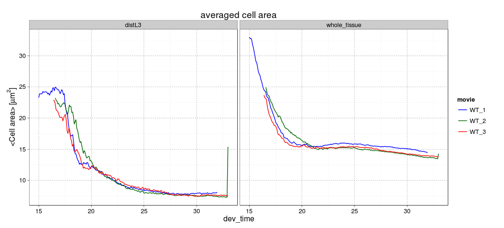 


***

## Averaged cell elongation

```r
# Query the DBs and calculate the norm of the cell elongation nematics for each cell
avgCellElong <- multi_db_query(movieDirs, mqf_cg_roi_nematics_cell_elong, selectedRois) %>% 
  print_head() 
```

```
##   movie frame          roi roi_center_x roi_center_y cgExx_smooth cgExy_smooth      phi       norm       x1       y1       x2       y2 time_sec
## 1  WT_1     0       distL3     551.6417     902.6196  -0.09564322   0.05275300 1.318776 0.10922685 543.0212 869.1414 560.2622 936.0979        0
## 2  WT_1     0 whole_tissue     494.2077     885.0022  -0.05426890   0.05255105 1.186137 0.07554288 485.2359 862.8400 503.1795 907.1644        0
## 3  WT_1     1       distL3     554.4271     903.9248  -0.08984036   0.03116325 1.403853 0.09509174 549.4260 874.2467 559.4282 933.6029      287
## 4  WT_1     1 whole_tissue     496.2994     884.4222  -0.04893280   0.04743912 1.185846 0.06815342 488.1993 864.4303 504.3994 904.4142      287
## 5  WT_1     2       distL3     557.1707     905.6653  -0.08443210   0.03722514 1.363171 0.09227400 551.1505 877.0878 563.1909 934.2428      573
## 6  WT_1     2 whole_tissue     498.2760     885.0726  -0.04308360   0.04740089 1.154259 0.06405498 490.0734 866.5327 506.4785 903.6125      573
##   timeInt_sec time_shift dev_time
## 1         287      54000 15.00000
## 2         287      54000 15.00000
## 3         286      54000 15.07972
## 4         286      54000 15.07972
## 5         276      54000 15.15917
## 6         276      54000 15.15917
## [1] 1208
```
 

```r
ggplot(avgCellElong, aes(dev_time, norm, color=movie)) +
  geom_line() +
  ylab(expression(paste("<cell elongation norm>")))  +
  scale_color_manual(values = movieColors) +
  facet_wrap(~roi, ncol=4) +
  ggtitle("averaged cell elongation norm")
```

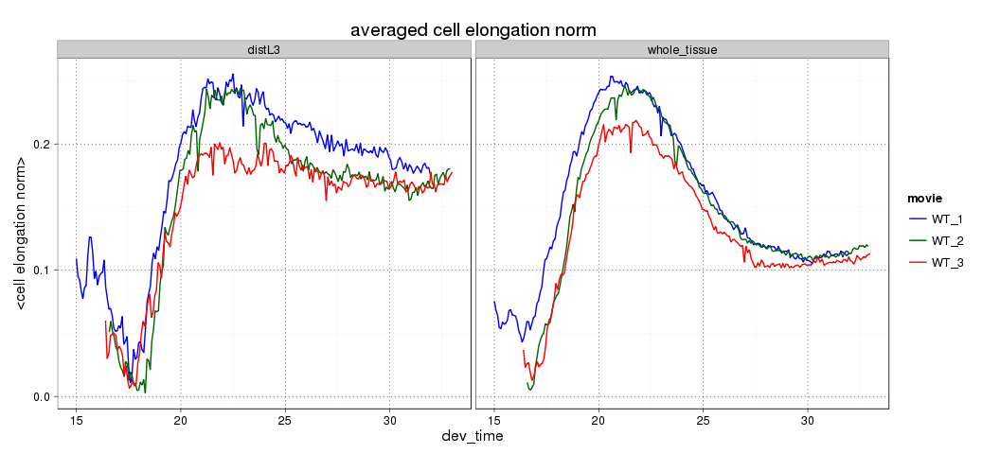 


***

## Averaged cell neighbor number

```r
avgNeighborNb <- multi_db_query(movieDirs, mqf_cg_roi_cell_neighbor_count, selectedRois) %>%
  print_head() 
```

```
##   movie frame          roi avg_num_neighbors time_sec timeInt_sec time_shift dev_time
## 1  WT_1     0       distL3          5.941176        0         287      54000 15.00000
## 2  WT_1     0 whole_tissue          6.006689        0         287      54000 15.00000
## 3  WT_1     1       distL3          5.941176      287         286      54000 15.07972
## 4  WT_1     1 whole_tissue          6.006601      287         286      54000 15.07972
## 5  WT_1     2       distL3          5.941176      573         276      54000 15.15917
## 6  WT_1     2 whole_tissue          6.016393      573         276      54000 15.15917
## [1] 1202
```

***


```r
  ggplot(avgNeighborNb, aes(dev_time, avg_num_neighbors, color=movie)) +
  geom_line() +
  ylab(expression(paste("<cell neighbor number>")))  +
  scale_color_manual(values = movieColors) +
  facet_wrap(~roi, ncol=4) +
  ggtitle("averaged cell neighbor number")
```

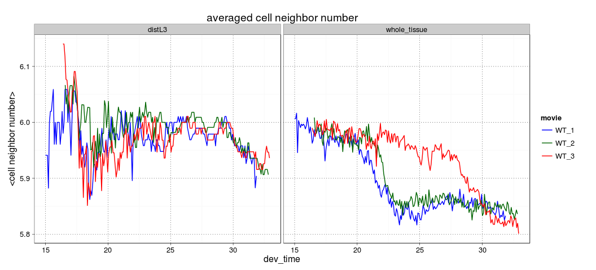 


***

## Average cell neighbor number by class of polygons

```r
avgPgClass <- multi_db_query(movieDirs, mqf_cg_roi_polygon_class, selectedRois) %>% print_head() 
```


```r
ggplot(avgPgClass, aes(dev_time, pgFreq, color=polygon_class)) +
  geom_line() +
  ylab(expression(paste("<cell neighbor number>")))  +
  # scale_color_manual(values = movieColors) +
  facet_grid(movie~roi) +
  ggtitle("averaged cell neighbor number")
```

***

## Cell division rate

```r
CDrateByTimeIntervals <- multi_db_query(movieDirs, mqf_cg_roi_rate_CD, selectedRois) %>% 
  chunk_time_into_intervals(3600) %>%
  group_by(movie, roi,interval_mid) %>%
  summarise(avgCDrate=mean(cell_loss_rate),
            semCD=se(cell_loss_rate),
            time_sec=interval_mid[1],
            dev_time=mean(dev_time))
```


```r
ggplot(CDrateByTimeIntervals, aes(dev_time, avgCDrate, color=movie)) + 
  geom_line()+
  geom_point(size=1, color="black") +
  geom_errorbar(aes(ymin=(avgCDrate-semCD), ymax=(avgCDrate+semCD)),
                size=0.3, width=0.4, color="black") +
  ylab(expression(paste("CD rate [", cell^-1, h^-1,"]"))) + 
  scale_color_manual(values = movieColors) +
  facet_wrap(~roi) +
  ggtitle("CD rate")
```

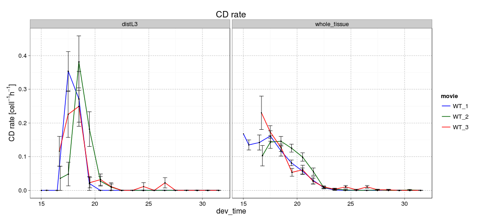 


***

## T1 rate

```r
T1rate <- multi_db_query(movieDirs, mqf_cg_roi_rate_T1, selectedRois) %>% 
  chunk_time_into_intervals(deltaT = 3600) %>%
  group_by(movie, roi,interval_mid) %>%
  summarise(avgT1rate=mean(cell_topo_rate),
            semT1=se(cell_topo_rate),
            time_sec=interval_mid[1],
            dev_time=mean(dev_time))
```


```r
ggplot(T1rate, aes(dev_time, avgT1rate, color=movie)) + 
  geom_line()+
  geom_point(size=1, color="black") +
  geom_errorbar(aes(ymin=(avgT1rate-semT1), ymax=(avgT1rate+semT1)),
                size=0.3, width=0.4, color="black") +
  facet_wrap(~roi) +
  ylab(expression(paste("T1 rate [", cell^-1, h^-1,"]"))) + 
  ylim(c(0.2,2.3)) +
  scale_color_manual(values = movieColors) +
  facet_wrap(~roi) +
  ggtitle("T1 rate")
```

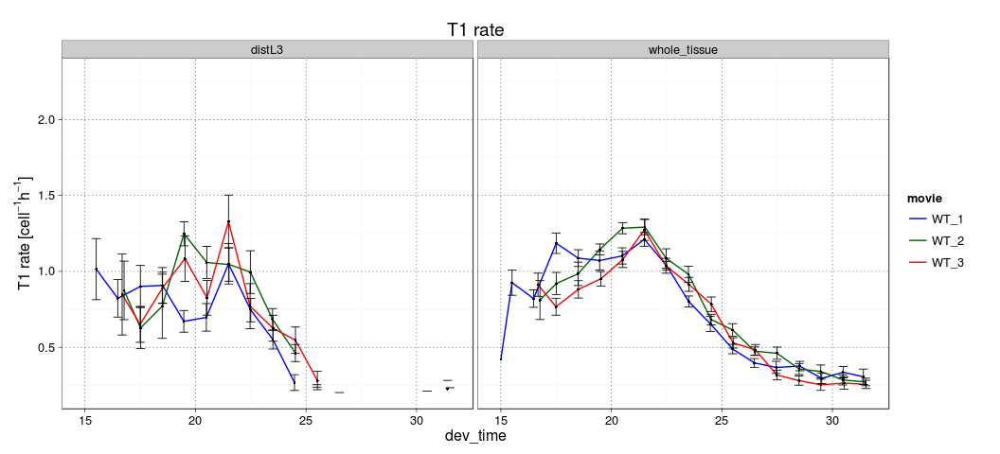 


***

## Cell division orientation (rose diag)


***

## T1 orientation (rose diag)

```r
movieDirs <- file.path(movieDbBaseDir, c("WT_1"))
selectedRois=c("whole_tissue")

# Get half T1 nematics and align movie start
T1Nematics <- multi_db_query(movieDirs, mqf_cg_roi_unit_nematics_T1, selectedRois) %>% 
  align_movie_start(movieDirs) %>% 
  mutate(frame=frame-closestFrame) %>% 
  group_by(movie) %>%
  mutate(maxnormByMovie=max(norm,na.rm=T)) %>% 
  group_by(movie,roi) %>%
  mutate(maxnormByRoi=max(norm,na.rm=T)) %>% print_head() 
```

```
## Source: local data frame [6 x 20]
## Groups: movie, roi [1]
## 
##    movie frame          roi roi_center_x roi_center_y cgT1xx_smooth cgT1xy_smooth       phi       norm       x1       y1       x2       y2 time_sec
##   (fctr) (int)        (chr)        (dbl)        (dbl)         (dbl)         (dbl)     (dbl)      (dbl)    (dbl)    (dbl)    (dbl)    (dbl)    (int)
## 1   WT_1     0 whole_tissue     437.8221     671.2497            NA            NA        NA         NA       NA       NA       NA       NA        0
## 2   WT_1     1 whole_tissue     517.9579     854.7862            NA            NA        NA         NA       NA       NA       NA       NA      287
## 3   WT_1     2 whole_tissue     492.9605     887.9991            NA            NA        NA         NA       NA       NA       NA       NA      573
## 4   WT_1     3 whole_tissue     495.0252     875.7355            NA            NA        NA         NA       NA       NA       NA       NA      849
## 5   WT_1     4 whole_tissue     558.5633     904.0128            NA            NA        NA         NA       NA       NA       NA       NA     1128
## 6   WT_1     5 whole_tissue     496.7646     884.4064  -0.005287355    0.04204381 0.8479489 0.04237497 487.8925 874.3487 505.6367 894.4642     1405
## Variables not shown: timeInt_sec (int), time_shift (dbl), dev_time (dbl), closestFrame (int), maxnormByMovie (dbl), maxnormByRoi (dbl)
## [1] 200
```

```r
T1Nematics$roi <- factor(T1Nematics$roi, levels=c("whole_tissue","distL3"))
```

***


```r
ggplot(T1Nematics , aes()) + 
  geom_segment(aes(x=phi, y=0, xend=phi, yend=(norm), color=dev_time),size=1, alpha=0.5) +
  geom_segment(aes(x=mod2pi(phi+pi), y=0, xend=mod2pi(phi+pi), yend=(norm),
                   color=dev_time), size=1, alpha=0.5) +
  scale_color_gradientn(name="time (hAPF)",
                        colours=c("black", "blue", "green", "yellow", "red"),
                        limits=c(min(T1Nematics$dev_time),max(T1Nematics$dev_time)),
                        na.value = "red") +
  coord_polar(start=-pi/2,direction=+1)+
  scale_x_continuous(breaks=seq(0,3*pi/2,pi/2), 
                     labels=c(expression(pi),expression(paste(pi/2," Ant")),
                              expression(0),expression(-pi/2)),
                     limits=c(0,2*pi)) +
  xlab("") +
  # scale_y_continuous(breaks=seq(0,1,0.2), limits=c(0,1)) +
  ylab("T1 nematic norm") +
  facet_wrap(~roi, ncol=4) +
  theme(#legend.justification=c(1,0),
    #legend.position=c(1,0),
    #legend.text=element_text(size=8),
    # legend.position="none",
    # legend.title=element_blank(),
    # legend.key = element_blank(),
    plot.title = element_blank(),
    # strip.text=element_blank(),
    # strip.background=element_blank(),
    panel.grid.minor=element_blank(),
    plot.margin = unit(c(0,0,0,0), "cm")) +
  ggtitle("T1 nematics - avg by roi in frame")
```

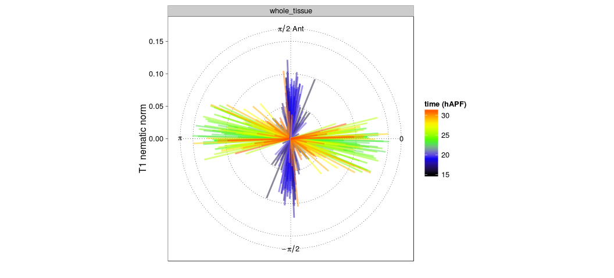 

```r
ggsave2(height=6,unit="in", outputFormat="svg")
```

```
## [1] "T1 nematics - avg by roi in frame.svg"
```


***

## Quantifying tissue deformation and its celluar contributions

### Isotropic deformation and its decomposition into cellular contributions

```r
movieDirs <- file.path(movieDbBaseDir, c("WT_1","WT_2", "WT_3"))
selectedRois=c("whole_tissue", "distL3", "distInterL3-L4")

isoContrib <- multi_db_query(movieDirs, mqf_cg_roi_rate_isotropic_contrib, selectedRois) %>%
  filter(isoContrib!="tissue_area")

deltaT=60 # sampling (60 seconds)
avgIsoDefRateInterpolated <- isoContrib %>%
  align_movie_start(movieDirs) %>%
  mutate(min_dev_time=min(dev_time),
         max_dev_time=max(dev_time)) %>% 
  group_by(movie, roi, isoContrib) %>%
  do({
    # browser()
    with(., approx(dev_time, value.ma,
                   xout = seq(min_dev_time[1], max_dev_time[1],
                              by = deltaT/3600), method = "linear")) %>% as.df()
  }) %>%
  rename(dev_time=x, value.ma=y) %>%
  filter(!is.na(value.ma)) %>%
  ungroup() %>% mutate(movieNb=length(unique(movie))) %>% 
  group_by(roi, isoContrib, dev_time) %>%
  # Make sure that further calculations will be done on values present in all compared movies
  filter(n()==movieNb) %>% ungroup()
  
avgIsoDefRateSummary <- avgIsoDefRateInterpolated %>%
  group_by(roi, isoContrib, dev_time) %>%
  summarise(value.avg=mean(value.ma), value.sd=sd(value.ma))
```

***


```r
# Plot average of iso contribution rates in 3 WT and their respective standard deviation
ggplot(avgIsoDefRateSummary, aes(dev_time, value.avg, color=isoContrib)) +
  geom_line() + 
  geom_ribbon(aes(ymin=(value.avg-value.sd), ymax=(value.avg+value.sd), fill=isoContrib),
              alpha=0.2, linetype="dotted", size=0.2) +
  xlab("Time [hAPF]")+
  # scale_x_continuous(breaks=seq(16,36, 2),limits=c(15,max(ceiling(shearRate$dev_time)))) +
  scale_x_continuous(breaks=seq(16,36, 4),limits=c(16,32)) +
  ylab(expression(paste("rate [",h^-1,"]"))) +
  geom_hline(color="black", size=0.2) +
  #scale_y_continuous(breaks=seq(-0.2,0.2, 0.1), limit=c(-0.22, 0.22)) +
  scale_color_manual(values=isotropColors) +
  scale_fill_manual(values=isotropColors) +
  facet_wrap(~roi) +
  ggtitle("averaged rates of isotropic deformation")
```

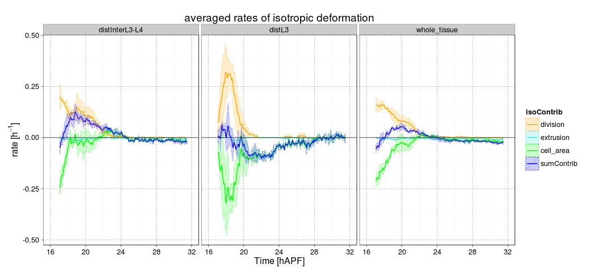 


***


```r
avgIsoDefCum <- avgIsoDefRateInterpolated %>%
  group_by(movie, roi, isoContrib) %>%
  mutate(timeInt=c(0,diff(dev_time)), value.cumsum=cumsum(value.ma*timeInt)) %>% 
  group_by(roi, isoContrib, dev_time) %>%
  summarise(cumsum.avg=mean(value.cumsum), cumsum.sd=sd(value.cumsum))
```

***


```r
ggplot(avgIsoDefCum, aes(dev_time, cumsum.avg, color=isoContrib)) +
  geom_line() +
  geom_ribbon(aes(ymin=(cumsum.avg-cumsum.sd), ymax=(cumsum.avg+cumsum.sd), fill=isoContrib),
              alpha=0.2, linetype="dotted", size=0.2) +
  xlab("Time [hAPF]")+
  ylab("cumulative sum") +
  scale_x_continuous(breaks=seq(16,36, 4),limits=c(16,32)) +
  geom_hline(color="black", size=0.2) +
  scale_y_continuous(breaks=seq(-1, 1, 0.4), limit=c(-1, 1)) +
  scale_color_manual(values=isotropColors) +
  scale_fill_manual(values=isotropColors) +
  facet_wrap(~roi) +
  ggtitle("cumulative avg isotropic deformation")
```

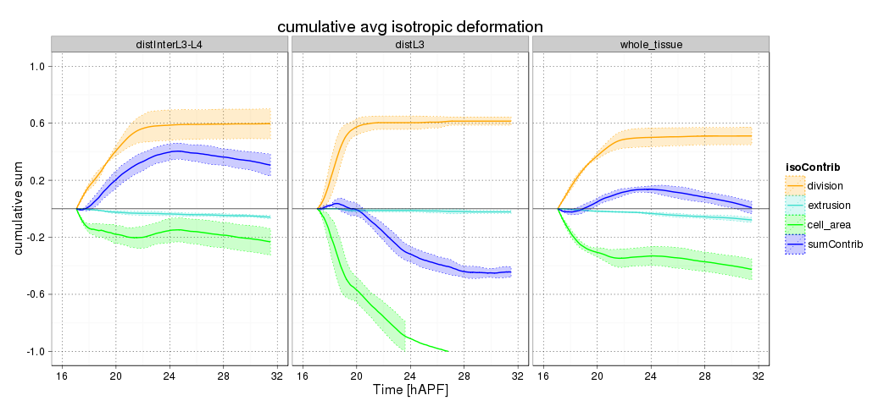 


***

### Pure shear deformation and its decomposition into cellular contributions

#### Triangulation of the cell network


```r
triProperties <- mqf_fg_triangle_properties(movieDir, "raw", triContour = T) %>%
  print_head()
```

```
##   tri_id movie frame    ta_xx    ta_xy     ta_yx    ta_yy tri_area      s_a    theta_a two_phi_a       Q_a roi time_sec timeInt_sec time_shift
## 1      1  WT_1    41 25.73521 4.237465  -8.08430 12.82599 364.3366 2.949039 -0.3092837  5.684289 0.3459120 raw    11617         283      54000
## 2      1  WT_1    41 25.73521 4.237465  -8.08430 12.82599 364.3366 2.949039 -0.3092837  5.684289 0.3459120 raw    11617         283      54000
## 3      1  WT_1    41 25.73521 4.237465  -8.08430 12.82599 364.3366 2.949039 -0.3092837  5.684289 0.3459120 raw    11617         283      54000
## 4      2  WT_1     0 16.10049 4.141756 -17.93016 16.97369 347.5472 2.925450 -0.5884726  4.060672 0.3625545 raw        0         287      54000
## 5      2  WT_1     0 16.10049 4.141756 -17.93016 16.97369 347.5472 2.925450 -0.5884726  4.060672 0.3625545 raw        0         287      54000
## 6      2  WT_1     0 16.10049 4.141756 -17.93016 16.97369 347.5472 2.925450 -0.5884726  4.060672 0.3625545 raw        0         287      54000
##   dev_time cell_id     x_pos    y_pos
## 1 18.22694   10001 104.59096 514.2104
## 2 18.22694   10008  73.94130 534.5956
## 3 18.22694   10179  67.50174 515.1043
## 4 15.00000   10001 176.60837 576.1622
## 5 15.00000   10008 158.56598 612.6568
## 6 15.00000   10320 152.27188 586.8624
## [1] 1680423
##   tri_id movie frame    ta_xx    ta_xy     ta_yx    ta_yy tri_area      s_a    theta_a two_phi_a       Q_a roi time_sec timeInt_sec time_shift
## 1      1  WT_1    41 25.73521 4.237465  -8.08430 12.82599 364.3366 2.949039 -0.3092837  5.684289 0.3459120 raw    11617         283      54000
## 2      1  WT_1    41 25.73521 4.237465  -8.08430 12.82599 364.3366 2.949039 -0.3092837  5.684289 0.3459120 raw    11617         283      54000
## 3      1  WT_1    41 25.73521 4.237465  -8.08430 12.82599 364.3366 2.949039 -0.3092837  5.684289 0.3459120 raw    11617         283      54000
## 4      2  WT_1     0 16.10049 4.141756 -17.93016 16.97369 347.5472 2.925450 -0.5884726  4.060672 0.3625545 raw        0         287      54000
## 5      2  WT_1     0 16.10049 4.141756 -17.93016 16.97369 347.5472 2.925450 -0.5884726  4.060672 0.3625545 raw        0         287      54000
## 6      2  WT_1     0 16.10049 4.141756 -17.93016 16.97369 347.5472 2.925450 -0.5884726  4.060672 0.3625545 raw        0         287      54000
##   dev_time cell_id     x_pos    y_pos
## 1 18.22694   10001 104.59096 514.2104
## 2 18.22694   10008  73.94130 534.5956
## 3 18.22694   10179  67.50174 515.1043
## 4 15.00000   10001 176.60837 576.1622
## 5 15.00000   10008 158.56598 612.6568
## 6 15.00000   10320 152.27188 586.8624
## [1] 1680423
```

***


```r
triProperties %>%
  render_frame(40) +
  geom_polygon(aes(x_pos, y_pos, group=tri_id),
               fill="yellow", color="black", alpha=0.9, size=0.1)
```

 


***

#### Pure shear deformation

```r
shearData <- multi_db_query(movieDirs, mqf_cg_roi_rate_shear, selectedRois)

shearRateSlim <- subset(shearData, (tensor=="CEwithCT" | tensor=="correlationEffects" |
                                      tensor=="nu" | tensor=="ShearT1" | 
                                      tensor=="ShearT2" | tensor=="ShearCD"))
shearRateSlim$tensor <- factor(shearRateSlim$tensor, 
                               levels=c("ShearCD", "CEwithCT", "correlationEffects",
                                        "nu", "ShearT1", "ShearT2"),
                               labels=c("cell_division", "cell_elongation_change",
                                        "correlation_effects","total_shear","T1", "T2"))

deltaT=60
shearRateInterpolated <- shearRateSlim %>% #filter(movie=="WT_25deg_111102") %>%
  align_movie_start(movieDirs) %>%
  select(-c(xy,yx,yy,xy.ma,yx.ma,yy.ma, TimeInt.ma,
            phi, norm,time_sec,timeInt_sec,closestFrame,time_shift)) %>%
  mutate(min_dev_time=min(dev_time),
         max_dev_time=max(dev_time)) %>% 
  group_by(movie, roi, tensor) %>%
  do({
    with(., approx(dev_time, xx.ma,
                   xout = seq(min_dev_time[1], max_dev_time[1],
                              by = deltaT/3600), method = "linear")) %>% as.df()
  }) %>%
  rename(dev_time=x, XX=y) %>% 
  filter(!is.na(XX)) %>%
  ungroup() %>% mutate(movieNb=length(unique(movie))) %>% 
  group_by(roi, tensor, dev_time) %>%
  # Make sure that further calculations will be done on values present in all compared movies
  filter(n()==movieNb) %>% ungroup()


shearRateSummary <- shearRateInterpolated %>%
  group_by(roi, tensor, dev_time) %>%
  summarise(xx.avg=mean(XX), xx.sd=sd(XX))
```

***


```r
# Plot avg and standard deviation for each tensor among 3 WT
ggplot(shearRateSummary, aes(dev_time,xx.avg*100, color=tensor)) +
  geom_line() + 
  geom_ribbon(aes(ymin=100*(xx.avg-xx.sd), ymax=100*(xx.avg+xx.sd), fill=tensor),
              alpha=0.2, linetype="dotted", size=0.2) +
  xlab("Time [hAPF]")+
  # scale_x_continuous(breaks=seq(16,36, 2),limits=c(15,max(ceiling(shearRate$dev_time)))) +
  scale_x_continuous(breaks=seq(16,36, 2),limits=c(16,34)) +
  ylab(expression(paste("shear rate xx [",10^-2,h^-1,"]"))) +
  # scale_y_continuous(breaks=seq(-6,8, 2), limit=c(-4.5, 7.5)) +
  scale_color_manual(values=shearColors) +
  scale_fill_manual(values=shearColors) +
  facet_wrap(~roi) +
  ggtitle("shear decomposition")
```

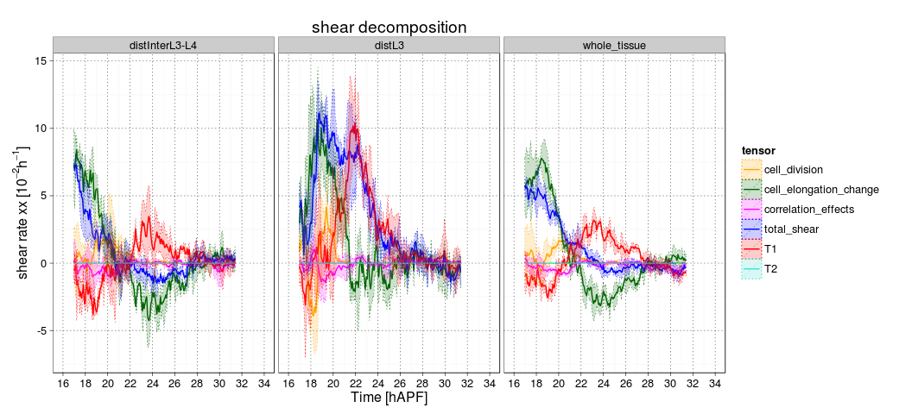 

***


```r
shearCumSumSummary <- shearRateInterpolated %>%
  group_by(movie, roi, tensor) %>%
  mutate(timeInt=c(0,diff(dev_time)),cumSum_xx=cumsum(XX*timeInt)) %>%
  group_by(roi, tensor, dev_time) %>%
  summarise(xxCumSum.avg=mean(cumSum_xx, na.rm = F), xxCumSum.sd=sd(cumSum_xx, na.rm = F))
```

***


```r
ggplot(shearCumSumSummary, aes(dev_time,xxCumSum.avg, color=tensor)) +
  geom_line() + 
  geom_ribbon(aes(ymin=(xxCumSum.avg-xxCumSum.sd), ymax=(xxCumSum.avg+xxCumSum.sd), fill=tensor),
              alpha=0.2, linetype="dotted", size=0.2) +
  xlab("Time [hAPF]")+
  # scale_x_continuous(breaks=seq(16,36, 2),limits=c(15,max(ceiling(shearRate$dev_time)))) +
  scale_x_continuous(breaks=seq(16,36, 2),limits=c(16,34)) +#31.3
  # scale_y_continuous(breaks=seq(-0.2,0.3, 0.1), limit=c(-0.2, 0.3)) +
  ylab(expression(paste("cumulative PD shear"))) +
  geom_hline(color="black", size=0.2) +
  scale_color_manual(values=shearColors) +
  scale_fill_manual(values=shearColors) +
  facet_wrap(~roi) +
  ggtitle("cumulative shear decomposition")
```

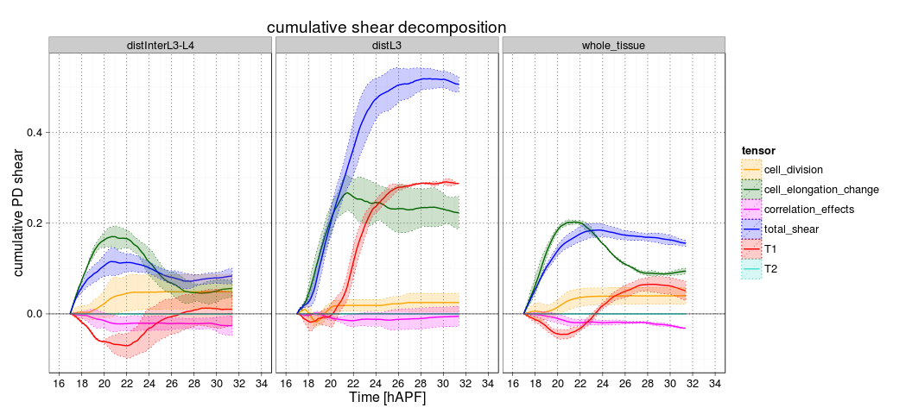 


