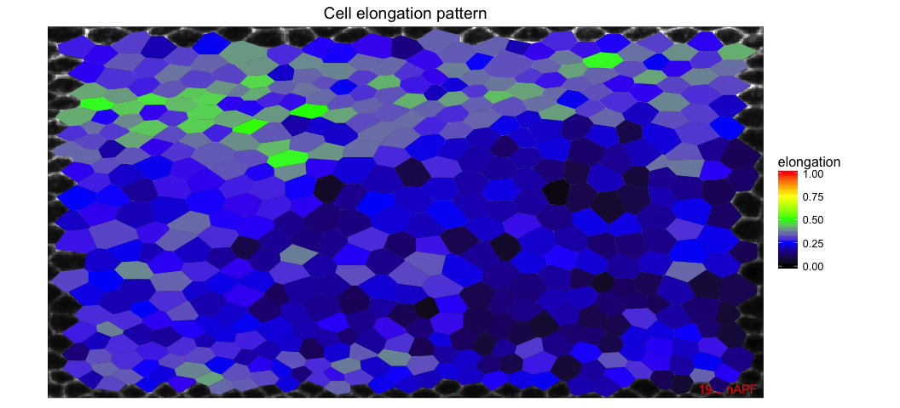
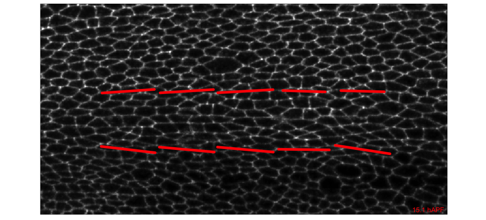
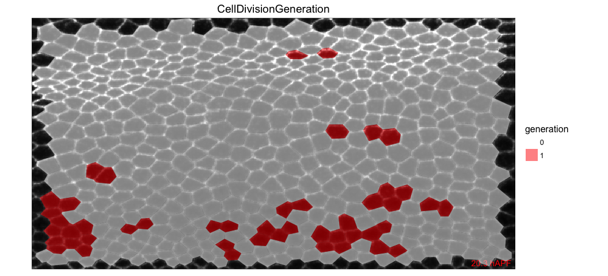
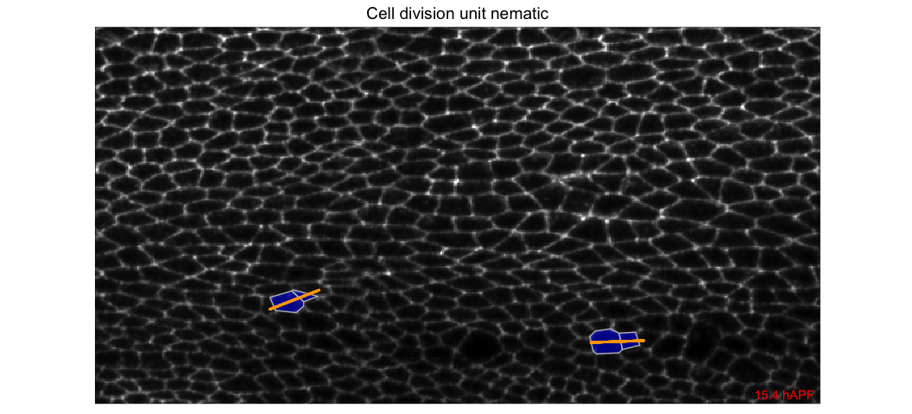
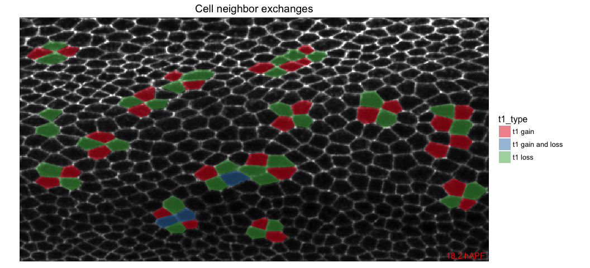
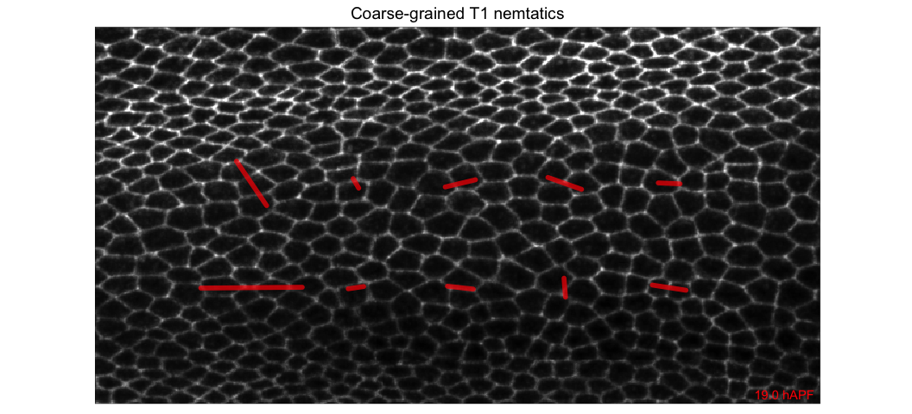
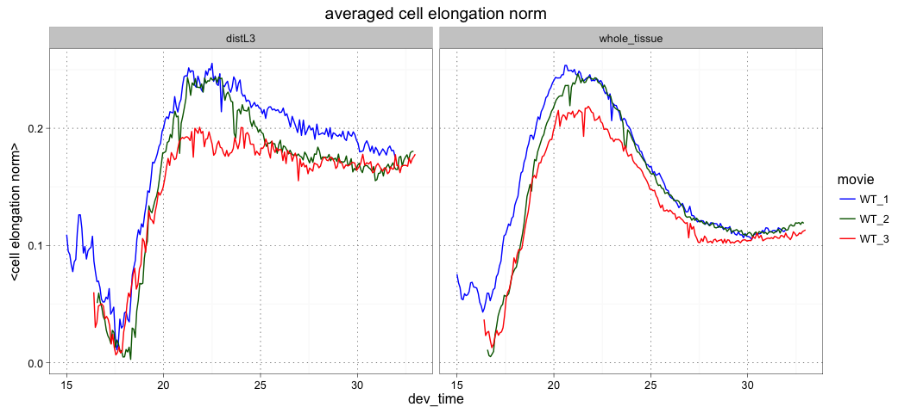
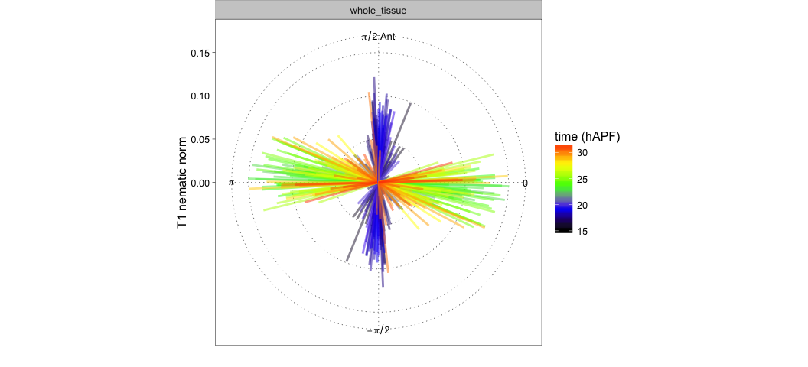
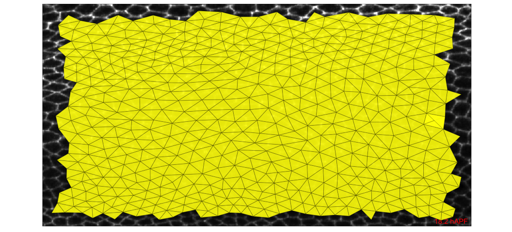

# TissueMiner: an R-tutorial to visualize cell dynamics in 2D tissues
Raphael Etournay  
April 15th 2016  


# Introduction to TissueMiner

* **Prerequisite:** it is assumed in this tutorial that 
    + time-lapses have been processed using the TissueMiner automated workflow [here](https://github.com/mpicbg-scicomp/tissue_miner)

* **We provide three processed time-lapses** corresponding to the distal part of 3 wild-type *Drosophila* pupal wings. [Please, download them here](https://cloud.mpi-cbg.de/index.php/s/XF5swEw9lxRmZNj). 

* **No programming skill required:** the tutorial [Learning_the_R_basics_for_TissueMiner]() will guide the user, without any previous knowledge in programming, through the main aspects of data manipulation and visualization using the R language. 

* **The power of an existing grammar** to manipulate and to visualize data. The open-source R language now provides very efficient and simple ways to handle important amount of tabular data, using a so called "grammar" of data manipulation (*dplyr* package) and visualization (*ggplot2* package) (ref Wickham). We found R to be ideal for querying our relational databases (*RSQLite* package), and to perform subsequent calculations and analyses for understanding tissue morphogenesis. Thus, the user keeps control of his data by learning a few verbs and the simple syntax of the grammar. This gives the advantage of full autonomy on the data that can manipulated without restriction. 

* **TissueMiner extends this grammar** to facilitate the visualization and quantification of cell dynamics during tissue morphogenesis

* **TissueMiner is compatible with the Python programming language**. We provide a Python-tutorial of TissueMiner [here](https://github.com/mpicbg-scicomp/tissue_miner/tree/master/docs)

* **High performance computing platform**. TissueMiner has been designed to be used in command-line in order to easily batch repetitive tasks and to run tasks on a high performance computing platform (cluster). 

* **A comprehensive HOWTO**. This tutorial progressively introduces the techniques of data manipulation and visualization for the user to learn how to master them. It is also organized as an *HOWTO* to visualize and quantify cell dynamics in 2D tissues, by a simple copy-paste of the code encapsulated in shaded grey boxes into a R-shell such as in [RStudio](https://www.rstudio.com/products/rstudio/). We strongly encourage the user to use RStudio or a similar software to conveniently run the R programs provide in TissueMiner.

* **TissueMiner can easily be extended** by the user to address project-specific questions

* **Tutorial layout**: the code is encapsulated in shaded grey boxes that delimit **code chunks**. The **results** are displayed immediately below in an open box in which all lines start with the ## sign. Within code chunks, **comments** are visible in green and are prefixed with at least a # sign. The comments indicate what the following code does. Here is an example:


```r
# This is a comment: the code below will print "Welcome to TissueMiner"
print("Welcome to TissueMiner")
```

```
## [1] "Welcome to TissueMiner"
```

## TissueMiner "snakemake" automated workflow

### Strengths
* The _snakemake_ automated workflow (sm command) builds the **database** and generates **useful data** about cell lineages, cell topology, cell geometry, and cell contributions to tissue deformation. 
* You can run the workflow step by step by mean of "rules" that we defined in the snakemake configuration [file](https://github.com/mpicbg-scicomp/tissue_miner/blob/master/workflow/tm.snkmk). Based on this configuration file, the snakemake engine checks if all necessary inputs are present before running a given step. If inputs are missing the snakemake engine runs the missing steps automatically.

### Limitations
* Data manipulation and visualization strategies shouldn't be modified within this workflow to avoid breaking the workflow. 

### To overcome the limitations: an Application programming interface
* This present User Manual guides the user through the _Application programming interface (API)_ that we developed in TissueMiner to **customize data visualization**.

### What are the data generated by the "snakemake" automated workflow ?
* Here is a list of important files that are generated by the complete automated workflow
    + The database: **(\<movie_name\>.sqlite)**
    + An extra table **(cellshapes.RData)** to represent cell contours by using anticlockwisely ordered cell vertices
    + An extra table **(./roi_bt/lgRoiSmoothed.RData)** to store cells in user-defined regions of interest
    + An extra table **(./topochanges/t1DataFilt.RData)** to store cell neighbor changes
    + An extra table **(./shear_contrib/triangles.RData)** to store triangles
    + Extra tables **(./shear_contrib/\<ROI_name\>/avgDeformTensorsWide.RData)** to store the calculated pure shear deformation of triangles and tissue for each region of interest
        
### Select specific rules to run part of the "snakemake" automated workflow
* A graph represents the order and the relations between rules (tasks) to be run. You can see such a graph in Figure 7 of the [resource paper]()
* Command to run the complete workflow including video creation: `sm all`
* Command to see all non-processed rules: `sm -n`
* Command to build the database only: `sm make_db`
* Command to generate the necessary data for exploiting the TissueMiner API: to be defined


## Beyond the automated workflow: now, make your own scripts

### Requirements

* **Ubuntu:** you may install [Rstudio](https://www.rstudio.com/products/rstudio/) or another integrated environment for R programming. The TissueMiner API has already been installed and configured during the installation procedure.

* **MacOS:** we provide a TissueMiner API installer that includes an Rstudio installation
Run this in a Terminal:

```bash
/usr/bin/ruby -e "$(curl -fsSL https://raw.githubusercontent.com/Homebrew/install/master/install)"
brew update
brew install git
export TM_HOME="${HOME}/tissue_miner"
git clone https://github.com/mpicbg-scicomp/tissue_miner.git ${TM_HOME}
${TM_HOME}/installation/osx/install_tm_api.sh
```

* **Any systems with the Docker toolbox:** you can use the Rstudio server from the provided docker image that includes all necessary R packages
    + go to https://github.com/mpicbg-scicomp/tissue_miner
    + download the TissueMiner API (in your home folder): click 'Download ZIP' 
    + unzip the file
    + open a docker terminal and start the rstudio server with the following commands


```bash
docker run -d -p 8787:8787 -e USER=rstudio -e PASSWORD=rstudio \
-v $HOME:/home/rstudio/share \
etournay/tissue_miner
```
*    + get the URL to reach the Rstudio server 

```bash
echo "http://$(docker-machine ip default):8787"
```
*    + **Copy and paste the resulting URL onto a web browser:** login: rstudio, password: rstudio

### TissueMiner configuration

* We provide two configuration files to setup the global environement: default_config.R and flywing_tm_config.R that you can find [here]()
    + define graphics theme
    + define a common color scheme for known quantities. Ex: color of shear curves
    + define time offsets for comparing multiple movies in time, using the `algnModel` variable
    + define a time offset to display the developmental time. Ex: 54000 seconds for 16 hAPF
    + define default parameters. Ex: movie grid size, default ROI name, ...  


* Configure Rstudio to run examples of the present User Manual
    + Ubuntu, Linux and MacOS

```bash
# To define the location of TissueMiner scripts and configuration file, just open a terminal and type in:
echo "TM_HOME=~/tissue_miner" >> ~/.Renviron
echo "TM_CONFIG=~/tissue_miner/config/flywing_tm_config.R" >> ~/.Renviron
```
*    + Windows

```bash
# On Windows, TM_HOME and TM_CONFIG must be defined in the .Renviron file.
# Jut type in: help("Startup") in a R session (Rstudio), and follow the manual
```

* Configure Rstudio to run your own scripts
    + You may use the default configuration 

```bash
# To define the location of TissueMiner scripts and configuration file, just open a terminal and type in:
echo "TM_HOME=~/tissue_miner" >> ~/.Renviron
echo "TM_CONFIG=~/tissue_miner/config/default_config.R" >> ~/.Renviron
```
*    + You may create your own configuration file

```bash
# To define the location of TissueMiner scripts and configuration file, just open a terminal and type in:
echo "TM_HOME=~/tissue_miner" >> ~/.Renviron

# Here provide the path to your configuration file
echo "TM_CONFIG=path_to_my_config_file" >> ~/.Renviron
```

    
### Your first script: load TissueMiner routines in Rstudio
* **Please modify the paths (first chunk below) according to your data location**
* **Always execute the code below before running the analysis**

***


```r
# Define path to all processed movies: TO BE EDITED BY THE USER
movieDbBaseDir="/Users/retourna/example_data/"

# Define a working directory where to save the analysis: TO BE EDITED BY THE USER
outDataBaseDir="/tmp/output"
```

***


```r
# Set up path to the TissueMiner code
# This command requires that the global environment TM_HOME is defined in the .bash_profile
scriptsDir=Sys.getenv("TM_HOME")

# Load TissueMiner libraries
source(file.path(scriptsDir, "commons/TMCommons.R"))
source(file.path(scriptsDir, "commons/BaseQueryFunctions.R"))
source(file.path(scriptsDir, "commons/TimeFunctions.R"))
source(file.path(scriptsDir, "config/flywing_tm_config.R"))

# Set up working directory
mcdir(outDataBaseDir)
```


* TissueMiner extends the existing grammars in R for visualizing and quantifying cell dynamics in 2D-living tissues:

Functions | Description | Project
--------------|-------------|-------------
**print_head** | head the current table with the row number | TissueMiner
**dt.merge** | fast merging of two dataframes, possibility to suffix column names | TissueMiner
**openMovieDb** | open a connection to a movie database | TissueMiner
**multi_db_query** | aggregate data into one dataframe | TissueMiner
**coarseGrid** | assign grid elements to cell positions | TissueMiner
**smooth_tissue** | average quantities in time using a moving window | TissueMiner
**align_movie_start** | align movies at earliest common developmental time | TissueMiner
**chunk_time_into_intervals** | undersample time for local time averaging | TissueMiner
**synchronize_frames** | find closest frame to user-defined time intervals | TissueMiner
**mqf_* functions** | set of multi-query functions to quantify cell dynamics | TissueMiner

The mqf functions constitute an important part of the TissueMiner API. They will be discribed thereafter.


***

## How to query a relational database ?

### Open a connection to the database

* Database format: SQLite
* Open a connection to one database: **openMovieDb()** function using the RSQLite package
* The name of the time-lapse is used to identify the corresponding database
* The SQLite connection is assigned to a variable called "db".


```r
# Define path a particular time-lapse called "demo"
movieDir <- file.path(movieDbBaseDir, c("demo"))

# Connection to the DB stored in the "db" variable
db <- openMovieDb(movieDir)
```


```r
# Close the connection
dbDisconnect(db)
```

***


### Example: overlay cells and vertices on the image

We can now overlay cells and vertices on the wing image. To do so, we built a dedicated **render_frame()** function that loads the specified frame of the time-lapse. This function takes the cell contour table and a desired frame as input variables. The **render_frame()** function returns the first layers of the graph that consists of a raster image of the wing and additional specifications such as the Y-axis flipping - **scale_y_continuous(trans = "reverse")** - and the iso-scaling of the X and Y axes - **coord_equal()**. 


```r
cellshapes <- locload(file.path(movieDir, "cellshapes.RData")) %>% print_head()
```

```
## Source: local data frame [6 x 5]
## 
##   frame cell_id x_pos y_pos bond_order
##   (int)   (int) (dbl) (dbl)      (dbl)
## 1     0   10001   193   195          1
## 2     0   10001   189   199          2
## 3     0   10001   206   212          3
## 4     0   10001   229   206          4
## 5     0   10001   219   192          5
## 6     0   10001   217   190          6
## [1] 219714
```

```r
# Plot cells and vertices on the original image
cellshapes %>%
  # add overlay image (! connection to DB required !):
  render_frame(50) +
  geom_polygon(aes(x_pos, y_pos, group=cell_id), color="green",fill=NA, size=0.2) + 
  geom_point(aes(x_pos, y_pos),color="red", size=0.4) +
  ggtitle("Cells and vertices overlaid on the image")
```

<!-- -->

## Further reading: the render_frame() function

Please, read the current definition of the **render_frame()** function at the [following location](https://github.com/mpicbg-scicomp/tissue_miner/blob/master/commons/MovieFunctions.R)

***

***
## Working with regions of interest (ROIs)

* By default TissueMiner creates two regions of interest:
    + **raw**: this ROI corresponds to all tracked cells contained in the DB
    + **whole_tissue**: this ROI corresponds to the largest population of cells that is visible throughout the movie. It's a subset of **raw** obtained by the lineage-browser algorithm that is part of the automated workflow of TissueMiner

* Other regions of interest can be manually defined by the user in Fiji ([see Fiji macro](https://github.com/mpicbg-scicomp/tissue_miner/blob/master/fiji_macros/draw_n_get_ROIcoord.ijm)). Of note, these additional ROIs are only taken into account if they were defined **before** running the automated workflow.  

The automated workflow includes routines to browse the cell lineage and to follow ROIs in time once defined on a given image of the time-lapse. Please note that cells in contact with the margin are discarded because the segmentation and tracking quality isn't optimum near the margin.

**Example: Visualize cells in a selected ROI**

```r
# Load tracked ROIs: 
lgRoiSmoothed <- locload(file.path(movieDir, "roi_bt/lgRoiSmoothed.RData")) %>%
  print_head() %>%
  filter(roi %in% c("cell_patch")) 
```

```
##          roi cell_id
## 1 cell_patch   10104
## 2 cell_patch   10110
## 3 cell_patch   10111
## 4 cell_patch   10112
## 5 cell_patch   10114
## 6 cell_patch   10116
## [1] 515
```

```r
# Load cell shapes for plotting on the wing
cellshapes <- locload(file.path(movieDir, "cellshapes.RData"))

# Merge ROI with cell polygonal definition
cellshapesWithRoi <- cellshapes %>%
  dt.merge(lgRoiSmoothed, by="cell_id", allow.cartesian=T) %>%
  arrange(frame, cell_id, bond_order) ## .. because merge messes up the ordering

# Plot  ROI on the wing
render_frame(cellshapesWithRoi, 50) + 
  geom_polygon(aes(x_pos, y_pos, fill=roi, group=cell_id), alpha=0.5) +
  scale_fill_manual(values=c("cell_patch"="darkgreen"))
```

<!-- -->
 
***

## Make videos 
**Videos are helpful to visualize the time evolution of patterns**

Here, we use a parallelized loop over all frames of the time-lapse. The well-known avconv (formerly ffmpeg) program to create videos must be installed on your computer, please, visit [http://ffmpegmac.net/](http://ffmpegmac.net/) for Mac users or simply "sudo apt-get install libav-tools" on Ubuntu-Linux. 

* To simplify the procedure of creating videos, we built a dedicated function **render_movie()** that takes a list of ggplot layers as an input argument.
* Please, read the current definition of the **render_movie()** function [here](https://github.com/mpicbg-scicomp/tissue_miner/blob/master/commons/MovieFunctions.R).

```r
# Make a video of the ROI on the wing
render_movie(cellshapesWithRoi, "bt_bhfix_peeled.mp4", list(
          geom_polygon(aes(x_pos, y_pos, fill=roi, group=cell_id),  alpha=0.5),
          scale_fill_manual(values=c("cell_patch"="darkgreen"))))
```


***

## A TissueMiner library to visualize cell dynamics

TissueMiner provide a set of tools to quantify and visualize cell dynamics at different spatial scales.
These tools are all prefixed with 'mqf' as they perform multiple queries to the pre-processed data obtained with the TissueMiner automated workflow. Their common features are:

* aggregate data from one selected movie into a dataframe for immediate visualization
* include ROI definitions
* include developmental time

Mandatory argument: a path to a selected movie directory

Optional arguments: to control selected ROIs and other parameters that are specific to some subsets of mqf functions

### Fine-grained analyses

* mqf_fg_* functions generate fine-grained data (cellular scale) that
    + are mapped to all ROIs by default
    + include bond, cell or triangle contours for plotting
    + perform an automatic scaling of nematics for an optimal display on the original image

mqf_fg_* functions | Description 
--------------|-------------
***mqf_fg_nematics_cell_elong*** | get cell elongation nematics from the DB 
***mqf_fg_unit_nematics_CD*** | calculate cell division unit nematics 
***mqf_fg_unit_nematics_T1*** | calculate cell neighbor change unit nematics 
***mqf_fg_cell_area*** | get cell area from the DB 
***mqf_fg_triangle_properties*** | get calculated triangle state properties 
***mqf_fg_bond_length*** | get bond length and positions from the DB 
***mqf_fg_cell_neighbor_count*** | calculate cell neighbor number from the DB 
***mqf_fg_dev_time*** | get developmental time from the configuration file 

***

### Coarse-grained analyses: per frame and by ROIs

* The **mqf_cg_roi_* functions**:
    + perform spatial (by ROI) and temporal (kernSize option) averaging of quantities
    + perform an automatic scaling of nematics for an optimal display on the original image

mqf_cg_roi_* functions | Description 
--------------|-------------|-------------
***mqf_cg_roi_cell_count*** | count cell number 
***mqf_cg_roi_cell_area*** | coarse-grain cell area 
***mqf_cg_roi_cell_neighbor_count*** | average cell neighbor count 
***mqf_cg_roi_polygon_class*** | average and trim cell polygon class 
***mqf_cg_roi_triangle_elong*** | coarse-grain cell elongation using triangles as a proxy 
***mqf_cg_roi_rate_CD*** | average cell division rate 
***mqf_cg_roi_rate_T2*** | average extrusion rate 
***mqf_cg_roi_rate_T1*** | average neighbor change rate 
***mqf_cg_roi_rate_isotropic_contrib*** | coarse-grain **isotropic** tissue deformation and its cellular contributions 
***mqf_cg_roi_rate_shear*** | coarse-grain **anisotropic** tissue deformation and its cellular contributions 
***mqf_cg_roi_nematics_cell_elong*** |  coarse-grain cell elongation nematics by ROI 
***mqf_cg_roi_unit_nematics_CD*** | coarse-grain division unit nematics
***mqf_cd_roi_unit_nematics_T1*** | coarse-grain neighbor change unit nematics 

***

### Coarse-grained analyses: per frame and by square-grid elements

* The **mqf_cg_grid_* functions**:
    + perform spatial (by grid element) and temporal (kernSize option) averaging of quantities
    + perform an automatic scaling of nematics for an optimal display on the original image

mqf_cg_grid_* functions | Description | Source data
--------------|-------------|-------------
***mqf_cg_grid_nematics_cell_elong*** | coarse-grain cell elongation nematics | DB
***mqf_cg_grid_unit_nematics_CD*** | coarse-grain division unit nematics | DB
***mqf_cg_grid_unit_nematics_T1*** | coarse-grain neighbor change unit nematics | DB

***

# Visualize patterned cell behaviors on the tissue

## Bond length pattern

To render cell bonds one must get bonds and their respective positions. Here, is an example in which different related tables must be joined together to pool the relevant data to be plotted:

* 3 connected tables from the relational database to be considered: **bonds**, **directed_bonds** and **vertices**
* By joining those 3 tables one can generate a new table containing the bonds with their respective vertices and length
* A bond is represented by drawing a segment between its two vertices
* Bond length is mapped onto a color gradient scale for a color-coded visualization


For the sake of clarity, we built a dedicated **mqf_fg_bond_length()** function to get bond properties along with bond positions for plotting. Please, read its definition [here](https://github.com/mpicbg-scicomp/tissue_miner/blob/master/commons/BaseQueryFunctions.R).

***

### Get and manipulate data for plotting

```r
# we use the movieDir variable defined above
bond_with_vx <- mqf_fg_bond_length(movieDir, "raw") %>% print_head()
```

```
##   movie frame cell_id bond_id vertex_id.2 vertex_id.1 x_pos.1 y_pos.1 x_pos.2 y_pos.2 bond_length roi time_sec timeInt_sec time_shift dev_time
## 1  demo     0   10000      53           1          51      28     343      18     339    11.65690 raw        0         291      54000       15
## 2  demo     0   10000      84          51          72      33     340      28     343     6.24264 raw        0         291      54000       15
## 3  demo     0   10000     128          72         100      45     344      33     340    13.65690 raw        0         291      54000       15
## 4  demo     0   10000     134         100         104      56     342      45     344    11.82840 raw        0         291      54000       15
## 5  demo     0   10000     135         104         105      60     337      56     342     6.65685 raw        0         291      54000       15
## 6  demo     0   10000     165         105         125      79     338      60     337    20.24260 raw        0         291      54000       15
## [1] 115219
```

***

### Plot the color-coded bond-length pattern

```r
bond_with_vx %>%
  render_frame(50) + 
  # bonds are represented by segments using geom_segment
  geom_segment(aes(x=x_pos.1, y=y_pos.1, xend=x_pos.2, yend=y_pos.2,
                   color=bond_length), # Here bond_length values are mapped to the color
               size=0.3, lineend="round") +
  # we overwrite the default color map by a custom rainbow palette
  scale_color_gradientn(name="bond_length",
                        colours=c("black", "blue", "green", "yellow", "red"),
                        limits=c(0,quantile(bond_with_vx$bond_length, probs = 99/100)),
                        na.value = "red") +
  ggtitle("Color-coded pattern of bond length")
```

<!-- -->

***

### Make a video of the color-coded bond-length pattern

```r
# Here use the render_movie function
render_movie(bond_with_vx, "BondLengthPattern.mp4", list(
  geom_segment(aes(x=x_pos.1, y=y_pos.1,xend=x_pos.2, yend=y_pos.2,color=bond_length), 
               size=0.3, lineend="round") ,
  scale_color_gradientn(name="bond_length",
                        colours=c("black", "blue", "green", "yellow", "red"),
                        limits=c(0,quantile(bond_with_vx$bond_length, probs = 99/100)),
                        na.value = "red") # outliers are red
))
```

***

## Cell area 

### Get and manipulate the data for plotting

* Using the **TissueMiner grammar**, one can get all cell properties and cell contours in one step

```r
cellArea <- mqf_fg_cell_area(movieDir, rois = c("raw"), cellContour = T)
```

* **Alternatively**, one can do each step separately. Here, we don't add ROI definition (faster).


```r
# Send a SQL query to get cell area in each frame
cellArea <- dbGetQuery(db,"select cell_id, frame, area from cells where cell_id!=10000") %>%
  # add cell polygons into it
  dt.merge(locload(file.path(movieDir, "cellshapes.RData")),
           by = c("frame", "cell_id")) %>%
  # order vertices around the cell contour for ploting cells as polygons
  arrange(cell_id, frame, bond_order) 
```

***

### Plot the color-coded cell area pattern

```r
cellArea %>%
  render_frame(50) + 
  # we now map cell area values to a color palette: fill=area
  geom_polygon(aes(x_pos, y_pos, group=cell_id, fill=area), alpha=0.7) + 
  scale_fill_gradientn(name="area (px)",
                       colours=c("black", "blue", "green", "yellow", "red"),
                       limits=c(0,quantile(cellArea$area, probs = 99.9/100)),
                       na.value = "red") +
  ggtitle("Cell area pattern")
```

<!-- -->

***

### Make a video of the cell area pattern

```r
render_movie(cellArea, "CellAreaPattern.mp4", list(
  geom_polygon(aes(x_pos, y_pos, group=cell_id, fill=area)),
  scale_fill_gradientn(name="area (px)",
                       colours=c("black", "blue", "green", "yellow", "red"),
                       limits=c(0,quantile(cellArea$area, probs = 99.9/100)),
                       na.value = "red")
))
```

***

### Subset the data by ROIs

```r
# We now select the blade ROI that we defined using the draw_n_get_ROIcoord.ijm Fiji macro.
cellArea <- mqf_fg_cell_area(movieDir, rois = c("raw"), cellContour = T)


whole_tissue_roi <- locload(file.path(movieDir, "roi_bt/lgRoiSmoothed.RData")) %>% 
  filter(roi=="whole_tissue") %>% print_head() 
```

```
##            roi cell_id
## 1 whole_tissue   10000
## 2 whole_tissue   10102
## 3 whole_tissue   10104
## 4 whole_tissue   10107
## 5 whole_tissue   10109
## 6 whole_tissue   10110
## [1] 372
```

```r
cellAreaInROI <- cellArea %>%
  # A inner-join operation intersects the data
  dt.merge(whole_tissue_roi, by = "cell_id") 
```

***

### Plot the color-coded cell area pattern in the 'whole_tissue' ROI

```r
cellAreaInROI %>%
  render_frame(3) + 
  # we now map cell area values to a color palette: fill=area
  geom_polygon(aes(x_pos, y_pos, group=cell_id, fill=area)) + 
  scale_fill_gradientn(name="area (px)",
                       colours=c("black", "blue", "green", "yellow", "red"),
                       limits=c(0,quantile(cellAreaInROI$area, probs = 99.9/100)),
                       na.value = "red") +
  ggtitle("Cell area pattern in blade")
```

<!-- -->


***

## Cell elongation (nematic norm)

### Get and manipulate the data for plotting

* Using the **TissueMiner grammar**, one can get all cell properties and cell contours in one step


```r
cellShapesElong <- mqf_fg_nematics_cell_elong(movieDir, "raw", cellContour = T)
```

* **Alternatively**, one can do each step separately. This way, one can easily filter desired cell properties


```r
# Send a SQL query to get the cell elongation tensor in each frame
cellShapesElong <- dbGetQuery(db,"select cell_id, frame, elong_xx, elong_xy from cells 
                                  where cell_id!=10000") %>%
  # calculate the norm of the elongation tensor (vectorized operation = on columns)
  mutate(norm=sqrt(elong_xx^2+elong_xy^2)) %>%
  # add cell vertices for cell rendering as polygons
  dt.merge(locload(file.path(movieDir, "cellshapes.RData")),
           by = c("frame", "cell_id")) %>%
  # order vertices around the cell contour
  arrange(cell_id, frame, bond_order) %>% print_head()
```

```
##   frame cell_id elong_xx  elong_xy      norm x_pos y_pos bond_order
## 1     0   10001 0.296725 0.0746626 0.3059742   193   195          1
## 2     0   10001 0.296725 0.0746626 0.3059742   189   199          2
## 3     0   10001 0.296725 0.0746626 0.3059742   206   212          3
## 4     0   10001 0.296725 0.0746626 0.3059742   229   206          4
## 5     0   10001 0.296725 0.0746626 0.3059742   219   192          5
## 6     0   10001 0.296725 0.0746626 0.3059742   217   190          6
## [1] 219714
```

***

### Plot the color-coded cell elongation pattern

```r
cellShapesElong %>%
  render_frame(50) +
  # we now map cell elongation values to a color palette: fill=elongNorm
  geom_polygon(aes(x_pos, y_pos, group=cell_id, fill=norm)) + 
  scale_fill_gradientn(name="elongation",
                       colours=c("black", "blue", "green", "yellow", "red"),
                       limits=c(0,1),
                       na.value = "red") +
  ggtitle("Cell elongation pattern")
```

<!-- -->

***

### Make a video of the cell elongation pattern

```r
render_movie(cellShapesElong, "CellElongationPattern.mp4", list(
  geom_polygon(aes(x_pos, y_pos, group=cell_id, fill=elongNorm)),
  scale_fill_gradientn(name="elongation",
                       colours=c("black", "blue", "green", "yellow", "red"),
                       limits=c(0,quantile(cellShapesElong$elongNorm, probs = 99.9/100)),
                       na.value = "red")
))
```


***

## Cell elongation nematics (fine-grained)

### Get and manipulate the data for plotting

* Using the **TissueMiner grammar**, one can get cell elongation nematics for plotting in one step

* The **mqf_fg_nematics_cell_elong()** does the following:
    + it retrieves elongation nematics from the database. 
    + it calculates nematic angle and norm.
    + it scales nematics for display on the image (automatic scaling by default)

* Please, read the **mqf_fg_nematics_cell_elong()** definition [here](https://github.com/mpicbg-scicomp/tissue_miner/blob/master/commons/BaseQueryFunctions.R)


```r
cellElongNematics <- mqf_fg_nematics_cell_elong(movieDir, "raw") %>% print_head()
```

```
##   movie frame cell_id center_x center_y elong_xx   elong_xy roi       phi      norm displayFactor       x1        y1       x2        y2 time_sec
## 1  demo     0   10001  209.731 201.6070 0.296725  0.0746626 raw 0.1232524 0.3059742      24.23546 206.0514 201.15117 213.4106 202.06283        0
## 2  demo     0   10002  577.155 247.0320 0.340883 -0.0941206 raw 6.1484872 0.3536381      24.23546 572.9085 247.60748 581.4015 246.45652        0
## 3  demo     0   10003  532.862 143.6060 0.248538  0.2278700 raw 0.3710212 0.3371882      24.23546 529.0541 142.12457 536.6699 145.08743        0
## 4  demo     0   10004  545.181 242.5890 0.391461  0.0907914 raw 0.1139501 0.4018517      24.23546 540.3430 242.03532 550.0190 243.14268        0
## 5  demo     0   10005  548.963  48.8402 0.498495 -0.1980080 raw 6.0941352 0.5363809      24.23546 542.5791  50.06167 555.3469  47.61873        0
## 6  demo     0   10006  160.281 206.3480 0.147981  0.0344489 raw 0.1143596 0.1519378      24.23546 158.4519 206.13791 162.1101 206.55809        0
##   timeInt_sec time_shift dev_time
## 1         291      54000       15
## 2         291      54000       15
## 3         291      54000       15
## 4         291      54000       15
## 5         291      54000       15
## 6         291      54000       15
## [1] 36261
```

***

### Plot the elongation nematics on each cell

* We plot nematics as segments on the original image


```r
cellElongNematics %>% 
  # crop a the image by defining squareRoi
  render_frame(50) +
  # plot nematics as segments
  geom_segment(aes(x=x1,y=y1,xend=x2,yend=y2),
               size=1, alpha=0.7, lineend="round", color="red", na.rm=T) +
  ggtitle("Cell elongation pattern")
```

<!-- -->


***

## Cell elongation nematics (coarse-grained)

### Get and manipulate the data for plotting

* TissueMiner provides a **coarseGrid()** function to map cell positions to each element of a square grid. The user can find its definition [here](https://github.com/mpicbg-scicomp/tissue_miner/blob/master/commons/RoiCommons.R).

* TissueMiner provides more specific routines using this **coarseGrid()** function to average nematics in space and time. Concerning cell elongtation, the **mqf_cg_grid_nematics_cell_elong()** TissueMiner function allows the user to directly get coarse-grained nematics that are automatically scaled for display on the original image. The display factor can also be manually defined.

* The **mqf_cg_grid_nematics_cell_elong()** from the TissueMiner grammar does the following:
    + it assigns grid elements to cells and get the cell elongation tensors from the database. 
    + it averages nematics in each grid element.
    + it scales nematics for display on the image (automatic scaling by default)

* Please, read the **mqf_cg_grid_nematics_cell_elong()** definition [here](https://github.com/mpicbg-scicomp/tissue_miner/blob/master/commons/BaseQueryFunctions.R)


```r
cellElongNematicsCG <- mqf_cg_grid_nematics_cell_elong(movieDir, gridSize = 96) %>%
  print_head()
```

```
##   movie frame xGrid yGrid roi cgExx_smooth cgExy_smooth        phi      norm       x1       y1       x2       y2 time_sec timeInt_sec time_shift
## 1  demo     0   145   145 raw    0.3348337  -0.03992370 6.22384823 0.3372054 102.1862 147.5434 187.8138 142.4566        0         291      54000
## 2  demo     0   145   241 raw    0.3274483   0.09651457 0.14331552 0.3413758 102.0255 234.7986 187.9745 247.2014        0         291      54000
## 3  demo     0   241   145 raw    0.3615719  -0.03191985 6.23915905 0.3629781 194.8775 147.0319 287.1225 142.9681        0         291      54000
## 4  demo     0   241   241 raw    0.3249297   0.04857413 0.07419615 0.3285403 199.3279 237.9024 282.6721 244.0976        0         291      54000
## 5  demo     0   337   145 raw    0.3248126  -0.02979818 6.23744354 0.3261766 295.5569 146.8970 378.4431 143.1030        0         291      54000
## 6  demo     0   337   241 raw    0.3633810   0.06902224 0.09385421 0.3698781 290.1622 236.5911 383.8378 245.4089        0         291      54000
##   dev_time
## 1       15
## 2       15
## 3       15
## 4       15
## 5       15
## 6       15
## [1] 700
```

***

### Plot coarse-grained cell elongation nematics
* We plot nematics as segments on the original image


```r
render_frame(cellElongNematicsCG, 1) +
  geom_segment(aes(x=x1, y=y1,xend=x2, yend=y2),
               size=2, lineend="round", color="red", na.rm=T)
```

<!-- -->

***

### Make a video of the coarse-grained cell elongation nematic pattern

```r
render_movie(cellElongNematicsCG, "CellElongationNematicPattern.mp4", list(
  geom_segment(aes(x=x1, y=y1, xend=x2, yend=y2),
               size=2, lineend="round", color="red", na.rm=T)
))
```


***

## Cell packing geometry throughout the tissue

### Get and manipulate the data for plotting

* Using the **TissueMiner grammar**, one can get the cell neighbor count for plotting in one step

* The **mqf_fg_cell_neighbor_count()** does the following:
    + it establishes all cell-cell contact from the database. 
    + it counts the number of cell-cell contact for each cell
    + it trims the neighbor count between 4 and 8 neighbors for display
    + it retrieves cell contours for display

* Please, read the **mqf_fg_cell_neighbor_count()** definition [here](https://github.com/mpicbg-scicomp/tissue_miner/blob/master/commons/BaseQueryFunctions.R)


```r
cellPolygonClass <- mqf_fg_cell_neighbor_count(movieDir, "raw", cellContour = T)
```

***

### Plot the color-coded cell neighbor number

```r
# Define a discrete color palette of polygon class
polygonClassColors <- c("2"="black","3"="darkgrey", "4"="green",
                        "5"="yellow", "6"="grey", "7"="blue",
                        "8"="red", "9"="purple", ">9"="black")

cellPolygonClass %>%
  render_frame(60) +
  geom_polygon(aes(x_pos, y_pos, fill=as.character(polygon_class_trimmed),
                   group=cell_id),  alpha=0.7) +
  scale_fill_manual(name="polygon class", values=polygonClassColors, drop=F) +
  ggtitle("PolygonClassPattern")
```

<!-- -->

***

### Make a video of the cell neighbor number

```r
# Define a discrete color palette of polygon class
polygonClassColors <- c("2"="black","3"="darkgrey", "4"="green",
                        "5"="yellow", "6"="grey", "7"="blue",
                        "8"="red", "9"="purple", ">9"="black")

render_movie(cellPolygonClass, "CellPackingPattern.mp4", list(
  geom_polygon(aes(x_pos, y_pos, fill=as.character(polygon_class_trimmed),
                   group=cell_id),  alpha=0.7),
  scale_fill_manual(name="polygon class", values=polygonClassColors, drop=F)
))
```


***

## Cumulative patterns of cell divisions

### Get and manipulate the data for plotting

```r
# limit generation to a more reasonable range
genColors =c("0"="white", "1" = "red", "2"="green", "3"="cyan", ">3"="magenta")

# Send a SQL query to get the cell lineage
cellsWithLin <- dbGetQuery(db, "select cell_id, lineage_group, generation 
                                from cell_histories") %>%
  # fix a generation cut off for a more reasonable range
  mutate(generation_cutoff=ifelse(generation>3, ">3", ac(generation))) %>%
  # add cell vertices for cell rendering as polygons
  dt.merge(locload(file.path(movieDir, "cellshapes.RData")), by = "cell_id") %>%
  arrange(frame, cell_id, bond_order) %>% print_head()
```

```
##   cell_id lineage_group generation generation_cutoff frame x_pos y_pos bond_order
## 1   10001          lg_2          0                 0     0   193   195          1
## 2   10001          lg_2          0                 0     0   189   199          2
## 3   10001          lg_2          0                 0     0   206   212          3
## 4   10001          lg_2          0                 0     0   229   206          4
## 5   10001          lg_2          0                 0     0   219   192          5
## 6   10001          lg_2          0                 0     0   217   190          6
## [1] 219714
```

***

### Plot color-coded cell generations

```r
cellsWithLin %>%
  render_frame(65) + 
  geom_polygon(aes(x_pos, y_pos, fill=as.factor(generation_cutoff), group=cell_id), alpha=0.5) +
  scale_fill_manual(name="generation", values=genColors) +
  ggtitle("CellDivisionGeneration")
```

<!-- -->

***

### Make a video of the time evolution of the cell generation pattern

```r
# Define a discrete color palette of polygon class
render_movie(cellsWithLin, "CellGenerationPattern.mp4", list(
  geom_polygon(aes(x_pos, y_pos, fill=as.factor(generation_cutoff),
                   group=cell_id), alpha=0.5),
  scale_fill_manual(name="generation", values=genColors)
))
```

***


***

## Cell division orientation (unit nematics)

### Get and manipulate the data for plotting
* Using the **TissueMiner grammar**, one can get cell division unit nematics for plotting in one step

* The **mqf_fg_unit_nematics_CD()** does the following:
    + it uses the cell center of mass of the daughter cells to calculate a unit nematic describing the division orientation
    + it scales nematics for display on the image (automatic scaling by default)

* Please, read the **mqf_fg_unit_nematics_CD()** definition [here](https://github.com/mpicbg-scicomp/tissue_miner/blob/master/commons/BaseQueryFunctions.R)


```r
cdNematics <- mqf_fg_unit_nematics_CD(movieDir, rois = "raw", cellContour = T) %>%
  print_head()
```

```
##   frame cell_id movie mother_cell_id roi  normCDxx   normCDxy      phi center_x center_y       x1       y1       x2       y2 time_sec timeInt_sec
## 1     1   10210  demo          10209 raw -0.136106 -0.9906943 5.429522  621.598 289.8545 605.6698 308.1206 637.5262 271.5884      291         290
## 2     1   10210  demo          10209 raw -0.136106 -0.9906943 5.429522  621.598 289.8545 605.6698 308.1206 637.5262 271.5884      291         290
## 3     1   10210  demo          10209 raw -0.136106 -0.9906943 5.429522  621.598 289.8545 605.6698 308.1206 637.5262 271.5884      291         290
## 4     1   10210  demo          10209 raw -0.136106 -0.9906943 5.429522  621.598 289.8545 605.6698 308.1206 637.5262 271.5884      291         290
## 5     1   10210  demo          10209 raw -0.136106 -0.9906943 5.429522  621.598 289.8545 605.6698 308.1206 637.5262 271.5884      291         290
## 6     1   10210  demo          10209 raw -0.136106 -0.9906943 5.429522  621.598 289.8545 605.6698 308.1206 637.5262 271.5884      291         290
##   time_shift dev_time              variable x_pos y_pos bond_order
## 1      54000 15.08083 left_daughter_cell_id   605   288          1
## 2      54000 15.08083 left_daughter_cell_id   602   296          2
## 3      54000 15.08083 left_daughter_cell_id   616   307          3
## 4      54000 15.08083 left_daughter_cell_id   624   304          4
## 5      54000 15.08083 left_daughter_cell_id   632   298          5
## 6      54000 15.08083 left_daughter_cell_id   629   292          6
## [1] 298
```

***

### Plot cell division unit nematics

```r
## Plot CD nematics on image #70 
cdNematics %>%
  render_frame(5) + # x range and y range 
  geom_polygon(aes(x_pos, y_pos, group=cell_id),  alpha=0.5, fill="blue", color="grey") +
  geom_segment(aes(x=x1,y=y1,xend=x2,yend=y2),
               size=1, lineend="round", color="orange", na.rm=T) +
  ggtitle("Cell division unit nemtatic")
```

<!-- -->


***

## Coarse-grained cell division nematics with time averaging

### Get and manipulate the data for plotting

* Using the **TissueMiner grammar**, one can coarse-grain cell division unit nematics for plotting in one step

* The **mqf_cg_grid_unit_nematics_CD()** does the following:
    + it assigns grid elements to cells and calculate the cell division unit nematics
    + it averages nematics in each grid element.
    + it scales nematics for display on the image (automatic scaling by default)

* Please, read the **mqf_cg_grid_unit_nematics_CD()** definition [here](https://github.com/mpicbg-scicomp/tissue_miner/blob/master/commons/BaseQueryFunctions.R)


```r
cgCDnematicsSmooth <- mqf_cg_grid_unit_nematics_CD(movieDir, gridSize = 96, kernSize = 5)
```

***

### Plot the coarse-grained cell division nematics

```r
## Plot CD nematics on image #55
cgCDnematicsSmooth %>%
  render_frame(5) + 
  geom_segment(aes(x=x1, y=y1, xend=x2, yend=y2),
               size=2, alpha=0.7, lineend="round", color="orange", na.rm=T) +
  ggtitle("Coarse-grained cell division nemtatics")
```

<!-- -->

***

### Make a video of the pattern of the coarse-grained cell division nematics

```r
# Define a discrete color palette of polygon class
render_movie(cgCDnematicsSmooth, "cgCDnematics.mp4", list(
  geom_segment(aes(x=x1, y=y1, xend=x2, yend=y2),
               size=1, alpha=0.7, lineend="round", color="orange", na.rm=T)
))
```


***

## Cell neighbor changes

### Get and manipulate the data for plotting


```r
# Load the detected changes in topology
topoChangeSummary  <- locload(file.path(movieDir, "topochanges/topoChangeSummary.RData")) %>%
  select(cell_id, frame, num_t1_gained, num_t1_lost, num_neighbors_t)

# Filter T1 transitions and bring cellshapes for plotting
csWithTopoT1 <- locload(file.path(movieDir, "cellshapes.RData")) %>%
  dt.merge(topoChangeSummary, allow.cartesian=TRUE) %>%
  filter(num_t1_gained>0 |  num_t1_lost>0) %>%
  mutate(t1_type=ifelse(num_t1_gained>0,
                        ifelse(num_t1_lost>0, "t1 gain and loss", "t1 gain"), "t1 loss")) %>%
  print_head()
```

```
##   frame cell_id x_pos y_pos bond_order num_t1_gained num_t1_lost num_neighbors_t t1_type
## 1     0   10014   500   263          1             0           1               7 t1 loss
## 2     0   10014   524   269          2             0           1               7 t1 loss
## 3     0   10014   530   263          3             0           1               7 t1 loss
## 4     0   10014   517   253          4             0           1               7 t1 loss
## 5     0   10014   510   251          5             0           1               7 t1 loss
## 6     0   10014   486   255          6             0           1               7 t1 loss
## [1] 28408
```

```r
## define t1 color attribute
T1cols <- create_palette(unique(csWithTopoT1$t1_type))
```

***

### Plot cells changing neighbors

```r
csWithTopoT1 %>% 
  render_frame(40) + 
  geom_polygon(aes(x_pos, y_pos, group=cell_id, fill=t1_type), alpha=0.5) +
  scale_fill_manual(values = T1cols, drop = FALSE) +
  ggtitle("Cell neighbor exchanges")
```

<!-- -->

### Make a video of cells changing neighbors

```r
# Define a discrete color palette of polygon class
render_movie(csWithTopoT1, "CellNeighborChangePattern.mp4", list(
  geom_polygon(aes(x_pos, y_pos, group=cell_id, fill=t1_type), alpha=0.5),
  scale_fill_manual(values = T1cols, drop = FALSE) 
))
```


***

## T1 orientation nematics (fine-grained)

### Get and manipulate the data for plotting

* Using the **TissueMiner grammar**, one can get T1 unit nematics for plotting in one step

* The **mqf_fg_unit_nematics_T1()** does the following:
    + it uses the cell center of mass of cells gaining or losing contact to calculate a unit nematic 
    + it flips (90°) nematics of cells gaining contact so that all nematics would add up upon a T1 transition or cancel out if the T1 event is reversed
    + it scales nematics for display on the image (automatic scaling by default)

* Please, read the **mqf_fg_unit_nematics_T1()** definition [here](https://github.com/mpicbg-scicomp/tissue_miner/blob/master/commons/BaseQueryFunctions.R)


```r
#t1nematics <- get_unit_nematics_T1(movieDir) %>% print_head()
t1nematics <- mqf_fg_unit_nematics_T1(movieDir, "raw", cellContour = T) %>% print_head()
```

```
##   frame cell_id movie type roi unit_T1xx   unit_T1xy      phi center_x center_y       x1       y1       x2       y2 time_sec timeInt_sec time_shift
## 1     0   10014  demo loss raw 0.9998438 -0.01767349 6.274348  491.324 259.1675 479.2067 259.2746 503.4413 259.0604        0         291      54000
## 2     0   10014  demo loss raw 0.9998438 -0.01767349 6.274348  491.324 259.1675 479.2067 259.2746 503.4413 259.0604        0         291      54000
## 3     0   10014  demo loss raw 0.9998438 -0.01767349 6.274348  491.324 259.1675 479.2067 259.2746 503.4413 259.0604        0         291      54000
## 4     0   10014  demo loss raw 0.9998438 -0.01767349 6.274348  491.324 259.1675 479.2067 259.2746 503.4413 259.0604        0         291      54000
## 5     0   10014  demo loss raw 0.9998438 -0.01767349 6.274348  491.324 259.1675 479.2067 259.2746 503.4413 259.0604        0         291      54000
## 6     0   10014  demo loss raw 0.9998438 -0.01767349 6.274348  491.324 259.1675 479.2067 259.2746 503.4413 259.0604        0         291      54000
##   dev_time variable t1_type x_pos y_pos bond_order
## 1       15  cell_id    loss   500   263          1
## 2       15  cell_id    loss   524   269          2
## 3       15  cell_id    loss   530   263          3
## 4       15  cell_id    loss   517   253          4
## 5       15  cell_id    loss   510   251          5
## 6       15  cell_id    loss   486   255          6
## [1] 30557
##   frame cell_id movie type roi unit_T1xx   unit_T1xy      phi center_x center_y       x1       y1       x2       y2 time_sec timeInt_sec time_shift
## 1     0   10014  demo loss raw 0.9998438 -0.01767349 6.274348  491.324 259.1675 479.2067 259.2746 503.4413 259.0604        0         291      54000
## 2     0   10014  demo loss raw 0.9998438 -0.01767349 6.274348  491.324 259.1675 479.2067 259.2746 503.4413 259.0604        0         291      54000
## 3     0   10014  demo loss raw 0.9998438 -0.01767349 6.274348  491.324 259.1675 479.2067 259.2746 503.4413 259.0604        0         291      54000
## 4     0   10014  demo loss raw 0.9998438 -0.01767349 6.274348  491.324 259.1675 479.2067 259.2746 503.4413 259.0604        0         291      54000
## 5     0   10014  demo loss raw 0.9998438 -0.01767349 6.274348  491.324 259.1675 479.2067 259.2746 503.4413 259.0604        0         291      54000
## 6     0   10014  demo loss raw 0.9998438 -0.01767349 6.274348  491.324 259.1675 479.2067 259.2746 503.4413 259.0604        0         291      54000
##   dev_time variable t1_type x_pos y_pos bond_order
## 1       15  cell_id    loss   500   263          1
## 2       15  cell_id    loss   524   269          2
## 3       15  cell_id    loss   530   263          3
## 4       15  cell_id    loss   517   253          4
## 5       15  cell_id    loss   510   251          5
## 6       15  cell_id    loss   486   255          6
## [1] 30557
```

***

### Plot the T1 nematics

```r
T1cols = c("gain"="red", "loss"="green", "gain_and_loss"="blue")

t1nematics %>% 
  render_frame(20) + #
  geom_polygon(aes(x_pos, y_pos, group=cell_id, fill=t1_type), alpha=0.5, color="grey") +
  scale_fill_manual(values = T1cols, drop = FALSE) +
  geom_segment(aes(x=x1,y=y1,xend=x2,yend=y2),
               size=1, alpha=0.7, lineend="round", color="red", na.rm=T)  +
  ggtitle("Cell neighbor exchanges")
```

<!-- -->


***

## T1 orientation nematics (coarse-grained)

### Get and manipulate the data for plotting

* Using the **TissueMiner grammar**, one can coarse-grain T1 unit nematics for plotting in one step

* The **mqf_cg_grid_unit_nematics_T1()** does the following:
    + it assigns grid elements to cells and calculate T1 unit nematics
    + it averages nematics in each grid element.
    + it scales nematics for display on the image (automatic scaling by default)

* Please, read the **mqf_cg_grid_unit_nematics_T1()** definition [here](https://github.com/mpicbg-scicomp/tissue_miner/blob/master/commons/BaseQueryFunctions.R)


```r
cgT1nematics <- mqf_cg_grid_unit_nematics_T1(movieDir, rois="raw", gridSize = 96, kernSize = 11) %>%
  print_head()
```

```
##   movie frame xGrid yGrid roi cgT1xx_smooth cgT1xy_smooth phi norm scaledFact x1 y1 x2 y2 time_sec timeInt_sec time_shift dev_time
## 1  demo     0   145   145 raw            NA            NA  NA   NA   121.8394 NA NA NA NA        0         291      54000       15
## 2  demo     0   145   241 raw            NA            NA  NA   NA   121.8394 NA NA NA NA        0         291      54000       15
## 3  demo     0   241   145 raw            NA            NA  NA   NA   121.8394 NA NA NA NA        0         291      54000       15
## 4  demo     0   241   241 raw            NA            NA  NA   NA   121.8394 NA NA NA NA        0         291      54000       15
## 5  demo     0   337   145 raw            NA            NA  NA   NA   121.8394 NA NA NA NA        0         291      54000       15
## 6  demo     0   337   241 raw            NA            NA  NA   NA   121.8394 NA NA NA NA        0         291      54000       15
## [1] 695
```

***

### Plot the coarse-grained T1 nematics

```r
## Plot CD nematics on image #50
cgT1nematics %>%
  render_frame(50) + 
  geom_segment(aes(x=x1,y=y1,xend=x2,yend=y2),
               size=2, alpha=0.7, lineend="round", color="red", na.rm=T) +
  ggtitle("Coarse-grained T1 nemtatics")
```

<!-- -->

***

### Make a video of the coarse-grained T1 nematics

```r
# Define a discrete color palette of polygon class
render_movie(cgT1nematics, "cgT1nematics.mp4", list(
  geom_segment(aes(x=x1,y=y1,xend=x2,yend=y2),
               size=1, alpha=0.7, lineend="round", color="red", na.rm=T)
))
```


***

## Comparing patterns between movies

* You first need to download the 3 large datasets

**HOWTO**

* Then you need to define the path to this datasets


```r
# Define path to all processed movies: TO BE EDITED BY THE USER
movieDbBaseDir="/Users/retourna/movieDB/"
```


* The configuration file remains flywing_tm_config.R

### Movie frame synchronization

```r
movieDirs <- file.path(movieDbBaseDir, c("WT_1","WT_2","WT_3"))
syncMovies <- multi_db_query(movieDirs, mqf_fg_cell_area, rois="raw", cellContour=T) %>%
  synchronize_frames(900) %>% print_head()
```

```
## Source: local data frame [6 x 4]
## Groups: movie [1]
## 
##    movie interval_mid syncFrame dev_time
##   (fctr)        (dbl)     (dbl)    (dbl)
## 1   WT_1        53550         0 15.00000
## 2   WT_1        54450         2 15.15886
## 3   WT_1        55350         5 15.39155
## 4   WT_1        56250         8 15.62622
## 5   WT_1        57150        11 15.86092
## 6   WT_1        58050        14 16.09716
## [1] 200
##   movie frame cell_id  area center_x center_y roi time_sec timeInt_sec time_shift    x_pos    y_pos bond_order interval_mid dev_time max_interval
## 1  WT_1    21   10001 867.5 162.3585 536.0844 raw     5893         278      54000 141.6083 527.6415          1        59850 16.63721       114750
## 2  WT_1    21   10001 867.5 162.3585 536.0844 raw     5893         278      54000 148.8365 547.2311          2        59850 16.63721       114750
## 3  WT_1    21   10001 867.5 162.3585 536.0844 raw     5893         278      54000 157.2551 553.7217          3        59850 16.63721       114750
## 4  WT_1    21   10001 867.5 162.3585 536.0844 raw     5893         278      54000 185.3934 538.9490          4        59850 16.63721       114750
## 5  WT_1    21   10001 867.5 162.3585 536.0844 raw     5893         278      54000 186.2675 536.8909          5        59850 16.63721       114750
## 6  WT_1    21   10001 867.5 162.3585 536.0844 raw     5893         278      54000 169.3064 521.9135          6        59850 16.63721       114750
##   min_interval
## 1        53550
## 2        53550
## 3        53550
## 4        53550
## 5        53550
## 6        53550
## [1] 1602009
```

***

### Movie rendering

```r
# use zip option of render_movie() to combine movies in Fiji

movieDir <- file.path(movieDbBaseDir, c("WT_1"))
db <- openMovieDb(movieDir)

render_movie(syncMovies %>% filter(movie=="WT_1"),
             "WT_1_CellAreaPattern.mp4", list(
  geom_polygon(aes(x_pos, y_pos, group=cell_id, fill=area)),
  scale_fill_gradientn(name="area (px)",
                       colours=c("black", "blue", "green", "yellow", "red"),
                       limits=c(0,quantile(syncMovies$area, probs = 99.9/100)),
                       na.value = "red")
), createZip = T)
dbDisconnect(db)

movieDir <- file.path(movieDbBaseDir, c("WT_2"))
db <- openMovieDb(movieDir)
render_movie(syncMovies %>% filter(movie=="WT_2"), 
             "WT_2_CellAreaPattern.mp4", list(
  geom_polygon(aes(x_pos, y_pos, group=cell_id, fill=area)),
  scale_fill_gradientn(name="area (px)",
                       colours=c("black", "blue", "green", "yellow", "red"),
                       limits=c(0,quantile(syncMovies$area, probs = 99.9/100)),
                       na.value = "red")
), createZip = T)
dbDisconnect(db) 

movieDir <- file.path(movieDbBaseDir, c("WT_3"))
db <- openMovieDb(movieDir)
render_movie(syncMovies %>% filter(movie=="WT_3"),
             "WT_3_CellAreaPattern.mp4", list(
  geom_polygon(aes(x_pos, y_pos, group=cell_id, fill=area)),
  scale_fill_gradientn(name="area (px)",
                       colours=c("black", "blue", "green", "yellow", "red"),
                       limits=c(0,quantile(syncMovies$area, probs = 99.9/100)),
                       na.value = "red")  
), createZip = T)
dbDisconnect(db) 
```


***

# Comparing averaged quantities between movies and ROIs

## General principles:

**CAUTION**: Tissue orientation matters for nematic components. Indeed, nematic tensors are symmetric traceless tensors that are characterized by 2 components projected onto the x and y axis of the Cartesian system. In order to compare nematics amongst different time-lapse one has to make sure that the tissues have a similar orientation with respect to the x and y axes. In the workflow, one has the possibility to rotate the images along with the data [see Fiji macro](https://github.com/mpicbg-scicomp/tissue_miner/blob/master/fiji_macros/orient_tissue.ijm) to obtain visually comparable time-lapses. 

**CAUTION**: Cumulative quantities are strongly influenced by the developmental time. Therefore, movies must be aligned in time prior to comparison between movies. We have aligned the three WT wing movies in time by aligning the peaks of their respective average cell elongation curves as a function of time. One movie is used as a reference and time shifts are applied to other movies. These time shifts must be stored in a configuration file containing the *algnModel* table as defined [here](https://github.com/mpicbg-scicomp/tissue_miner/blob/master/config/flywing_tm_config.R).

***

### Description of the multi_db_query() function:

* To compare quantities between movies and ROi's, we built a multi_db_query() function that takes three arguments: the movies to be queried, the specific type of analysis to be performed and the ROI’s to be queried. The multi_db_query() function automatically takes into account the corrected developmental time stored in the flywing_tm_config.R file.

Usage: 

* multi_db_query(movieDirectories, queryFun = mqf_cell_count, ...)

Arguments:

* movieDirectories: a list of absolute paths to the movie directories
* queryFun: a string containing the query function for a specific type of analysis to be performed. The default is mqf_cell_count, which count the number of cells per frame in each ROIs of each selected movie.
* ...: optional argument corresponding to a list of selected ROIs. By default, all existing ROIs are selected.

Returned value:

* a dataframe 

***

### Select movies and ROIs to be analyzed

```r
# Define a list of movies to compare (paths to ùovie directories)
movieDirs <- file.path(movieDbBaseDir, c("WT_1",
                                         "WT_2",
                                         "WT_3"))

#  Define ROIs to be analyzed
selectedRois=c("whole_tissue","interL2-L3", "distL3")
```

***


## Averaged cell area


```r
avgCellArea <- multi_db_query(movieDirs, mqf_cg_roi_cell_area, selectedRois) %>% print_head()
```

```
##   movie frame          roi area.avg area.sum nbcell time_sec timeInt_sec time_shift dev_time
## 1  WT_1     0       distL3 538.0098  27438.5     51        0         287      54000 15.00000
## 2  WT_1     0 whole_tissue 762.2676 227918.0    299        0         287      54000 15.00000
## 3  WT_1     1       distL3 552.2745  28166.0     51      287         286      54000 15.07972
## 4  WT_1     1 whole_tissue 756.8944 229339.0    303      287         286      54000 15.07972
## 5  WT_1     2       distL3 552.5098  28178.0     51      573         276      54000 15.15917
## 6  WT_1     2 whole_tissue 758.2180 231256.5    305      573         276      54000 15.15917
## [1] 1206
```


```r
ggplot(avgCellArea, aes(dev_time, area.avg*(0.208^2), color=movie)) +
  geom_line() +
  ylab(expression(paste("<Cell area> [",mu,m^2,"]")))  +
  scale_color_manual(values = movieColors) +
  facet_wrap(~roi, ncol=4) +
  ggtitle("averaged cell area")
```

<!-- -->


***

## Averaged cell elongation

```r
# Query the DBs and calculate the norm of the cell elongation nematics for each cell
avgCellElong <- multi_db_query(movieDirs, mqf_cg_roi_nematics_cell_elong, selectedRois) %>% 
  print_head() 
```

```
##   movie frame          roi roi_center_x roi_center_y cgExx_smooth cgExy_smooth      phi       norm       x1       y1       x2       y2 time_sec
## 1  WT_1     0       distL3     551.6417     902.6196  -0.09564322   0.05275300 1.318776 0.10922685 543.0212 869.1414 560.2622 936.0979        0
## 2  WT_1     0 whole_tissue     494.2077     885.0022  -0.05426890   0.05255105 1.186137 0.07554288 485.2359 862.8400 503.1795 907.1644        0
## 3  WT_1     1       distL3     554.4271     903.9248  -0.08984036   0.03116325 1.403853 0.09509174 549.4260 874.2467 559.4282 933.6029      287
## 4  WT_1     1 whole_tissue     496.2994     884.4222  -0.04893280   0.04743912 1.185846 0.06815342 488.1993 864.4303 504.3994 904.4142      287
## 5  WT_1     2       distL3     557.1707     905.6653  -0.08443210   0.03722514 1.363171 0.09227400 551.1505 877.0878 563.1909 934.2428      573
## 6  WT_1     2 whole_tissue     498.2760     885.0726  -0.04308360   0.04740089 1.154259 0.06405498 490.0734 866.5327 506.4785 903.6125      573
##   timeInt_sec time_shift dev_time
## 1         287      54000 15.00000
## 2         287      54000 15.00000
## 3         286      54000 15.07972
## 4         286      54000 15.07972
## 5         276      54000 15.15917
## 6         276      54000 15.15917
## [1] 1206
```
 

```r
ggplot(avgCellElong, aes(dev_time, norm, color=movie)) +
  geom_line() +
  ylab(expression(paste("<cell elongation norm>")))  +
  scale_color_manual(values = movieColors) +
  facet_wrap(~roi, ncol=4) +
  ggtitle("averaged cell elongation norm")
```

<!-- -->


***

## Averaged cell neighbor number

```r
avgNeighborNb <- multi_db_query(movieDirs, mqf_cg_roi_cell_neighbor_count, selectedRois) %>%
  print_head() 
```

```
##   movie frame          roi avg_num_neighbors time_sec timeInt_sec time_shift dev_time
## 1  WT_1     0       distL3          5.941176        0         287      54000 15.00000
## 2  WT_1     0 whole_tissue          6.006689        0         287      54000 15.00000
## 3  WT_1     1       distL3          5.941176      287         286      54000 15.07972
## 4  WT_1     1 whole_tissue          6.006601      287         286      54000 15.07972
## 5  WT_1     2       distL3          5.941176      573         276      54000 15.15917
## 6  WT_1     2 whole_tissue          6.016393      573         276      54000 15.15917
## [1] 1200
```

***


```r
  ggplot(avgNeighborNb, aes(dev_time, avg_num_neighbors, color=movie)) +
  geom_line() +
  ylab(expression(paste("<cell neighbor number>")))  +
  scale_color_manual(values = movieColors) +
  facet_wrap(~roi, ncol=4) +
  ggtitle("averaged cell neighbor number")
```

<!-- -->


***

## Average cell neighbor number by class of polygons

```r
avgPgClass <- multi_db_query(movieDirs, mqf_cg_roi_polygon_class, selectedRois) %>% print_head() 
```


```r
ggplot(avgPgClass, aes(dev_time, pgFreq, color=polygon_class)) +
  geom_line() +
  ylab(expression(paste("<cell neighbor number>")))  +
  # scale_color_manual(values = movieColors) +
  facet_grid(movie~roi) +
  ggtitle("averaged cell neighbor number")
```

***

## Cell division rate

```r
CDrateByTimeIntervals <- multi_db_query(movieDirs, mqf_cg_roi_rate_CD, selectedRois) %>% 
  chunk_time_into_intervals(3600) %>%
  group_by(movie, roi,interval_mid) %>%
  summarise(avgCDrate=mean(cell_loss_rate),
            semCD=se(cell_loss_rate),
            time_sec=interval_mid[1],
            dev_time=mean(dev_time))
```


```r
ggplot(CDrateByTimeIntervals, aes(dev_time, avgCDrate, color=movie)) + 
  geom_line()+
  geom_point(size=1, color="black") +
  geom_errorbar(aes(ymin=(avgCDrate-semCD), ymax=(avgCDrate+semCD)),
                size=0.3, width=0.4, color="black") +
  ylab(expression(paste("CD rate [", cell^-1, h^-1,"]"))) + 
  scale_color_manual(values = movieColors) +
  facet_wrap(~roi) +
  ggtitle("CD rate")
```

<!-- -->


***

## T1 rate

```r
T1rate <- multi_db_query(movieDirs, mqf_cg_roi_rate_T1, selectedRois) %>% 
  chunk_time_into_intervals(deltaT = 3600) %>%
  group_by(movie, roi,interval_mid) %>%
  summarise(avgT1rate=mean(cell_topo_rate),
            semT1=se(cell_topo_rate),
            time_sec=interval_mid[1],
            dev_time=mean(dev_time))
```


```r
ggplot(T1rate, aes(dev_time, avgT1rate, color=movie)) + 
  geom_line()+
  geom_point(size=1, color="black") +
  geom_errorbar(aes(ymin=(avgT1rate-semT1), ymax=(avgT1rate+semT1)),
                size=0.3, width=0.4, color="black") +
  facet_wrap(~roi) +
  ylab(expression(paste("T1 rate [", cell^-1, h^-1,"]"))) + 
  ylim(c(0.2,2.3)) +
  scale_color_manual(values = movieColors) +
  facet_wrap(~roi) +
  ggtitle("T1 rate")
```

<!-- -->


***

## Cell division orientation (rose diag)


***

## T1 orientation (rose diag)

```r
movieDirs <- file.path(movieDbBaseDir, c("WT_1"))
selectedRois=c("whole_tissue")

# Get half T1 nematics and align movie start
T1Nematics <- multi_db_query(movieDirs, mqf_cg_roi_unit_nematics_T1, selectedRois) %>% 
  align_movie_start(movieDirs) %>% 
  mutate(frame=frame-closestFrame) %>% 
  group_by(movie) %>%
  mutate(maxnormByMovie=max(norm,na.rm=T)) %>% 
  group_by(movie,roi) %>%
  mutate(maxnormByRoi=max(norm,na.rm=T)) %>% print_head() 
```

```
## Source: local data frame [6 x 20]
## Groups: movie, roi [1]
## 
##    movie frame          roi roi_center_x roi_center_y cgT1xx_smooth cgT1xy_smooth       phi       norm       x1       y1       x2       y2 time_sec
##   (fctr) (int)        (chr)        (dbl)        (dbl)         (dbl)         (dbl)     (dbl)      (dbl)    (dbl)    (dbl)    (dbl)    (dbl)    (int)
## 1   WT_1     0 whole_tissue     437.8221     671.2497            NA            NA        NA         NA       NA       NA       NA       NA        0
## 2   WT_1     1 whole_tissue     517.9579     854.7862            NA            NA        NA         NA       NA       NA       NA       NA      287
## 3   WT_1     2 whole_tissue     492.9605     887.9991            NA            NA        NA         NA       NA       NA       NA       NA      573
## 4   WT_1     3 whole_tissue     495.0252     875.7355            NA            NA        NA         NA       NA       NA       NA       NA      849
## 5   WT_1     4 whole_tissue     558.5633     904.0128            NA            NA        NA         NA       NA       NA       NA       NA     1128
## 6   WT_1     5 whole_tissue     496.7646     884.4064  -0.005287355    0.04204381 0.8479489 0.04237497 487.8925 874.3487 505.6367 894.4642     1405
## Variables not shown: timeInt_sec (int), time_shift (dbl), dev_time (dbl), closestFrame (int), maxnormByMovie (dbl), maxnormByRoi (dbl)
## [1] 200
```

```r
T1Nematics$roi <- factor(T1Nematics$roi, levels=c("whole_tissue","distL3"))
```

***


```r
ggplot(T1Nematics , aes()) + 
  geom_segment(aes(x=phi, y=0, xend=phi, yend=(norm), color=dev_time),size=1, alpha=0.5) +
  geom_segment(aes(x=mod2pi(phi+pi), y=0, xend=mod2pi(phi+pi), yend=(norm),
                   color=dev_time), size=1, alpha=0.5) +
  scale_color_gradientn(name="time (hAPF)",
                        colours=c("black", "blue", "green", "yellow", "red"),
                        limits=c(min(T1Nematics$dev_time),max(T1Nematics$dev_time)),
                        na.value = "red") +
  coord_polar(start=-pi/2,direction=+1)+
  scale_x_continuous(breaks=seq(0,3*pi/2,pi/2), 
                     labels=c(expression(pi),expression(paste(pi/2," Ant")),
                              expression(0),expression(-pi/2)),
                     limits=c(0,2*pi)) +
  xlab("") +
  # scale_y_continuous(breaks=seq(0,1,0.2), limits=c(0,1)) +
  ylab("T1 nematic norm") +
  facet_wrap(~roi, ncol=4) +
  theme(#legend.justification=c(1,0),
    #legend.position=c(1,0),
    #legend.text=element_text(size=8),
    # legend.position="none",
    # legend.title=element_blank(),
    # legend.key = element_blank(),
    plot.title = element_blank(),
    # strip.text=element_blank(),
    # strip.background=element_blank(),
    panel.grid.minor=element_blank(),
    plot.margin = unit(c(0,0,0,0), "cm")) +
  ggtitle("T1 nematics - avg by roi in frame")
```

<!-- -->

```r
#ggsave2(height=6,unit="in", outputFormat="svg")
```


***

## Quantifying tissue deformation and its celluar contributions

### Isotropic deformation and its decomposition into cellular contributions

```r
movieDirs <- file.path(movieDbBaseDir, c("WT_1","WT_2", "WT_3"))
selectedRois=c("whole_tissue", "distL3", "distInterL3-L4")

isoContrib <- multi_db_query(movieDirs, mqf_cg_roi_rate_isotropic_contrib, selectedRois) %>%
  filter(isoContrib!="tissue_area")

deltaT=60 # sampling (60 seconds)
avgIsoDefRateInterpolated <- isoContrib %>%
  align_movie_start(movieDirs) %>%
  mutate(min_dev_time=min(dev_time),
         max_dev_time=max(dev_time)) %>% 
  group_by(movie, roi, isoContrib) %>%
  do({
    # browser()
    with(., approx(dev_time, value.ma,
                   xout = seq(min_dev_time[1], max_dev_time[1],
                              by = deltaT/3600), method = "linear")) %>% as.df()
  }) %>%
  rename(dev_time=x, value.ma=y) %>%
  filter(!is.na(value.ma)) %>%
  ungroup() %>% mutate(movieNb=length(unique(movie))) %>% 
  group_by(roi, isoContrib, dev_time) %>%
  # Make sure that further calculations will be done on values present in all compared movies
  filter(n()==movieNb) %>% ungroup()
  
avgIsoDefRateSummary <- avgIsoDefRateInterpolated %>%
  group_by(roi, isoContrib, dev_time) %>%
  summarise(value.avg=mean(value.ma), value.sd=sd(value.ma))
```

***


```r
# Plot average of iso contribution rates in 3 WT and their respective standard deviation
ggplot(avgIsoDefRateSummary, aes(dev_time, value.avg, color=isoContrib)) +
  geom_line() + 
  geom_ribbon(aes(ymin=(value.avg-value.sd), ymax=(value.avg+value.sd), fill=isoContrib),
              alpha=0.2, linetype="dotted", size=0.2) +
  xlab("Time [hAPF]")+
  # scale_x_continuous(breaks=seq(16,36, 2),limits=c(15,max(ceiling(shearRate$dev_time)))) +
  scale_x_continuous(breaks=seq(16,36, 4),limits=c(16,32)) +
  ylab(expression(paste("rate [",h^-1,"]"))) +
  #geom_hline(color="black", size=0.2) +
  #scale_y_continuous(breaks=seq(-0.2,0.2, 0.1), limit=c(-0.22, 0.22)) +
  scale_color_manual(values=isotropColors) +
  scale_fill_manual(values=isotropColors) +
  facet_wrap(~roi) +
  ggtitle("averaged rates of isotropic deformation")
```

<!-- -->


***


```r
avgIsoDefCum <- avgIsoDefRateInterpolated %>%
  group_by(movie, roi, isoContrib) %>%
  mutate(timeInt=c(0,diff(dev_time)), value.cumsum=cumsum(value.ma*timeInt)) %>% 
  group_by(roi, isoContrib, dev_time) %>%
  summarise(cumsum.avg=mean(value.cumsum), cumsum.sd=sd(value.cumsum))
```

***


```r
ggplot(avgIsoDefCum, aes(dev_time, cumsum.avg, color=isoContrib)) +
  geom_line() +
  geom_ribbon(aes(ymin=(cumsum.avg-cumsum.sd), ymax=(cumsum.avg+cumsum.sd), fill=isoContrib),
              alpha=0.2, linetype="dotted", size=0.2) +
  xlab("Time [hAPF]")+
  ylab("cumulative sum") +
  scale_x_continuous(breaks=seq(16,36, 4),limits=c(16,32)) +
  #geom_hline(color="black", size=0.2) +
  scale_y_continuous(breaks=seq(-2, 1, 0.4), limit=c(-1.2, 1)) +
  scale_color_manual(values=isotropColors) +
  scale_fill_manual(values=isotropColors) +
  facet_wrap(~roi) +
  ggtitle("cumulative avg isotropic deformation")
```

<!-- -->


***

### Pure shear deformation and its decomposition into cellular contributions

#### Triangulation of the cell network


```r
triProperties <- mqf_fg_triangle_properties(movieDir, "raw", triContour = T) %>%
  print_head()
```

```
##   tri_id movie frame    ta_xx     ta_xy    ta_yx    ta_yy tri_area      s_a   theta_a two_phi_a       Q_a roi time_sec timeInt_sec time_shift
## 1      1  demo     0 16.72664 -15.57113 8.497242 3.517866 191.1537 2.626539 0.8714773 0.3798001 0.5183478 raw        0         291      54000
## 2      1  demo     0 16.72664 -15.57113 8.497242 3.517866 191.1537 2.626539 0.8714773 0.3798001 0.5183478 raw        0         291      54000
## 3      1  demo     0 16.72664 -15.57113 8.497242 3.517866 191.1537 2.626539 0.8714773 0.3798001 0.5183478 raw        0         291      54000
## 4      2  demo     1 16.56822 -15.17960 8.906794 4.058772 202.4482 2.655242 0.8626127 0.3978095 0.4738339 raw      291         290      54000
## 5      2  demo     1 16.56822 -15.17960 8.906794 4.058772 202.4482 2.655242 0.8626127 0.3978095 0.4738339 raw      291         290      54000
## 6      2  demo     1 16.56822 -15.17960 8.906794 4.058772 202.4482 2.655242 0.8626127 0.3978095 0.4738339 raw      291         290      54000
##   dev_time cell_id   x_pos   y_pos
## 1 15.00000   10001 209.731 201.607
## 2 15.00000   10018 175.886 193.097
## 3 15.00000   10027 199.549 187.751
## 4 15.08083   10001 206.187 204.483
## 5 15.08083   10018 172.848 195.845
## 6 15.08083   10027 195.916 189.677
## [1] 197991
##   tri_id movie frame    ta_xx     ta_xy    ta_yx    ta_yy tri_area      s_a   theta_a two_phi_a       Q_a roi time_sec timeInt_sec time_shift
## 1      1  demo     0 16.72664 -15.57113 8.497242 3.517866 191.1537 2.626539 0.8714773 0.3798001 0.5183478 raw        0         291      54000
## 2      1  demo     0 16.72664 -15.57113 8.497242 3.517866 191.1537 2.626539 0.8714773 0.3798001 0.5183478 raw        0         291      54000
## 3      1  demo     0 16.72664 -15.57113 8.497242 3.517866 191.1537 2.626539 0.8714773 0.3798001 0.5183478 raw        0         291      54000
## 4      2  demo     1 16.56822 -15.17960 8.906794 4.058772 202.4482 2.655242 0.8626127 0.3978095 0.4738339 raw      291         290      54000
## 5      2  demo     1 16.56822 -15.17960 8.906794 4.058772 202.4482 2.655242 0.8626127 0.3978095 0.4738339 raw      291         290      54000
## 6      2  demo     1 16.56822 -15.17960 8.906794 4.058772 202.4482 2.655242 0.8626127 0.3978095 0.4738339 raw      291         290      54000
##   dev_time cell_id   x_pos   y_pos
## 1 15.00000   10001 209.731 201.607
## 2 15.00000   10018 175.886 193.097
## 3 15.00000   10027 199.549 187.751
## 4 15.08083   10001 206.187 204.483
## 5 15.08083   10018 172.848 195.845
## 6 15.08083   10027 195.916 189.677
## [1] 197991
```

***


```r
triProperties %>%
  render_frame(40) +
  geom_polygon(aes(x_pos, y_pos, group=tri_id),
               fill="yellow", color="black", alpha=0.9, size=0.1)
```

<!-- -->


***

#### Pure shear deformation

```r
shearData <- multi_db_query(movieDirs, mqf_cg_roi_rate_shear, selectedRois)

shearRateSlim <- subset(shearData, (tensor=="CEwithCT" | tensor=="correlationEffects" |
                                      tensor=="nu" | tensor=="ShearT1" | 
                                      tensor=="ShearT2" | tensor=="ShearCD"))
shearRateSlim$tensor <- factor(shearRateSlim$tensor, 
                               levels=c("ShearCD", "CEwithCT", "correlationEffects",
                                        "nu", "ShearT1", "ShearT2"),
                               labels=c("cell_division", "cell_elongation_change",
                                        "correlation_effects","total_shear","T1", "T2"))

deltaT=60
shearRateInterpolated <- shearRateSlim %>% #filter(movie=="WT_25deg_111102") %>%
  align_movie_start(movieDirs) %>%
  select(-c(xy,yx,yy,xy.ma,yx.ma,yy.ma, TimeInt.ma,
            phi, norm,time_sec,timeInt_sec,closestFrame,time_shift)) %>%
  mutate(min_dev_time=min(dev_time),
         max_dev_time=max(dev_time)) %>% 
  group_by(movie, roi, tensor) %>%
  do({
    with(., approx(dev_time, xx.ma,
                   xout = seq(min_dev_time[1], max_dev_time[1],
                              by = deltaT/3600), method = "linear")) %>% as.df()
  }) %>%
  rename(dev_time=x, XX=y) %>% 
  filter(!is.na(XX)) %>%
  ungroup() %>% mutate(movieNb=length(unique(movie))) %>% 
  group_by(roi, tensor, dev_time) %>%
  # Make sure that further calculations will be done on values present in all compared movies
  filter(n()==movieNb) %>% ungroup()


shearRateSummary <- shearRateInterpolated %>%
  group_by(roi, tensor, dev_time) %>%
  summarise(xx.avg=mean(XX), xx.sd=sd(XX))
```

***


```r
# Plot avg and standard deviation for each tensor among 3 WT
ggplot(shearRateSummary, aes(dev_time,xx.avg*100, color=tensor)) +
  geom_line() + 
  geom_ribbon(aes(ymin=100*(xx.avg-xx.sd), ymax=100*(xx.avg+xx.sd), fill=tensor),
              alpha=0.2, linetype="dotted", size=0.2) +
  xlab("Time [hAPF]")+
  # scale_x_continuous(breaks=seq(16,36, 2),limits=c(15,max(ceiling(shearRate$dev_time)))) +
  scale_x_continuous(breaks=seq(16,36, 2),limits=c(16,34)) +
  ylab(expression(paste("shear rate xx [",10^-2,h^-1,"]"))) +
  # scale_y_continuous(breaks=seq(-6,8, 2), limit=c(-4.5, 7.5)) +
  scale_color_manual(values=shearColors) +
  scale_fill_manual(values=shearColors) +
  facet_wrap(~roi) +
  ggtitle("shear decomposition")
```

<!-- -->

***


```r
shearCumSumSummary <- shearRateInterpolated %>%
  group_by(movie, roi, tensor) %>%
  mutate(timeInt=c(0,diff(dev_time)),cumSum_xx=cumsum(XX*timeInt)) %>%
  group_by(roi, tensor, dev_time) %>%
  summarise(xxCumSum.avg=mean(cumSum_xx, na.rm = F), xxCumSum.sd=sd(cumSum_xx, na.rm = F))
```

***


```r
ggplot(shearCumSumSummary, aes(dev_time,xxCumSum.avg, color=tensor)) +
  geom_line() + 
  geom_ribbon(aes(ymin=(xxCumSum.avg-xxCumSum.sd), ymax=(xxCumSum.avg+xxCumSum.sd), fill=tensor),
              alpha=0.2, linetype="dotted", size=0.2) +
  xlab("Time [hAPF]")+
  # scale_x_continuous(breaks=seq(16,36, 2),limits=c(15,max(ceiling(shearRate$dev_time)))) +
  scale_x_continuous(breaks=seq(16,36, 2),limits=c(16,34)) +#31.3
  # scale_y_continuous(breaks=seq(-0.2,0.3, 0.1), limit=c(-0.2, 0.3)) +
  ylab(expression(paste("cumulative PD shear"))) +
  #geom_hline(color="black", size=0.2) +
  scale_color_manual(values=shearColors) +
  scale_fill_manual(values=shearColors) +
  facet_wrap(~roi) +
  ggtitle("cumulative shear decomposition")
```

<!-- -->


