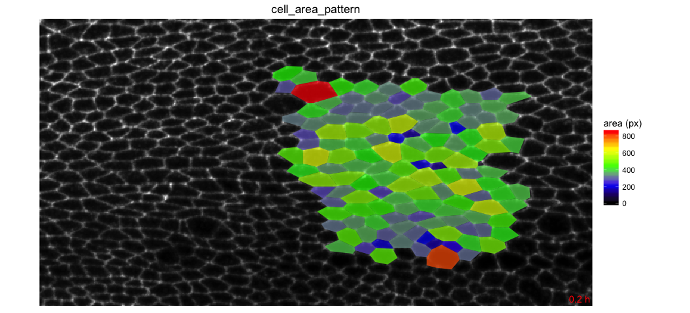
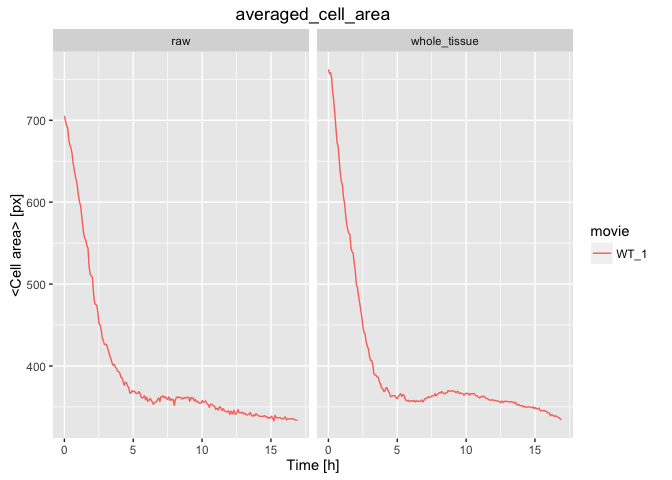
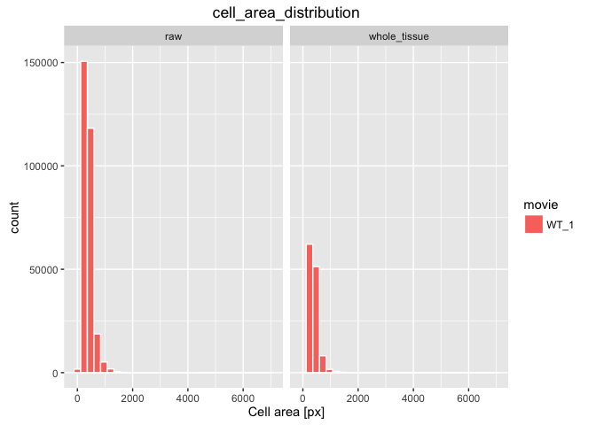
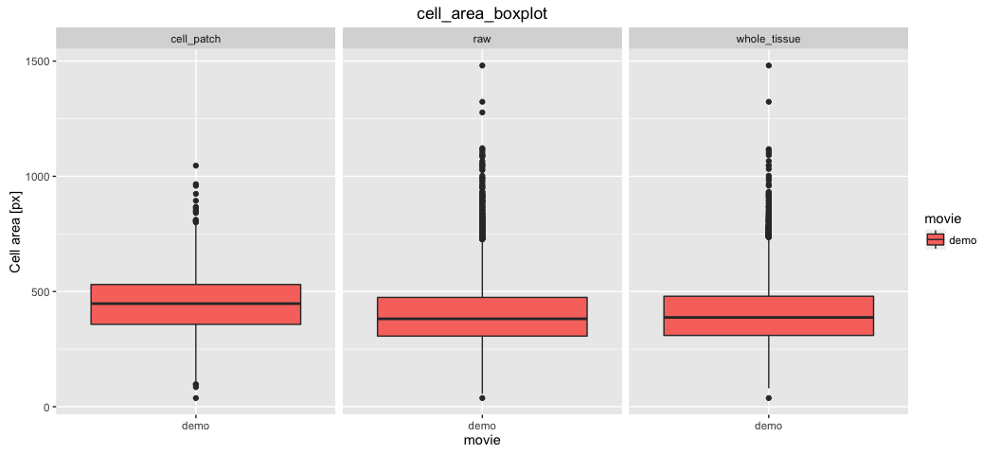
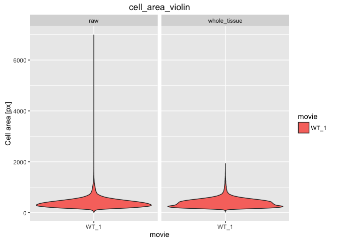

# Cell area analysis in multiple ROI's

Cell area is stored in the database, but ROI's are not. ROI's are identified by their name. Here are the available ROI's for the example data: 

* raw 
* whole_tissue
* cell_patch

### 1. Make a movie of cell area pattern plotted on the tissue for the *cell_patch* ROI

* Copy-paste the following commands in the terminal:

```
tm sm roi_tracking 
tm cell_area_pattern.R . output_analysis "cell_patch"
```



[How to look at the results ?](../tm_qs_example_data.md#4-look-at-the-results) **|** 
[Back to tutorial list](../tm_qs_example_data.md#3-select-the-analysis-you-are-interested-in) **|** 
[Try with your own data](../tm_qs_user_data.md#first-use-of-tissueminer-with-your-own-data)

### 2. Plot cell area distrubution and averages in each ROI
* Copy-paste the following commands in the terminal:

```
tm sm make_db 
tm cell_area_graphs.R . output_analysis "raw whole_tissue cell_patch"
```



[How to look at the results ?](../tm_qs_example_data.md#4-look-at-the-results) **|** 
[Back to tutorial list](../tm_qs_example_data.md#3-select-the-analysis-you-are-interested-in) **|** 
[Try with your own data](../tm_qs_user_data.md#first-use-of-tissueminer-with-your-own-data)

### 3. For further details

* compare multiple movies and ROI's, see [TM R User Manual](https://mpicbg-scicomp.github.io/tissue_miner/tm_tutorial/R-tutorial.html#comparing-averaged-quantities-between-movies-and-rois)
