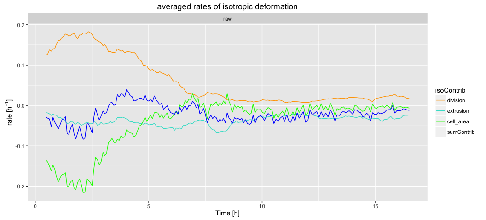

# Cell contributions to tissue area change analysis

Cell contributions to tissue area changes are easily calculated from the database. It is therefore sufficient to build the database only.


### 1. Plot the rate of tissue area changes and its cellular contributions

* Copy-paste the following commands in the terminal:

```
tm sm make_db
tm cell_contributions_to_tissue_area_change_rate.R . output_analysis
```



[How to look at the results ?](../tm_qs_example_data.md#4-look-at-the-results) **|** 
[Back to tutorial list](../tm_qs_example_data.md#3-select-the-analysis-you-are-interested-in)


### 2. For further details

* compare multiple movies and ROI's, see [TM R User Manual](https://mpicbg-scicomp.github.io/tissue_miner/tm_tutorial/R-tutorial.html#comparing-averaged-quantities-between-movies-and-rois)
