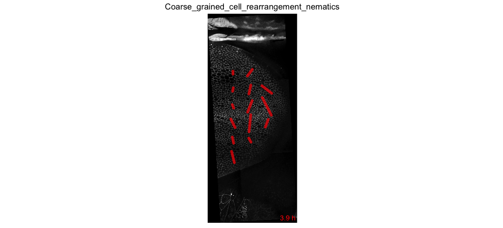

# Cell rearrangement analysis

Cell neighbor changes are calculated from the database using a dedicated routine included in the automated workflow. Therefore, on top of building the database, we also run this routine with the command `sm topo_countt1`


### 1. Make a video of the cell rearrangement coarse-grained pattern plotted on the tissue

* Copy-paste the following commands in the terminal:

```
sm topo_countt1 
cell_neighbor_change_orientation_pattern.R . output_analysis
```



[Select another analysis](tm_qs_example_data.md)


### 2. Plot cell neighbor change rate
* Copy-paste the following commands in the terminal:

```
sm topo_countt1 
cell_neighbor_change_rate.R . output_analysis
```


[Select another analysis](tm_qs_example_data.md)

### 3. Plot average cell neighbor change orientation as a function of time
* Copy-paste the following commands in the terminal:

```
sm topo_countt1 
cell_neighbor_change_orientation.R . output_analysis
```


[Select another analysis](tm_qs_example_data.md)

### 4. For further details
* filter by regions of interest, see [Master Guide](https://mpicbg-scicomp.github.io/tissue_miner/tm_tutorial/R-tutorial.html#plot-the-color-coded-cell-area-pattern-in-the-whole_tissue-roi)
* compare multiple movies and ROI's, see [Master Guide](https://mpicbg-scicomp.github.io/tissue_miner/tm_tutorial/R-tutorial.html#comparing-averaged-quantities-between-movies-and-rois)
