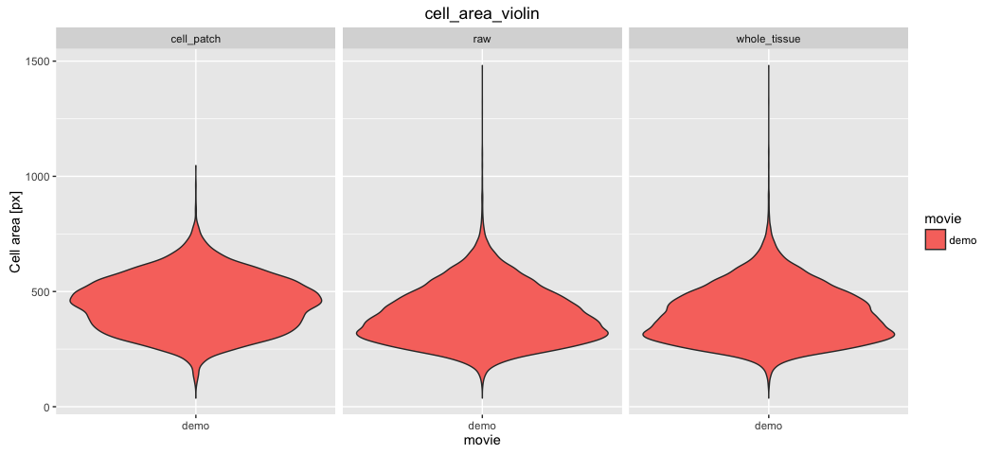

# Cell area analysis in multiple ROI's


### 1. Make a movie of cell area pattern plotted on the tissue for the *cell_patch* ROI

What if you suspect that different parts of the tissue are doing different cellular behaviours (or have different areas, for example) and you want to analyse them separately and compare them? In our example data we have provided three ROIs:

* raw (created by the workflow, this default ROI includes all segmented cells)
* whole_tissue (created by the workflow, this default ROI only includes cells that are never in contact to the image border)
* cell_patch (user defined ROI, created by the author of this tutorial)

In your own data, you can draw as many ROIs as necessary! ROIs can be overlapping (one cell can belong to many different ROIs). In our workflow, the information about which cells belong to which ROIs is not included in the database but accounted for separately by running the `tm sm roi_tracking` command. The next command on the right will calculate cell area for the ROI called 'cell_patch'. It takes the current movie directory `.` as an input and it outputs the results in the `output_analysis` folder within the same movie directory.


If you have multiple ROIs, just write them next to each other separated by a space or a coma as you wish, but don't forget the quotes.


* Copy-paste the following commands in the terminal (watch the quotes !):

```
tm "sm roi_tracking; cell_area_pattern.R . output_analysis 'cell_patch'"
```


[Where to find the results ?](../tm_qs_example_data.md#4-look-at-the-results) **|** 
[Back to tutorial list](../tm_qs_example_data.md#3-select-the-analysis-you-are-interested-in)

### 2. Plot cell area distrubution and averages in each ROI

A graph is even more powerful than a movie when you want to compare different regions. Here, we compare the average cell area or distributions of cell areas in different regions. The `tm sm make_db` command builds the database if not yet present (or returns "Nothing to be done" if the database is present). The next command does the plots. It takes the current movie directory `.` as an input and it outputs the results in the `output_analysis` folder within the same movie directory.

* Copy-paste the following commands in the terminal:

```
tm "sm make_db; cell_area_graphs.R . output_analysis 'raw whole_tissue cell_patch'"
```



[Where to find the results ?](../tm_qs_example_data.md#4-look-at-the-results) **|** 
[Back to tutorial list](../tm_qs_example_data.md#3-select-the-analysis-you-are-interested-in)

### 3. For further details

* compare multiple movies and ROI's, see [TM R User Manual](https://mpicbg-scicomp.github.io/tissue_miner/user_manual/TM_R-UserManual.html#comparing-averaged-quantities-between-movies-and-rois)
