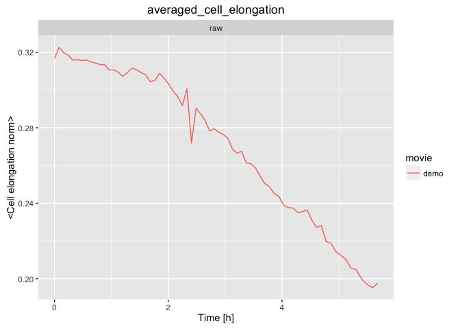
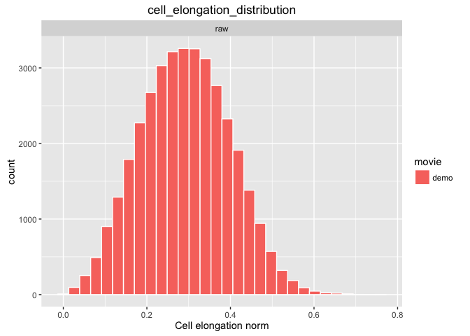

# Cell elongation analysis

### 1. Make a movie of cell elongation magnitude pattern plotted on the tissue

We want to colour code the movie by cell shape anisotropy (elongation magnitude). The `tm sm make_db` command will first build a database from the segmented data (or return "Nothing to be done" if the database is already present). The next command on the right will run the cell elongation analysis and make the video we want. It outputs the data in the output_analysis folder within the same movie directory.

* Copy-paste the following commands in the terminal:

```
tm sm make_db; tm cell_elongation_magnitude_pattern.R . output_analysis
```


[Where to find the results ?](../tm_qs_example_data.md#4-look-at-the-results) **|** 
[Back to tutorial list](../tm_qs_example_data.md#3-select-the-analysis-you-are-interested-in)


### 2. Make a movie of coarse-grained cell elongation nematics plotted on the tissue

We want to calculate the cell shape anisotropy averaged in each element of a square grid, and we want plot the orientation axes (elongation nematics) on the tissue. The `tm sm make_db` command will first build a database from the segmented data (or return "Nothing to be done" if the database is already present). The next command then runs the cell elongation orientation analysis and makes the video we want. It outputs the data in the output_analysis folder within the same movie directory.


* Copy-paste the following commands in the terminal:

```
tm sm make_db; tm cell_elongation_nematic_cg_pattern.R . output_analysis
```


[Where to find the results ?](../tm_qs_example_data.md#4-look-at-the-results) **|** 
[Back to tutorial list](../tm_qs_example_data.md#3-select-the-analysis-you-are-interested-in)

### 3. Plot cell elongation distribution and averages

We now want to make some graphs that demonstrate how the distributions of cell elongation behave in the movie. For example, we will make a graph to show how the cell elongation on average changes over time. The `tm sm make_db` command builds the database if not yet present (or returns "Nothing to be done" if the database is present). The next command does the plots and saves them in the output_analysis folder within the same movie directory.

* Copy-paste the following commands in the terminal:

```
tm sm make_db; tm cell_elongation_graphs.R . output_analysis
```



[Where to find the results ?](../tm_qs_example_data.md#4-look-at-the-results) **|** 
[Back to tutorial list](../tm_qs_example_data.md#3-select-the-analysis-you-are-interested-in)

### 4. For further details

* compare multiple movies and ROI's, see [TM R User Manual](https://mpicbg-scicomp.github.io/tissue_miner/user_manual/TM_R-UserManual.html#comparing-averaged-quantities-between-movies-and-rois)
