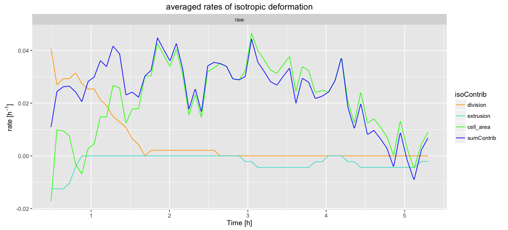

# Cell contributions to tissue area change analysis

### 1. Plot the rate of tissue area changes and its cellular contributions

We want to plot cellular contributions to tissue area changes. The `sm make_db` command will first build a database from the segmented data (or return "Nothing to be done" if the database is already present). The next command below will run the analysis and make the video we want. It takes the current movie directory `.` as an input and it outputs the results in the `output_analysis` folder within the same movie directory.

* Copy-paste the following commands in the terminal:

```
sm make_db
cell_contributions_to_tissue_area_change_rate.R . output_analysis
```



[Where to find the results ?](../tm_qs_example_data.md#4-look-at-the-results) **|** 
[Back to tutorial list](../tm_qs_example_data.md#3-select-the-analysis-you-are-interested-in)


### 2. For further details

* compare multiple movies and ROI's, see [TM R User Manual](https://mpicbg-scicomp.github.io/tissue_miner/user_manual/TM_R-UserManual.html#comparing-averaged-quantities-between-movies-and-rois)
