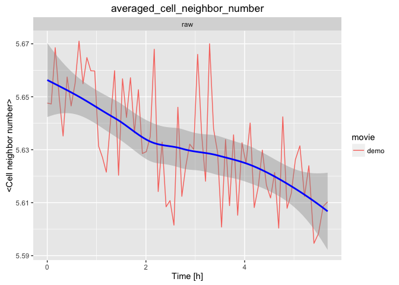

# Cell packing analysis


### 1. Make a video of color-coded cell neighbor number plotted on the tissue

We want to colour code the movie by cell neighbor number.  The `sm make_db` command will first build a database from the segmented data (or return "Nothing to be done" if the database is already present). The next command below will run the cell neighbor number analysis and make the video we want. It takes the current movie directory `.` as an input and it outputs the results in the `output_analysis` folder within the same movie directory.

* Copy-paste the following commands in the terminal:

```
sm make_db 
cell_neighbor_number_pattern.R . output_analysis
```


[Where to find the results ?](../tm_qs_example_data.md#4-look-at-the-results) **|** 
[Back to tutorial list](../tm_qs_example_data.md#3-select-the-analysis-you-are-interested-in)

### 2. Plot cell neighbor count and averages

We now want to make some graphs that demonstrate how the distributions of cell neighbor number behave in the movie. For example, we will make a graph to show how the averaged neighbor number changes over time.  We need a database, but we also need to run the `sm topo_countt1` command, which will take information from the database and detect cell neighbor changes (using a routine that is included in the automated workflow). This command will also build the database if not yet present. The next command below runs the analysis and makes the video we want. It takes the current movie directory `.` as an input and it outputs the results in the `output_analysis` folder within the same movie directory.

* Copy-paste the following commands in the terminal:

```
sm topo_countt1 
cell_neighbor_number_graphs.R . output_analysis
```



[Where to find the results ?](../tm_qs_example_data.md#4-look-at-the-results) **|** 
[Back to tutorial list](../tm_qs_example_data.md#3-select-the-analysis-you-are-interested-in)

### 3. For further details

* compare multiple movies and ROI's, see [TM R User Manual](https://mpicbg-scicomp.github.io/tissue_miner/user_manual/TM_R-UserManual.html#comparing-averaged-quantities-between-movies-and-rois)
