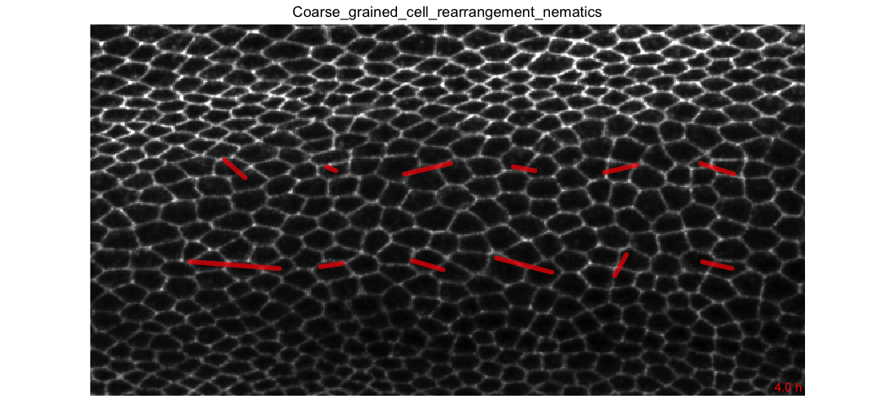

# Cell rearrangement analysis

### 1. Make a video of the cell rearrangement coarse-grained pattern plotted on the tissue

We want to calculate the coarse-grained orientation of cell neighbor changes, _e.g_ averaged in each element of a square grid, and we want to overlay the orientation axes (unit nematics) on the tissue. We need the database, but we also need to run the `sm topo_countt1` command, which will take information from the database and detect cell neighbor changes (using a routine that is included in the automated workflow). This command will also build the database if not yet present. The next command below runs the analysis and makes the video we want. It takes the current movie directory `.` as an input and it outputs the results in the `output_analysis` folder within the same movie directory.


* Copy-paste the following commands in the terminal:

```
sm topo_countt1 
cell_neighbor_change_orientation_pattern.R . output_analysis
```



[Where to find the results ?](../tm_qs_example_data.md#4-look-at-the-results) **|** 
[Back to tutorial list](../tm_qs_example_data.md#3-select-the-analysis-you-are-interested-in)


### 2. Plot cell neighbor change rate

Now, we want to make a graph that shows the average cell neighbor change rate per cell. The `sm topo_countt1` command will take information from the database and detect cell neighbor changes (or return "Nothing to be done" if already computed before). This command will also build the database if not yet present. The next command below does the plot. It takes the current movie directory `.` as an input and it outputs the results in the `output_analysis` folder within the same movie directory.

* Copy-paste the following commands in the terminal:

```
sm topo_countt1 
cell_neighbor_change_rate.R . output_analysis
```


[Where to find the results ?](../tm_qs_example_data.md#4-look-at-the-results) **|** 
[Back to tutorial list](../tm_qs_example_data.md#3-select-the-analysis-you-are-interested-in)

### 3. Plot average cell neighbor change orientation as a function of time

We now want to plot the average cell neighbor change orientation as a function of time in a circular diagram. The time is color coded. The `sm topo_countt1` command will take information from the database and detect cell neighbor changes (or return "Nothing to be done" if already computed before). This command will also build the database if not yet present. The next command below does the plot. It takes the current movie directory `.` as an input and it outputs the results in the `output_analysis` folder within the same movie directory.

* Copy-paste the following commands in the terminal:

```
sm topo_countt1 
cell_neighbor_change_orientation.R . output_analysis
```


[Where to find the results ?](../tm_qs_example_data.md#4-look-at-the-results) **|** 
[Back to tutorial list](../tm_qs_example_data.md#3-select-the-analysis-you-are-interested-in)

### 4. For further details

* compare multiple movies and ROI's, see [TM R User Manual](https://mpicbg-scicomp.github.io/tissue_miner/user_manual/TM_R-UserManual.html#comparing-averaged-quantities-between-movies-and-rois)
