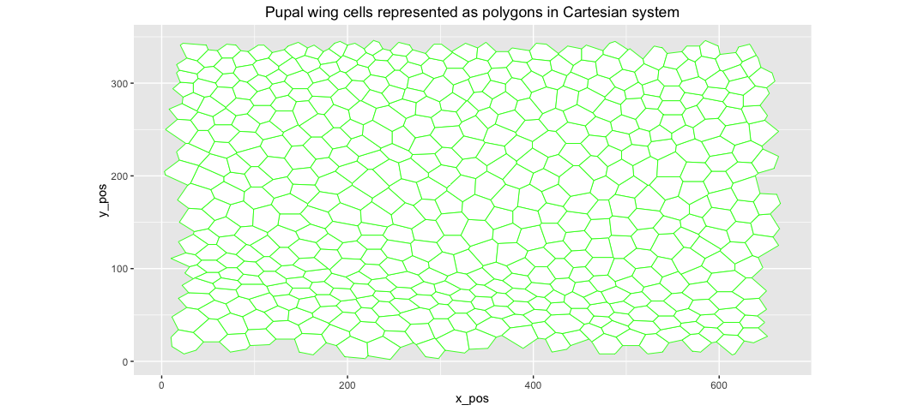
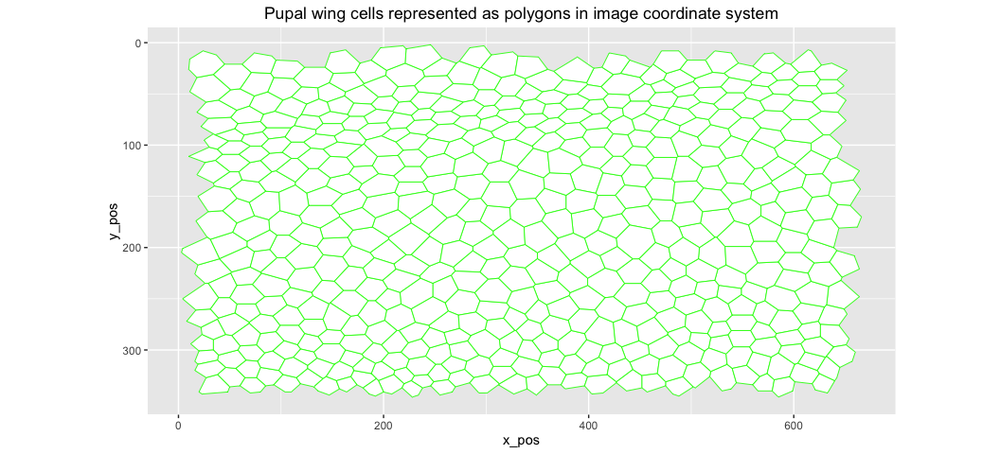

# Learning the R basics for TissueMiner

**Tutorial layout**: the code is encapsulated in shaded grey boxes that delimit **code chunks**. The **results** are displayed immediately below in an open box in which all lines start with the ## sign. Within code chunks, **comments** are visible in green and are prefixed with at least a # sign. The comments indicate what the following code does. Here is an example:


```r
# This is a comment: the code below will print "Welcome to TissueMiner"
print("Welcome to TissueMiner")
```

```
## [1] "Welcome to TissueMiner"
```

# R: the basics

Many books or web sites describe the R language, and we only introduce the necessary knowledge to understand this tutorial.
We recommend of few references that have been useful to us:

* *The art of R programming* by Norman Matloff 
* *R cookbook* by Paul Teetor
* *R graphics cookbook* by Winston Chang
* [R cheatsheets/](https://www.rstudio.com/resources/cheatsheets/)
* [General overview](http://www.r-bloggers.com/how-to-learn-r-2/)
* Useful dplyr sources
    + [dplyr tutorial](http://genomicsclass.github.io/book/pages/dplyr_tutorial.html)
    + [dplyr introduction](https://cran.rstudio.com/web/packages/dplyr/vignettes/introduction.html)
    + [dplyr webinar](https://pages.rstudio.net/Webinar-Series-Recording-Essential-Tools-for-R.html)
* Useful ggplot sources
    + [ggplot tutorial](http://minimaxir.com/2015/02/ggplot-tutorial/)
    + [ggplot tutorial](https://github.com/jennybc/ggplot2-tutorial)
    + [ggplot overview](https://ulhpc-tutorials.readthedocs.org/en/latest/advanced/R/README/)
* [Importing data into R](https://www.datacamp.com/courses/importing-data-into-r/)
* [Courses](https://www.datacamp.com/courses)

## Variable assignment and simple instructions


```r
# assign a number to the variables x and y
x <- 2
y <- 3
# display the result of x + y
x + y
```

```
## [1] 5
```

```r
# is x equal y?
x==y
```

```
## [1] FALSE
```

```r
# is x different from y?
x!=y
```

```
## [1] TRUE
```

```r
# is x superior to y? 
x>y
```

```
## [1] FALSE
```

```r
# is x inferior to y?
x<y
```

```
## [1] TRUE
```

***

## A vector is a series of values. 

```r
# assign a vector to x and to y:
x <- c(4,3,2)
y <- c(1,2,3)
# assign a bolean vector to z:
z <- c(TRUE,FALSE,TRUE)
# display the result of x + y (element-wise addition):
x + y
```

```
## [1] 5 5 5
```

```r
# display the result of x + y + z (z is automatically coerced to integers)
x + y + z
```

```
## [1] 6 5 6
```

***

## Named vectors
In some cases, it is convenient to name each element of the vector. Such a vector is useful to store configuration parameters.

```r
# assign a named vector to x:
x <- c("movie1"="red", "movie2"="blue", "movie3"="green")
# display the content of x
x
```

```
##  movie1  movie2  movie3 
##   "red"  "blue" "green"
```

***

## Tabular data: dataframe
Tabular data that we obtain from the relational database are stored in a table refereed to as *dataframe* in the R language. This tutorial essentially shows how to manipulate dataframes in order to perform calculations and prepare the data for plotting. A dataframe is composed of columns that correspond to vectors of identical length.

```r
# Assign a data frame to x:
x <- data.frame(frame=c(1,2,3), cell_area=c(20,22,24))
# display the content of x:
x
```

```
##   frame cell_area
## 1     1        20
## 2     2        22
## 3     3        24
```

```r
# display the number of lines in x:
nrow(x)
```

```
## [1] 3
```

```r
# display the 2 first rows of x:
head(x, n=2)
```

```
##   frame cell_area
## 1     1        20
## 2     2        22
```

```r
# display the 2 last rows of x:
tail(x, n=2)
```

```
##   frame cell_area
## 2     2        22
## 3     3        24
```

***

# Query a relational database using the SQL language

* **Simplicity of the SQL language:** only three words ***select***, ***from***, and ***where*** are sufficient to perform database queries: one can ***select*** the desired columns ***from*** a given table ***where*** the rows of a given column fulfill a user defined criterium.
* A SQL query results in a table or dataframe that we assign to a variable in the R language
* More complicated SQL queries are possible, but we will instead use the grammar of data manipulation provided in R to manipulate the dataframes in the computer memory.


```r
library(RSQLite)

# open a connection to the database of the demo movie (example data)
movieDbBaseDir <- "~/example_data"
movieDir <- file.path(movieDbBaseDir, c("demo"))
dbFile=file.path(movieDir, paste0(basename(movieDir), ".sqlite"))
# Connection to the DB stored in the "db" variable
db <- dbConnect(SQLite(),dbname=paste0(dbFile))


# Use the built-in "dbGetQuery" function to query the database
# Write SQL statements in quotes
# Assign the resulting data frame to the "cellProperties" variable
cellProperties <- dbGetQuery(db, "select cell_id, frame, area from cells")

# show first lines of the table
head(cellProperties)
```

```
##   cell_id frame area
## 1   10000     0    0
## 2   10000     1    0
## 3   10000     2    0
## 4   10000     3    0
## 5   10000     4    0
## 6   10000     5    0
```

```r
# Filter out the margin cell (id 10000) around the tissue
cellProperties <- dbGetQuery(db, "select cell_id, frame, area from cells
                                  where cell_id!=10000") 
```

# Manipulate large data sets using a grammar of data manipulation

* Here, we briefly introduce the main verbs and the syntax of the grammar of data manipulation supplied by the dplyr package. In practice, just **a single operator and about 5 verbs only are sufficient to effectively manipulate data**. We also encourage the user to download the Rstudio cheat sheet [here](http://www.rstudio.com/resources/cheatsheets/) in which the grammar is summarized.

* Simply stated, this grammar allows the user to **chain a series of operations** by using the pipe operator **%>%**. In each step of the chain, every intermediate result is taken as an input for the next operation. Each type of operation on dataframes is identified by a verb. 

* This grammar also allows the user to chain other built-in R-functions or custom ones.

In the present tutorial, we mainly use the following few verbs:

Functions | Description | Package
--------------|-------------|-------------
**dbGetQuery** | query a SQLite database and returns a dataframe | RSQLite
**mutate** | perform calculations on columns by adding or modifying existing ones | dplyr
**summarize** | compute summary statistics | dplyr
**group_by** (**ungroup**) | subsets data into chunks prior to a mutate or a summarize operation | dplyr
**filter** | parse data on row content | dplyr
**select** | parse data on column names | dplyr
**arrange** | order values of desired columns | dplyr
**inner_join** | merge two data frames by intersecting user-defined columns | dplyr
**melt** or **gather** | gather columns into rows |reshape2/dplyr
**dcast** or **spread** | spread rows into columns | reshape2/dplyr

***

## Learning the grammar on the provided example data


**Goal:** calculate the average cell area in square microns as function of time in hours from start of time-lapse recording. 

If you haven't yet downloaded the example dataset in your home folder, please run the command below in a terminal


```bash
curl https://cloud.mpi-cbg.de/index.php/s/COYw9ugcG9BJQnf/download  | tar -zxvf -
```

**Howto:**

* load the necessary R libraries
* open a connection to the database of the demo movie (example data)
* use the **dbGetQuery()** function to input a dataframe to start the chain of operations
* use the **%>%** operator to chain operations
* manipulate the input dataframe using the *dplyr* grammar 


```r
# Load the necessary R libraries
library(dplyr)

# use the **dbGetQuery()** function to input a dataframe to start the chain of operations
# use the **%>%** operator to chain operations
# manipulate the input dataframe using the *dplyr* grammar 
avgCellArea <- dbGetQuery(db, "select cell_id, frame, area from cells") %>%
  # remove the huge artificial margin cell around the tissue
  filter(cell_id!=10000) %>%
  # convert pixel to squared microns knowing that 1px = 0.207 micron
  mutate(area_real=(0.207)^2*area) %>%
  # indicate that the next function must be applied frame-wise 
  group_by(frame) %>%
  # calculate the average area in each frame of the time-lapse
  summarize(area_avg=mean(area_real)) %>%
  # cancel grouping
  ungroup() %>% 
  # bring time in seconds into the current table by matching the frame number
  inner_join(dbGetQuery(db, "select * from frames"), by="frame") %>%
  # convert time to hours
  mutate(time_h=round(time_sec/3600, 1)) %>%
  # remove the unecessary columns
  select(-c(frame, time_sec)) %>%
  # order time chronologically
  arrange(time_h)
```

***

## Vectorized conditional statement (ifelse)
The R language provides a vectorized **ifelse()** function that we can then use in combination with the dplyr grammar. The vectorized **ifelse()** function takes 3 arguments corresponding to the condition (if), the consequent (then), and the alternative (else).


```r
# Here, is an example in which we display each intermediate step
cell <- dbGetQuery(db, "select cell_id, frame, area, elong_xx, elong_xy from cells") %>% 
  # additional column isMarginCell to flag the margin cell as "true"
  mutate(isMarginCell=ifelse(cell_id==10000, TRUE, FALSE))
```

***

## Modify table layout into wide or long formats

### Wide to long format: the melt() or gather() function.
The  melt() (or gather()) function creates two columns: 

* one 'variable' column listing variable names 
* one 'value' column with their corresponding value.

Both **melt()** and **gather()** are equivalent, gather() being the newest implementation from the dplyr package.


```r
# Load necessary libraries
library(data.table)
library(tidyr)

# Example 1: 
# by default, melt() only gathers numerical data into a pair of {variable, value} columns
longFormat <- melt(cell) 
# by default, gather() gathers all columns
longFormat <- gather(cell) 
head(longFormat)
```

```
##       key value
## 1 cell_id 10000
## 2 cell_id 10000
## 3 cell_id 10000
## 4 cell_id 10000
## 5 cell_id 10000
## 6 cell_id 10000
```

```r
# Of note, the two columns {cell_id, frame} uniquely define each cell in frame 
# Therefore, to keep consistent data, the frame column should not be gathered

# Example 2: specify which columns to gather into {variable, value} columns
longFormat <- melt(cell, measure.vars = c("area","elong_xx","elong_xy","isMarginCell")) 
# Or
longFormat <- gather(cell, variable, value, c(area,elong_xx,elong_xy,isMarginCell)) 
head(longFormat)
```

```
##   cell_id frame variable value
## 1   10000     0     area     0
## 2   10000     1     area     0
## 3   10000     2     area     0
## 4   10000     3     area     0
## 5   10000     4     area     0
## 6   10000     5     area     0
```

```r
# Example 3: specify which columns shouldn't be gathered (equivalent to example 2)
longFormat <- melt(cell, id.vars =  c("cell_id","frame")) 
# Or
longFormat <- gather(cell, variable, value, -c(cell_id,frame)) 
head(longFormat)
```

```
##   cell_id frame variable value
## 1   10000     0     area     0
## 2   10000     1     area     0
## 3   10000     2     area     0
## 4   10000     3     area     0
## 5   10000     4     area     0
## 6   10000     5     area     0
```

***

### Lond to wide format: the dcast() or spread() function
The  dcast() (or spread()) function creates as many columns as variable names contained in the 'variable' column and lists the corresponding values. Both **dcast()** and **spread()** are equivalent, spread() being the newest implementation from the tidyr package.


```r
# The melt operation is reversible (the row identifiers must be uniquely defined),
# but booleans area coerced into numeric format
# Using dcast(), cell_id and frame are the row identifiers,
# wherease the variable column is spread into column names
example <- cell  %>%
  melt(id.vars =  c("cell_id","frame"))  %>%
  dcast(cell_id+frame~variable, value.var="value") 
# Or
example <- cell  %>%
  gather(variable, value, -c(cell_id,frame))  %>%
  spread(variable,value) 
head(example)
```

```
##   cell_id frame area elong_xx elong_xy isMarginCell
## 1   10000     0    0        0        0            1
## 2   10000     1    0        0        0            1
## 3   10000     2    0        0        0            1
## 4   10000     3    0        0        0            1
## 5   10000     4    0        0        0            1
## 6   10000     5    0        0        0            1
```


***

# Visualize complex data sets using a grammar of graphics 

* Here, we briefly introduce the main verbs and the syntax of the grammar of data **visualization** supplied by the ggplot2 package. In practice, just a single operator and a few visual marks are sufficient to effectively plot data. We also encourage the user to download the corresponding Rstudio cheat sheet [here](http://www.rstudio.com/resources/cheatsheets/) regarding data visualization with ggplot2.

* Simply stated, this grammar allows the user to **chain multiple graphical layers to construct a graph** by using the plus operator **+**, thereby improving the clarity of the code for complex graphs.


Some geometrical layers (common types of graphs):

Function | Description | Package or project
---------|-------------|-------------------
**ggplot** | map data to graph elements (axes, colors, etc...)| ggplot2
**geom_point** | plot  data as points | ggplot2
**geom_line** | join the points by lines | ggplot2
**geom_segment** | plot a segment (nematic tensor or cell bond) | ggplot2
**geom_polygon** | plot a polygon (cell contour) | ggplot2
**render_frame** | plot data onto one movie image | TissueMiner
**render_movie** | plot data onto every movie image and make a movie |TissueMiner

Some complementary scaling layers:

Function | Description | Package or project
---------|-------------|-------------------
**scale\_x\_continuous** | to control the x axis rendering | ggplot2
**scale_color_gradientn** | to use a gradient of colors when rendering the data | ggplot2


Saving a graph in the desired format (raster or vector graphics)

Function | Description | Package or project
---------|-------------|-------------------
**ggsave2** | save plots  | TissueMiner (using ggplot2)


**Example:**


**Goal:** plot the average cell area in square microns as function of time in hours from start of time-lapse recording:

* use the **ggplot()** function
* ggplot's first argument is the dataframe containing the data to be plotted
* ggplot's **aes()** function: to map the data to the system of coordinates


```r
# Load the necessary libraries
library(ggplot2)

# Show the first rows of the previously calculated avgCellArea data frame:
head(avgCellArea)
```

```
## Source: local data frame [6 x 2]
## 
##   area_avg time_h
##      (dbl)  (dbl)
## 1 16.46156    0.0
## 2 16.17277    0.1
## 3 16.27033    0.2
## 4 16.21719    0.2
## 5 16.22896    0.3
## 6 16.27422    0.4
```

```r
# Map the data to the system of coordinates using ggplot
ggplot(avgCellArea, aes(x = time_h, y = area_avg)) +
  # plot the average area as a line using geom_line
  geom_line() +
  # add a title
  ggtitle("Average cell area as function of time")
```

<!-- -->


* save the graph with **ggsave2()**


```r
# Save the plot as svg for editing in Inkscape
#ggsave2(width=14, unit="in", outputFormat="svg")
```

***

# Apply the R-grammar to visualize cells

* Cells can be rendered as polygons using the vertices ordered anti-clockewisely around each cell. Vertices ordering is performed in the automated TissueMiner workflow.
* The ordered list of vertices around each cell is stored in the *cellshapes.RData* table in the same folder as the database file.
* The **geom_polygon()** function is used to represent cells as polygons on the original image.


```r
# Load data into the 'cellshapes' variable
load(file.path(movieDir, "cellshapes.RData")) 
head(cellshapes)
```

```
## Source: local data frame [6 x 5]
## 
##   frame cell_id x_pos y_pos bond_order
##   (int)   (int) (dbl) (dbl)      (dbl)
## 1     0   10001   193   195          1
## 2     0   10001   189   199          2
## 3     0   10001   206   212          3
## 4     0   10001   229   206          4
## 5     0   10001   219   192          5
## 6     0   10001   217   190          6
```

***

## Example 1: plot cells as polygons in the Cartesian system


```r
ggplot(cellshapes %>% filter(frame==70)) +
  # plot cells as polygons:
  geom_polygon(aes(x_pos, y_pos, group=cell_id),color="green",fill="white", size=0.3) +
  # X and Y axes must have the same scale:
  coord_equal() +
  # add a title "Pupal wing cells represented as polygons in Cartesian system" 
  ggtitle("Pupal wing cells represented as polygons in Cartesian system")
```

<!-- -->

***

## Example 2: plot cells as polygons in the image coordinate system


```r
ggplot(cellshapes %>% filter(frame==70)) +
  geom_polygon(aes(x_pos, y_pos, group=cell_id),color="green",fill="white", size=0.3) + 
  coord_equal() +
  # In an image coordinate system, the Y-axis is pointing downwards. We flip the Y-axis:
  scale_y_continuous(trans = "reverse") +
  ggtitle("Pupal wing cells represented as polygons in image coordinate system")
```

<!-- -->

***

## Example 3: plot cells and vertices


```r
ggplot(cellshapes %>% filter(frame==70)) +
  geom_polygon(aes(x_pos, y_pos, group=cell_id),color="green",fill="white", size=0.3) +
  # plot each vertex as a point:
  geom_point(aes(x_pos, y_pos),color="red", size=0.4) + 
  coord_equal() +
  scale_y_continuous(trans = "reverse") +
  ggtitle("Pupal wing cells and vertices")
```

<!-- -->

***


