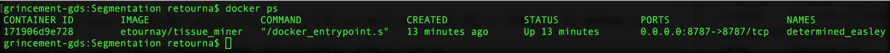

```{r set-options, echo=FALSE, cache=FALSE}
options(width=60)

```


# Introduction to TissueMiner

* **Prerequisite:** it is assumed in this User Manual that the user has done the [Quickstart tutorials](https://github.com/mpicbg-scicomp/tissue_miner#documentation).

* **We provide one demo dataset (demo) and three processed time-lapses** corresponding to the distal part of 3 wild-type *Drosophila* pupal wings (WT_1, WT_2 and WT_3).

* **No programming skill required:** the tutorial [Learning_the_R_basics_for_TissueMiner](Learning_the_R_basics_for_TissueMiner.html) will guide the user, without any previous knowledge in programming, through the main aspects of data manipulation and visualization using the R language. 

* **The power of an existing grammar** to manipulate and to visualize data. The open-source R language now provides very efficient and simple ways to handle important amount of tabular data, using a so called "grammar" of data manipulation (*dplyr* package) and visualization (*ggplot2* package) (by [Hadley Wickham](http://hadley.nz/)). We found R to be ideal for querying our relational databases (*RSQLite* package), and to perform subsequent calculations and analyses for understanding tissue morphogenesis. Thus, the user keeps control of his data by learning a few verbs and the simple syntax of the grammar. This gives the advantage of full autonomy on the data that can manipulated without restriction. 

* **TissueMiner extends this grammar** by providing an Application Programming Interface (API) to facilitate the visualization and quantification of cell dynamics during tissue morphogenesis. This API consists of a series of easy-to-use commands that we describe here on examples.

* **TissueMiner is compatible with the Python programming language**. We provide a [Python-tutorial](https://github.com/mpicbg-scicomp/tissue_miner/blob/master/docs/TM_tutorial_in_Python/TissueMiner_pythonTutorial-3WT_Demo.md#tissueminer-python-tutorial) of TissueMiner.

* **High performance computing platform**. TissueMiner has been designed to be used in command-line in order to easily batch repetitive tasks and to run tasks on a high performance computing platform (cluster). 

* **A comprehensive HOWTO** to visualize and quantify cell dynamics in 2D tissues, by a simple copy-paste of the code encapsulated in shaded grey boxes into a R-shell such as in [RStudio](https://www.rstudio.com/products/rstudio/). We also provide a single script [analyze_movie.R](https://github.com/mpicbg-scicomp/tissue_miner/blob/master/docs/quickstart/scripts/analyze_movie.R) to perform tasks of the section 2 of this User Manual. We strongly encourage the user to use RStudio or a similar software to conveniently run the R programs step by step.

* **TissueMiner can easily be extended** by the user to address project-specific questions

* **Tutorial layout**: the code is encapsulated in shaded grey boxes that delimit **code blocks**. The **results** are displayed immediately below in an open box in which all lines start with the ## sign. Within code blocks, **comments** are visible in green and are prefixed with at least a # sign. The comments indicate what the following code does. Here is an example:

```{r layout example, warning=FALSE, message=FALSE, echo=T}
# This is a comment: the code below will print "Welcome to TissueMiner"
print("Welcome to TissueMiner")
```

## Prepare the movie data
### First, organize your movie images as follows

* Create a **movie_repository folder** where you store the data from all your movies
    + Inside this folder, create one **movie folder** per movie
        + inside each movie folder, create a **Segmentation folder** to store movie images
            + the movie should be stored as a series of tif or png files, one per timepoint, with the name of each file composed of a sample name + underscore + frame number 

The data organization is summarized as follow:

`<movie_repository>/<movie_directory>/Segmentation/<movie_directory_name>_%03d.png`


where %03d represents a frame number padded with 3 digits. The number of digits can be modified, see [FAQ](https://github.com/mpicbg-scicomp/tissue_miner/blob/master/faq.md#how-to-change-the-number-of-digits-used-for-padding-).


Here, is an example: movieSegmentation/demo/Segmentation/demo_000.png


* The image type should be **8-bit** or **RGB**.
* The image format should be **png** or **tiff**


### Segment and track cells using TissueAnalyzer

**Tissue Analyzer** (copyright Aigouy 2016) ships with its own licence
(see license_TA.txt bundled in the software). Tissue Analyzer should not be modified or
reverse engineered.  Tissue Analyzer should always be distributed
bundled with **TissueMiner** and not alone.

You can install the latest version of Tissue Analyzer (formerly known
as Packing Analyzer) within FIJI (http://fiji.sc/Fiji). To do so:

* get a fresh FIJI installation (including JDK8)
* launch FIJI
* open the "Help" menu
* click on "Update..."
* click on "Manage update sites"
* click on "Add" and enter "http://sites.imagej.net/TA/" in the URL field (and anything you like in the "Name" field)
* click "Close" and FIJI should offer you to install TA.

Once the installation is complete, restart FIJI, open the "Plugins" menu and click on "Tissue Analyzer"

For a quick start guide, click [here](https://mpicbg-scicomp.github.io/tissue_miner/tm_tutorial/TAdoc.pdf)


### Optionally, define regions of interest (ROI's) and orient the tissue along the x or y axis
To this purpose, we provide two [FIJI](http://fiji.sc/) programs ***draw_n_get_ROIcoord.ijm*** and ***orient_tissue.ijm***.

#### Define ROI's:
* launch FIJI
* go to the ***fiji_macros*** folder located in your TissueMiner installation folder
* drag-and-drop the ***draw_n_get_ROIcoord.ijm*** file into FIJI
* a script editor opens automatically
* click **RUN** and define your ROI's   

By default, TissueMiner always creates two ROI's: 

* "raw": corresponds to all segmented and tracked cells
* "whole_tissue": corresponds to cell lineages that remain in the field of view

#### Orient the tissue
* launch FIJI
* go to the ***fiji_macros*** folder located in your TissueMiner installation folder
* drap-and-drop the ***orient_tissue.ijm*** file into FIJI
* a script editor opens automatically
* click **RUN** and define the tissue axis to be aligned on x or y. 

Both programs automatically save a text file (UserFrameRoi.txt and transformation.txt, respectively). If these files are present, TissueMiner will take them into account for further precessing steps.


## TissueMiner "snakemake" automated workflow

The snakemake automated workflow performs computationally intensive tasks. It constitutes an important part of TissueMiner as it creates the relational database, which stores information about cell geometry, cell topology and cell history for a given movie. This workflow also browses cell lineages to assign cells to regions of interest (ROI's), and it calculates cellular contributions to tissue deformation in each ROI. Finally, it can also create videos of patterned cell behaviors. 

Running time estimate on a single core (2,7 GHz Intel Core i5; 2Gb of RAM) for the provided samples:


dataset | size (Gb) | cell junction number | cell contour number | cell lineage number | ROI number | run time
--------|-----------|----------------------|---------------------|---------------------|------------|----------
**demo** | 0.1 | ~200000 | ~68000 | ~1200 | 3 | 2min48sec
**WT_3** | 2.1 | ~1450000 | ~487000 | ~8600 | 6 | 17min00sec
**WT_1** | 2.5 | ~1610000 | ~540000 | ~9400 | 6 | 18min03sec


Running times on multicore computers would significantly be reduced. 


### What are the data generated by the "snakemake" automated workflow ?
* Here is a list of important files that are generated by the **automated workflow**
    + The database: **(\<movie_name\>.sqlite)**
    + An extra table **(cellshapes.RData)** to represent cell contours by using anticlockwisely ordered cell vertices
    + An extra table **(./roi_bt/lgRoiSmoothed.RData)** to store cells in user-defined **regions of interest**
    + An extra table **(./topochanges/t1DataFilt.RData)** to store cell neighbor changes
    + An extra table **(./shear_contrib/triangles.RData)** to store triangles
    + Extra tables **(./shear_contrib/\<ROI_name\>/avgDeformTensorsWide.RData)** to store the calculated pure shear deformation of triangles and tissue for each region of interest
        
### Select specific rules to run part of the "snakemake" automated workflow
* A graph represents the order and the relations between rules (tasks) to be run. You can see such a graph in Figure 7 of the [resource paper]().
* Command to run the complete workflow including video creation: `sm all`
* Command to see all non-processed rules: `sm -n`
* Command to build the database only: `sm make_db`
* Command to generate the necessary data for exploiting the TissueMiner API: `sm shear_calculate topo_countt1 polygon_class tri_categorize`
* Using docker, all of these commands must be used right after the docker command that we store in the `tm` alias for simplicity. Example:
    + `alias tm='docker run --rm -ti -v $(dirname $PWD):/movies -w /movies/$(basename $PWD) etournay/tissue_miner'`
    + `tm sm shear_calculate topo_countt1 polygon_class tri_categorize`

### Strengths
* The _snakemake_ automated workflow (`sm` command) builds the **database** and generates additional data about cell lineages, cell topology, cell geometry, and cell contributions to tissue deformation. 
* You can run the workflow step by step by mean of "rules" that we defined in the snakemake configuration [file](https://github.com/mpicbg-scicomp/tissue_miner/blob/master/workflow/tm.snkmk). Based on this configuration file, the snakemake engine checks if all necessary inputs are present before running a given step. If inputs are missing the snakemake engine runs the missing steps automatically.

### Limitation
* Data manipulation and visualization strategies shouldn't be modified within this workflow to avoid breaking the workflow. 

### To overcome this limitation: a TissueMiner API
* This present User Manual guides the user through the _Application programming interface (API)_ that we developed in TissueMiner to **customize data visualization**.


## TissueMiner API installation and configuration

### Requirements

On Ubuntu and even on MacOSX, the dockerized TissueMiner isn't necessary for running the API because the dependencies can be installed directly on the computer.

--- **On Ubuntu (docker is NOT necessary):** you may install [Rstudio](https://www.rstudio.com/products/rstudio/) or another integrated environment for R programming. The TissueMiner API has already been installed and configured during the installation procedure of TissueMiner.

***

--- **On MacOS (docker is NOT necessary):** we provide a TissueMiner API installer/updater that includes an Rstudio installation if not yet present. Run this in a simple Terminal:
```{bash osx tm-api-installation, warning=FALSE, message=FALSE, echo=T, eval=F}
/usr/bin/ruby -e "$(curl -fsSL https://raw.githubusercontent.com/Homebrew/install/master/install)"
brew update
brew install git
export TM_HOME="${HOME}/tissue_miner"
git clone https://github.com/mpicbg-scicomp/tissue_miner.git ${TM_HOME}
${TM_HOME}/installation/osx/install_tm_api.sh
```

***

--- **On any systems with the Docker toolbox:** you can use the **Rstudio server** from the provided docker image that includes all necessary R packages. 

* open a Docker QuickStart Terminal and start the RStudio server: **edit the following command** with the appropriate path (run it only once please !)
```{bash rocker, warning=FALSE, message=FALSE, echo=T, eval=F}
# First, define the path to the movie repository. 
# Ex: replace /media/fileserver/movie_repository by the path to your movie repository

docker run -d -p 8787:8787 -e USER=rstudio -e PASSWORD=rstudio \
-v /media/fileserver/movie_repository:/home/rstudio/movie_repository \
etournay/tissue_miner
```

* get the URL to reach the Rstudio server (run it each time you need to get the URL, or better bookmark the web page in your web browser)
```{bash rocker in web browser, warning=FALSE, message=FALSE, echo=T, eval=F}
echo "http://$(docker-machine ip default):8787"
```
* **copy and paste the resulting URL onto a web browser:** login: rstudio, password: rstudio

* now, you can enjoy R programming in the RStudio server !

* to stop the Rstudio server, open the Docker QuickStart Terminal and follow these steps sequentially:
```{bash docker ps, warning=FALSE, message=FALSE, echo=T, eval=F}
docker ps
```
output example: 


```{bash docker stop container, warning=FALSE, message=FALSE, echo=T, eval=F}
# In this example, I stop the RStudio server by running 
docker stop 171906d9e728 # where the last argument is the CONTAINER ID that is just displayed above
```

***

* mount other folders into the dockerized TissueMiner using the `-v` option (make sure that the dockerized Rstudio server isn't already running by using `docker ps`). Example:
```{bash rocker mount example, warning=FALSE, message=FALSE, echo=T, eval=F}
# First, define the path to the movie repository (ex: /media/fileserver/movie_repository)
# Second, define the path to your own R scripts (ex: $HOME/my_R_scripts)
# Third, you may also define the path to your entire home folder (ex: $HOME)

docker run -d -p 8787:8787 -e USER=rstudio -e PASSWORD=rstudio \
-v /media/fileserver/movie_repository:/home/rstudio/movie_repository \
-v $HOME/my_R_scripts:/home/rstudio/scripts \
-v $HOME:/home/rstudio/home_share \
etournay/tissue_miner
```

### TissueMiner configuration

--- We provide two **configuration files to set up the global TissueMiner environment**: **[default_config.R](https://github.com/mpicbg-scicomp/tissue_miner/blob/master/config/default_config.R)** and **[flywing_tm_config.R](https://github.com/mpicbg-scicomp/tissue_miner/blob/master/config/flywing_tm_config.R)**:

* define graphics theme
* define a common color scheme for known quantities. Ex: color of shear curves
* define time offsets for comparing multiple movies in time, using the `algnModel` variable
* define a time offset to display the developmental time. Ex: 54000 seconds for 16 hAPF
* define default parameters. Ex: movie grid size, default ROI name, ...  

***

--- Configure Rstudio when used **without** Docker: 

* set up the path to the TissueMiner API scripts ( Ubuntu, Linux and MacOS)
```{bash RStudio TM path, Linux and MacOS, warning=FALSE, message=FALSE, echo=T, eval=F}
echo "TM_HOME=~/tissue_miner" >> ~/.Renviron
```

* set up the path to the configuration file to run examples of the **present User Manual**
```{bash RStudio config path, Linux and MacOS, warning=FALSE, message=FALSE, echo=T, eval=F}
echo "TM_CONFIG=~/tissue_miner/config/flywing_tm_config.R" >> ~/.Renviron
```

* **or** you may use the [default configuration](https://github.com/mpicbg-scicomp/tissue_miner/blob/master/config/default_config.R)  
```{bash RStudio startup default, warning=FALSE, message=FALSE, echo=T, eval=F}
echo "TM_CONFIG=~/tissue_miner/config/default_config.R" >> ~/.Renviron
```    

* **or** you may create your **own configuration** file
```{bash RStudio startup user config, warning=FALSE, message=FALSE, echo=T, eval=F}
# Here provide the path to your configuration file
echo "TM_CONFIG=path_to_my_config_file" >> ~/.Renviron
``` 

* **edit your .Renviron file**: in Rstudio, click on the "Files" panel (right side), then click the "Home" panel and finally click the .Renviron file that you can now edit in Rstudio.

***

--- Configure the **dockerized RStudio**:

* in this context, the .Renviron file cannot be modified permanently: we use an alternative method described below.
* the `TM_HOME` variable is already set up to take into account the dockerized TissueMiner scripts.
* the `TM_CONFIG` variable is set up by default to use the `default_config.R` of the dockerized TissueMiner.
* you can transiently overwrite these variables by using a dedicated R command `Sys.setenv()` that you should always add at the begining of your scripts. Examples:

```{r set up config and script path, eval=FALSE}
# Example 1: home_share is the mount point to access your data (see above)
Sys.setenv(TM_CONFIG="/home/rstudio/data/tm_config/my_favorite_config.R")

# Example 2: assuming that the user has cloned the TM git repository in his home folder 
Sys.setenv(TM_HOME="/home/rstudio/data/tissue_miner/")

```

### Header of all your scripts: load the TissueMiner API in R (Rstudio)
* We assume you already have downloaded the [example data](https://github.com/mpicbg-scicomp/tissue_miner#datasets)
* **Please modify the paths (first code block below) according to the data location**
* **Always execute the two blocks below before running any analysis**: this will load all the necessary functions in the memory of the computer.

***
Please, do not forget to **edit the path** below to set up your data location in the `movieDbBaseDir` variable !
```{r Setup IN/OUT, warning=FALSE, message=FALSE, echo=T,results='hide'}
# Define path to all processed movies: MUST BE EDITED BY THE USER
movieDbBaseDir="/home/rstudio/data/example_data"

# Define path a particular time-lapse called "demo"
movieDir <- file.path(movieDbBaseDir, c("demo"))

# Define a working directory where to save the analysis
outDataBaseDir=file.path(movieDir, "output_analysis")
```

***

```{r Setup environment, warning=FALSE, message=FALSE, echo=T,results='hide'}
# Set up path to the TissueMiner code
# This command requires that the global environment TM_HOME is defined in the .bash_profile
scriptsDir=Sys.getenv("TM_HOME")

# Load TissueMiner libraries
source(file.path(scriptsDir, "commons/TMCommons.R"))
source(file.path(scriptsDir, "commons/BaseQueryFunctions.R"))
source(file.path(scriptsDir, "commons/TimeFunctions.R"))

# Overwrite any default configuration for running the examples of the User Manual
source(file.path(scriptsDir, "config/flywing_tm_config.R"))

# Set up working directory
mcdir(outDataBaseDir)

```

***

* TissueMiner extends the existing grammars in R for visualizing and quantifying cell dynamics in 2D-living tissues:

Functions | Description | Project
--------------|-------------|-------------
**print_head** | head the current table with the row number | TissueMiner
**dt.merge** | fast merging of two dataframes, possibility to suffix column names | TissueMiner
**openMovieDb** | open a connection to a movie database | TissueMiner
**multi_db_query** | aggregate data into one dataframe | TissueMiner
**coarseGrid** | assign grid elements to cell positions | TissueMiner
**smooth_tissue** | average quantities in time using a moving window | TissueMiner
**align_movie_start** | align movies at earliest common developmental time | TissueMiner
**chunk_time_into_intervals** | undersample time for local time averaging | TissueMiner
**synchronize_frames** | find closest frame to user-defined time intervals | TissueMiner
**mqf_* functions** | set of multi-query functions to quantify cell dynamics | TissueMiner

The mqf functions constitute an important part of the TissueMiner API. They will be discribed thereafter.


***

## How to query a relational database ?

### Open a connection to the database


* We use `openMovieDb` provided with the TissueMiner API

```{r SQLite DB connection, warning=FALSE, message=FALSE, echo=TRUE, cache=FALSE}
# Connection to the DB stored in the "db" variable
db <- openMovieDb(movieDir)

```

```{r SQLite DB disconnection, warning=FALSE, message=FALSE, echo=TRUE, cache=FALSE, eval=FALSE}
# Close the connection
dbDisconnect(db)
```

Please, keep the **connection open** to run the tutorial !

***


### Example: overlay cells and vertices on the image

We can now overlay cells and vertices on the movie image. To do so, we built a dedicated **[render_frame()](https://github.com/mpicbg-scicomp/tissue_miner/blob/master/commons/MovieFunctions.R#L99)** function that loads the specified frame of the time-lapse. This function takes the cell contour table and a desired frame as input variables. The **render_frame()** function alone returns the first layers of the graph that consists of a raster image of the wing and additional specifications such as the Y-axis flipping - **scale_y_continuous(trans = "reverse")** - and the iso-scaling of the X and Y axes - **coord_equal()**. Additional options are appended using the `+` sign.


```{r Rendering cells and vertices example4, warning=FALSE, message=FALSE, fig.width=11, cache=TRUE}
# Load the definitions of cell contours (calculated with the automated workflow `tm sm make_db`)
cellshapes <- locload(file.path(movieDir, "cellshapes.RData")) %>% print_head()

# Plot cells and vertices on the original image
cellshapes %>%
  
  # add overlay image (! connection to DB required !):
  render_frame(50) +
  
  # add a geometrical layer to represent cells as polygons
  geom_polygon(aes(x_pos, y_pos, group=cell_id), color="green",fill=NA, size=0.2) +
  
  # add a geometrical layer to represent vertices as points
  geom_point(aes(x_pos, y_pos),color="red", size=0.4) +
  
  # add a title to the graph
  ggtitle("Cells and vertices overlaid on the image")

```

## Working with regions of interest (ROIs)

* By default TissueMiner creates two regions of interest:
    + **raw**: this ROI corresponds to all tracked cells contained in the DB
    + **whole_tissue**: this ROI corresponds to the largest population of cells that is visible throughout the movie. It's a subset of **raw** obtained by the lineage-browser algorithm that is part of the automated workflow of TissueMiner

* Other regions of interest can be manually defined by the user in Fiji ([see Fiji macro](https://github.com/mpicbg-scicomp/tissue_miner/blob/master/fiji_macros/draw_n_get_ROIcoord.ijm)). Of note, these additional ROIs are only taken into account if they were defined **before** running the automated workflow. Then force the automated workflow to rerun with the `-R` option, e.g `sm -R roi_tracking` that updates all previously performed calculations from the tracking of ROIs (the docker command is `tm sm -R roi_tracking`).

* The automated workflow includes routines to browse the cell lineage and to follow ROIs in time once defined on a given image of the time-lapse. Please note that cells in contact with the margin are discarded because the segmentation and tracking quality isn't optimum near the margin.

**Example: Visualize cells in a selected ROI**
```{r ROI definition data, warning=FALSE, message=FALSE, fig.width=11, cache=TRUE}

# Load tracked ROIs: 
lgRoiSmoothed <- locload(file.path(movieDir, "roi_bt/lgRoiSmoothed.RData")) %>%
  print_head() %>%
  filter(roi %in% c("cell_patch")) 

# Load cell shapes for plotting on the wing
cellshapes <- locload(file.path(movieDir, "cellshapes.RData"))

# Merge ROI with cell polygonal definition
cellshapesWithRoi <- cellshapes %>%
  dt.merge(lgRoiSmoothed, by="cell_id", allow.cartesian=T) %>%
  arrange(frame, cell_id, bond_order) ## .. because merge messes up the ordering

# Plot  ROI on the wing
render_frame(cellshapesWithRoi, 50) + 
  geom_polygon(aes(x_pos, y_pos, fill=roi, group=cell_id), alpha=0.5) +
  scale_fill_manual(values=c("cell_patch"="darkgreen"))
```
 
***

## Make videos 
**Videos are helpful to visualize the time evolution of patterns**

Here, we use a parallelized loop over all frames of the time-lapse. The well-known avconv (formerly ffmpeg) program to create videos must be installed on your computer, see API requirements above.

* To simplify the procedure of creating videos, we built a dedicated function **render_movie()** that takes a list of ggplot layers as an input argument.
* Please, read the current definition of the **[render_movie()](https://github.com/mpicbg-scicomp/tissue_miner/blob/master/commons/MovieFunctions.R#L104)** function.
```{r ROI definition movie, warning=FALSE, message=FALSE, fig.width=11, cache=TRUE, eval=FALSE}
# Make a video of the ROI on the wing
render_movie(cellshapesWithRoi, "bt_bhfix_peeled.mp4", list(
  
  # geometrical layer to represent cells as polygons
  geom_polygon(aes(x_pos, y_pos, fill=roi, group=cell_id),  alpha=0.5),
  
  # additional layer to fill cells with the green color
  scale_fill_manual(values=c("cell_patch"="darkgreen"))))
```


```{r MEM CLEAN UP 3, warning=FALSE, message=FALSE, echo=F,results='hide'}
rm(avgCellArea,cellshapes,cellshapesWithRoi,lgRoiSmoothed)
```

***

## A TissueMiner library to visualize cell dynamics

TissueMiner provide a set of tools to quantify and visualize cell dynamics at different spatial scales.
These tools are all prefixed with **'mqf_'** as they perform **m**ultiple **q**ueries to the pre-processed data obtained with the TissueMiner automated workflow. Their common features are:

* aggregate data from one selected movie into a dataframe for immediate visualization
* include ROI definitions
* include developmental time

Mandatory argument: a path to a selected movie directory

Optional arguments: to control selected ROIs and other parameters that are specific to some subsets of mqf functions

These mqf_* functions are listed below. Just click on a function to get the detailed description of its options passed as arguments

### Fine-grained analyses

* The mqf_**fg**_* functions generate **f**ine-**g**rained data (cellular scale) that
    + are mapped to all ROIs by default
    + include bond, cell or triangle contours for plotting
    + perform an automatic scaling of nematics for an optimal display on the original image

mqf_**fg**_* functions | Description 
--------------|-------------
***[mqf_fg_nematics_cell_elong](https://github.com/mpicbg-scicomp/tissue_miner/blob/master/commons/BaseQueryFunctions.R#L267)*** | get cell elongation nematics from the DB 
***[mqf_fg_unit_nematics_CD](https://github.com/mpicbg-scicomp/tissue_miner/blob/master/commons/BaseQueryFunctions.R#L303)*** | calculate cell division unit nematics 
***[mqf_fg_unit_nematics_T1](https://github.com/mpicbg-scicomp/tissue_miner/blob/master/commons/BaseQueryFunctions.R#L380)*** | calculate cell neighbor change unit nematics 
***[mqf_fg_cell_area](https://github.com/mpicbg-scicomp/tissue_miner/blob/master/commons/BaseQueryFunctions.R#L455)*** | get cell area from the DB 
***[mqf_fg_triangle_properties](https://github.com/mpicbg-scicomp/tissue_miner/blob/master/commons/BaseQueryFunctions.R#L481)*** | get calculated triangle state properties 
***[mqf_fg_bond_length](https://github.com/mpicbg-scicomp/tissue_miner/blob/master/commons/BaseQueryFunctions.R#L519)*** | get bond length and positions from the DB 
***[mqf_fg_cell_neighbor_count](https://github.com/mpicbg-scicomp/tissue_miner/blob/master/commons/BaseQueryFunctions.R#L561)*** | calculate cell neighbor number from the DB 
***[mqf_fg_dev_time](https://github.com/mpicbg-scicomp/tissue_miner/blob/master/commons/BaseQueryFunctions.R#L599)*** | get developmental time from the configuration file 

***

### Coarse-grained analyses: per frame and by ROIs

* The mqf_**cg_roi**_* functions:
    + perform spatial (by ROI) and temporal (kernSize option) averaging of quantities
    + perform an automatic scaling of nematics for an optimal display on the original image

mqf_cg_roi_* functions | Description 
--------------|-------------|-------------
***[mqf_cg_roi_cell_count](https://github.com/mpicbg-scicomp/tissue_miner/blob/master/commons/BaseQueryFunctions.R#L144)*** | count cell number 
***[mqf_cg_roi_cell_area](https://github.com/mpicbg-scicomp/tissue_miner/blob/master/commons/BaseQueryFunctions.R#L618)*** | coarse-grain cell area 
***[mqf_cg_roi_cell_neighbor_count](https://github.com/mpicbg-scicomp/tissue_miner/blob/master/commons/BaseQueryFunctions.R#L642)*** | average cell neighbor count 
***[mqf_cg_roi_polygon_class](https://github.com/mpicbg-scicomp/tissue_miner/blob/master/commons/BaseQueryFunctions.R#L663)*** | average and trim cell polygon class 
***[mqf_cg_roi_triangle_elong](https://github.com/mpicbg-scicomp/tissue_miner/blob/master/commons/BaseQueryFunctions.R#L688)*** | coarse-grain cell elongation using triangles as a proxy 
***[mqf_cg_roi_rate_CD](https://github.com/mpicbg-scicomp/tissue_miner/blob/master/commons/BaseQueryFunctions.R#L736)*** | average cell division rate 
***[mqf_cg_roi_rate_T2](https://github.com/mpicbg-scicomp/tissue_miner/blob/master/commons/BaseQueryFunctions.R#L757)*** | average extrusion rate 
***[mqf_cg_roi_rate_T1](https://github.com/mpicbg-scicomp/tissue_miner/blob/master/commons/BaseQueryFunctions.R#L804)*** | average neighbor change rate 
***[mqf_cg_roi_rate_isotropic_contrib](https://github.com/mpicbg-scicomp/tissue_miner/blob/master/commons/BaseQueryFunctions.R#L822)*** | coarse-grain **isotropic** tissue deformation and its cellular contributions 
***[mqf_cg_roi_rate_shear](https://github.com/mpicbg-scicomp/tissue_miner/blob/master/commons/BaseQueryFunctions.R#L898)*** | coarse-grain **anisotropic** tissue deformation and its cellular contributions 
***[mqf_cg_roi_nematics_cell_elong](https://github.com/mpicbg-scicomp/tissue_miner/blob/master/commons/BaseQueryFunctions.R#L935)*** |  coarse-grain cell elongation nematics by ROI 
***[mqf_cg_roi_unit_nematics_CD](https://github.com/mpicbg-scicomp/tissue_miner/blob/master/commons/BaseQueryFunctions.R#L977)*** | coarse-grain division unit nematics
***[mqf_cd_roi_unit_nematics_T1](https://github.com/mpicbg-scicomp/tissue_miner/blob/master/commons/BaseQueryFunctions.R#L1027)*** | coarse-grain neighbor change unit nematics 

***

### Coarse-grained analyses: per frame and by square-grid elements

* The mqf_**cg_grid**_* functions:
    + perform spatial (by grid element) and temporal (kernSize option) averaging of quantities
    + perform an automatic scaling of nematics for an optimal display on the original image

mqf_cg_grid_* functions | Description
--------------|-------------|-------------
***[mqf_cg_grid_nematics_cell_elong](https://github.com/mpicbg-scicomp/tissue_miner/blob/master/commons/BaseQueryFunctions.R#L1076)*** | coarse-grain cell elongation nematics (DB)
***[mqf_cg_grid_unit_nematics_CD](https://github.com/mpicbg-scicomp/tissue_miner/blob/master/commons/BaseQueryFunctions.R#L1122)*** | coarse-grain division unit nematics 
***[mqf_cg_grid_unit_nematics_T1](https://github.com/mpicbg-scicomp/tissue_miner/blob/master/commons/BaseQueryFunctions.R#L1173)*** | coarse-grain neighbor change unit nematics

***

# Visualize patterned cell behaviors on the tissue

## Bond length pattern

To render cell bonds one must get bonds and their respective positions. Here, is an example in which different related tables must be joined together to pool the relevant data to be plotted:

* 3 connected tables from the relational database to be considered: **bonds**, **directed_bonds** and **vertices**
* By joining those 3 tables one can generate a new table containing the bonds with their respective vertices and length
* A bond is represented by drawing a segment between its two vertices
* Bond length is mapped onto a color gradient scale for a color-coded visualization


For the sake of clarity, we built a dedicated **[mqf_fg_bond_length()](https://github.com/mpicbg-scicomp/tissue_miner/blob/master/commons/BaseQueryFunctions.R#L519)** function to get bond properties along with bond positions for plotting.

***

### Get and manipulate data for plotting

We now use the TissueMiner mqf_fg_bond_length() function to get all bond positions in one step for all cells (raw ROI).

```{r Rendering bonds get bonds and vertices, warning=FALSE, message=FALSE, cache=TRUE, cache.lazy=FALSE}
# we use the movieDir variable defined above
bond_with_vx <- mqf_fg_bond_length(movieDir, "raw") %>% print_head()
```

***

### Plot the color-coded bond-length pattern

To overlay bonds on the tissue, we use the TissueMiner `render_frame()` function to display a given image of the tissue in the cartesian coordinate system, and we add specific layers (see the ggplot2 grammar of graphics):
* `geom_segment()`: to plot bonds as straight lines
* `scale_color_gradientn()`: to color-code the bonds according to their length, up to the limit of 99% of the bond length distribution 
* `ggtitle()`: to add a title to the plot

```{r Rendering bonds plot data, warning=FALSE, message=FALSE, fig.width=11, cache=TRUE}
bond_with_vx %>%
  render_frame(50) + 
  # bonds are represented by segments using geom_segment
  geom_segment(aes(x=x_pos.1, y=y_pos.1, xend=x_pos.2, yend=y_pos.2,
                   color=bond_length), # Here bond_length values are mapped to the color
               size=0.5, lineend="round") +
  # we overwrite the default color map by a custom rainbow palette
  scale_color_gradientn(name="bond_length",
                        colours=c("black", "blue", "green", "yellow", "red"),
                        limits=c(0,quantile(bond_with_vx$bond_length, probs = 99/100)),
                        na.value = "red") +
  ggtitle("Color-coded pattern of bond length")

```

***

### Make a video of the color-coded bond-length pattern

To create an animation of the color-coded bond length pattern, we use the TissueMiner `render_movie()` function. This function takes a few arguments:
* the input data `bond_with_vx`
* the name of the output video to be created
* a list of ggplot2 layers (same layers as in the previou paragraph)

```{r Rendering bonds video1, warning=FALSE, message=FALSE, eval=FALSE}
# Here use the render_movie function
render_movie(bond_with_vx, "BondLengthPattern.mp4", list(
  geom_segment(aes(x=x_pos.1, y=y_pos.1,xend=x_pos.2, yend=y_pos.2,color=bond_length), 
               size=0.3, lineend="round") ,
  scale_color_gradientn(name="bond_length",
                        colours=c("black", "blue", "green", "yellow", "red"),
                        limits=c(0,quantile(bond_with_vx$bond_length, probs = 99/100)),
                        na.value = "red") # outliers are red
))
```

***

## Cell area 

### Get and manipulate the data for plotting

To get the area of all individual cells, we use the TissueMiner function `mqf_fg_cell_area()`. In order to overlay the color-coded cell area pattern on the tissue, we set the boolean variable `cellContour = TRUE` to also get the coordinates of cell contours to be plotted. The principle for plotting and creating videos is the same as for the bond length pattern above.

* Using the **TissueMiner grammar**, one can get all cell properties and cell contours in one step
```{r Cell area pattern load data, warning=FALSE, message=FALSE, fig.width=11, cache=FALSE, eval=FALSE}
cellArea <- mqf_fg_cell_area(movieDir, rois = c("raw"), cellContour = T)
```

* **Alternatively**, one can do each step separately. Here, we don't add ROI definition (faster).

```{r Cell area pattern load data stepwise, warning=FALSE, message=FALSE, fig.width=11, cache=TRUE}
# Send a SQL query to get cell area in each frame
cellArea <- dbGetQuery(db,"select cell_id, frame, area from cells where cell_id!=10000") %>%
  # add cell polygons into it
  dt.merge(locload(file.path(movieDir, "cellshapes.RData")),
           by = c("frame", "cell_id")) %>%
  # order vertices around the cell contour for ploting cells as polygons
  arrange(cell_id, frame, bond_order) 
```

***

### Plot the color-coded cell area pattern

We represent cells as polygons using the `geom_polygon()` ggplot2 layer.

```{r Cell area pattern rendering, warning=FALSE, message=FALSE, fig.width=11, cache=TRUE}
cellArea %>%
  render_frame(50) + 
  # we now map cell area values to a color palette: fill=area
  geom_polygon(aes(x_pos, y_pos, group=cell_id, fill=area), alpha=0.7) + 
  scale_fill_gradientn(name="area (px)",
                       colours=c("black", "blue", "green", "yellow", "red"),
                       limits=c(0,quantile(cellArea$area, probs = 99.9/100)),
                       na.value = "red") +
  ggtitle("Cell area pattern")

```

***

### Make a video of the cell area pattern
```{r Cell area pattern video, warning=FALSE, message=FALSE, eval=FALSE}
render_movie(cellArea, "CellAreaPattern.mp4", list(
  geom_polygon(aes(x_pos, y_pos, group=cell_id, fill=area)),
  scale_fill_gradientn(name="area (px)",
                       colours=c("black", "blue", "green", "yellow", "red"),
                       # ignore possible outliers by trimming the area distribution
                       limits=c(0,quantile(cellArea$area, probs = 99.9/100)),
                       na.value = "red")
))

```

***

### Subset the data by ROIs
```{r Merge ROI definition with data, warning=FALSE, message=FALSE, fig.width=11, cache=TRUE}
# We now select the blade ROI that we defined using the draw_n_get_ROIcoord.ijm Fiji macro.
cellArea <- mqf_fg_cell_area(movieDir, rois = c("raw"), cellContour = T)

whole_tissue_roi <- locload(file.path(movieDir, "roi_bt/lgRoiSmoothed.RData")) %>% 
  filter(roi=="whole_tissue") %>% print_head() 
  
cellAreaInROI <- cellArea %>%
  # A inner-join operation intersects the data
  dt.merge(whole_tissue_roi, by = "cell_id") 
```

***

### Plot the color-coded cell area pattern in the 'whole_tissue' ROI
```{r Cell area pattern in blade ROI rendering, warning=FALSE, message=FALSE, fig.width=11, cache=TRUE}
cellAreaInROI %>%
  render_frame(3) + 
  # we now map cell area values to a color palette: fill=area
  geom_polygon(aes(x_pos, y_pos, group=cell_id, fill=area)) + 
  scale_fill_gradientn(name="area (px)",
                       colours=c("black", "blue", "green", "yellow", "red"),
                       limits=c(0,quantile(cellAreaInROI$area, probs = 99.9/100)),
                       na.value = "red") +
  ggtitle("Cell area pattern in whole_tissue")

```

```{r MEM CLEAN UP 4, warning=FALSE, message=FALSE, echo=F,results='hide'}
rm(whole_tissue_roi,cellArea,cellAreaInROI)
```

***

## Cell elongation (nematic norm)

### Get and manipulate the data for plotting

Similarly to the cell area pattern section, we now plot the cell elongation pattern on the tissue. We use the TissueMiner `mqf_fg_nematics_cell_elong()` function to retrieve the data, and the `render_frame()` and `render_movie()` functions to overlay the quantified data on the tissue and create a video.

* Using the **TissueMiner grammar**, one can get all cell properties and cell contours in one step

```{r Cell elongation pattern load data, warning=FALSE, message=FALSE, fig.width=11, cache=T, eval=T}
cellShapesElong <- mqf_fg_nematics_cell_elong(movieDir, "raw", cellContour = T) %>% print_head()
```

***

### Plot the color-coded cell elongation pattern
```{r Cell shape anisotropy plot data, warning=FALSE, message=FALSE, fig.width=11, cache=TRUE}
cellShapesElong %>%
  render_frame(50) +
  # we now map cell elongation values to a color palette: fill=elongNorm
  geom_polygon(aes(x_pos, y_pos, group=cell_id, fill=norm)) + 
  scale_fill_gradientn(name="elongation",
                       colours=c("black", "blue", "green", "yellow", "red"),
                       limits=c(0,1),
                       na.value = "red") +
  ggtitle("Cell elongation pattern")
```

***

### Make a video of the cell elongation pattern
```{r Cell elongation pattern video, warning=FALSE, message=FALSE, eval=FALSE}
render_movie(cellShapesElong, "CellElongationPattern.mp4", list(
  geom_polygon(aes(x_pos, y_pos, group=cell_id, fill=elongNorm)),
  scale_fill_gradientn(name="elongation",
                       colours=c("black", "blue", "green", "yellow", "red"),
                       limits=c(0,quantile(cellShapesElong$elongNorm, probs = 99.9/100)),
                       na.value = "red")
))

```

```{r MEM CLEAN UP 5, warning=FALSE, message=FALSE, echo=F,results='hide'}
rm(cellShapesElong)
```

***

## Cell elongation nematics (fine-grained)

### Get and manipulate the data for plotting

* Using the **TissueMiner grammar**, one can get cell elongation nematics for plotting in one step

* The **[mqf_fg_nematics_cell_elong()](https://github.com/mpicbg-scicomp/tissue_miner/blob/master/commons/BaseQueryFunctions.R#L267)** does the following:
    + it retrieves elongation nematics from the database. 
    + it calculates nematic angle and norm.
    + it scales nematics for display on the image (automatic scaling by default)

* We use the TissueMiner `mqf_fg_nematics_cell_elong()` function to retrieve the data, and the `render_frame()` and `render_movie()` functions to overlay the quantified data on the tissue and create a video.

```{r Cell elongation nematics load data, warning=FALSE, message=FALSE, fig.width=11, cache=TRUE, eval=TRUE}
cellElongNematics <- mqf_fg_nematics_cell_elong(movieDir, "raw") %>% print_head()
```

***

### Plot the elongation nematics on each cell

* We plot nematics as segments on the original image using the `geom_segment()` layer.

```{r Cell elongation nematics plot data, warning=FALSE, message=FALSE, fig.width=11, cache=TRUE}
cellElongNematics %>% 
  # crop a the image by defining squareRoi
  render_frame(50) +
  # plot nematics as segments
  geom_segment(aes(x=x1,y=y1,xend=x2,yend=y2),
               size=1, alpha=0.7, lineend="round", color="red", na.rm=T) +
  ggtitle("Cell elongation pattern")
```

```{r MEM CLEAN UP 6, warning=FALSE, message=FALSE, echo=F,results='hide'}
rm(cellElongNematics)
```

***

## Cell elongation nematics (coarse-grained)

### Get and manipulate the data for plotting

* TissueMiner provides a **[coarseGrid()](https://github.com/mpicbg-scicomp/tissue_miner/blob/master/commons/RoiCommons.R#L90)** function to map cell positions to each element of a square grid.

* TissueMiner provides more specific routines using this **coarseGrid()** function to average nematics in space and time. Concerning cell elongtation, the **mqf_cg_grid_nematics_cell_elong()** TissueMiner function allows the user to directly get coarse-grained nematics that are automatically scaled for display on the original image. The display factor can also be manually defined.

* The **[mqf_cg_grid_nematics_cell_elong()](https://github.com/mpicbg-scicomp/tissue_miner/blob/master/commons/BaseQueryFunctions.R#L1076)** from the TissueMiner grammar does the following:
    + it assigns grid elements to cells and get the cell elongation tensors from the database. 
    + it averages nematics in each grid element.
    + it scales nematics for display on the image (automatic scaling by default)

* We use the TissueMiner `mqf_cg_grid_nematics_cell_elong()` function to retrieve the data, and the `render_frame()` and `render_movie()` functions to overlay the quantified data on the tissue and create a video.


```{r Coarse-grained cell elongation nematics create grid, warning=FALSE, message=FALSE, cache=TRUE}
cellElongNematicsCG <- mqf_cg_grid_nematics_cell_elong(movieDir, gridSize = 96) %>%
  print_head()
```

***

### Plot coarse-grained cell elongation nematics
* We plot nematics as segments on the original image using the `geom_segment()` layer.

```{r Coarse-grained cell elongation nematics plot nematics, warning=FALSE, message=FALSE, fig.width=11, cache=TRUE}

render_frame(cellElongNematicsCG, 1) +
  geom_segment(aes(x=x1, y=y1,xend=x2, yend=y2),
               size=2, lineend="round", color="red", na.rm=T)

```

***

### Make a video of the coarse-grained cell elongation nematic pattern
```{r Cell elongation nematic pattern video, warning=FALSE, message=FALSE, eval=FALSE}
render_movie(cellElongNematicsCG, "CellElongationNematicPattern.mp4", list(
  geom_segment(aes(x=x1, y=y1, xend=x2, yend=y2),
               size=2, lineend="round", color="red", na.rm=T)
))

```

```{r MEM CLEAN UP 7, warning=FALSE, message=FALSE, echo=F,results='hide'}
rm(cellElongNematicsCG)
```

***

## Cell packing geometry throughout the tissue

### Get and manipulate the data for plotting

* Using the **TissueMiner grammar**, one can get the cell neighbor count for plotting in one step

* The **[mqf_fg_cell_neighbor_count()](https://github.com/mpicbg-scicomp/tissue_miner/blob/master/commons/BaseQueryFunctions.R#L561)** does the following:
    + it establishes all cell-cell contact from the database. 
    + it counts the number of cell-cell contact for each cell
    + it trims the neighbor count between 4 and 8 neighbors for display
    + it retrieves cell contours for display

* We use the TissueMiner `mqf_fg_cell_neighbor_count()` function to retrieve the data, and the `render_frame()` and `render_movie()` functions to overlay the quantified data on the tissue and create a video.

```{r Cell polygon class load data, warning=FALSE, message=FALSE, cache=T}
cellPolygonClass <- mqf_fg_cell_neighbor_count(movieDir, "raw", cellContour = T)
```

***

### Plot the color-coded cell neighbor number
```{r Cell polygon class plot data, warning=FALSE, message=FALSE, fig.width=11, cache=TRUE}
# Define a discrete color palette of polygon class
polygonClassColors <- c("2"="black","3"="darkgrey", "4"="green",
                        "5"="yellow", "6"="grey", "7"="blue",
                        "8"="red", "9"="purple", ">9"="black")

cellPolygonClass %>%
  render_frame(60) +
  geom_polygon(aes(x_pos, y_pos, fill=as.character(polygon_class_trimmed),
                   group=cell_id),  alpha=0.7) +
  scale_fill_manual(name="polygon class", values=polygonClassColors, drop=F) +
  ggtitle("PolygonClassPattern")

```

***

### Make a video of the cell neighbor number
```{r Cell polygon class make video, warning=FALSE, message=FALSE, eval=FALSE}
# Define a discrete color palette of polygon class
polygonClassColors <- c("2"="black","3"="darkgrey", "4"="green",
                        "5"="yellow", "6"="grey", "7"="blue",
                        "8"="red", "9"="purple", ">9"="black")

render_movie(cellPolygonClass, "CellPackingPattern.mp4", list(
  geom_polygon(aes(x_pos, y_pos, fill=as.character(polygon_class_trimmed),
                   group=cell_id),  alpha=0.7),
  scale_fill_manual(name="polygon class", values=polygonClassColors, drop=F)
))

```

```{r MEM CLEAN UP 8, warning=FALSE, message=FALSE, echo=F,results='hide'}
rm(cellPolygonClass)
```

***

## Cumulative patterns of cell divisions

### Get and manipulate the data for plotting
```{r Cell division generations get data, warning=FALSE, message=FALSE, fig.width=11, cache=TRUE}
# limit generation to a more reasonable range
genColors =c("0"="white", "1" = "red", "2"="green", "3"="cyan", ">3"="magenta")

# Send a SQL query to get the cell lineage
cellsWithLin <- dbGetQuery(db, "select cell_id, lineage_group, generation 
                                from cell_histories") %>%
  # fix a generation cut off for a more reasonable range
  mutate(generation_cutoff=ifelse(generation>3, ">3", ac(generation))) %>%
  # add cell vertices for cell rendering as polygons
  dt.merge(locload(file.path(movieDir, "cellshapes.RData")), by = "cell_id") %>%
  arrange(frame, cell_id, bond_order) %>% print_head()

```

***

### Plot color-coded cell generations
```{r Cell division generations plot data, warning=FALSE, message=FALSE, fig.width=11, cache=TRUE}
cellsWithLin %>%
  render_frame(65) + 
  geom_polygon(aes(x_pos, y_pos, fill=as.factor(generation_cutoff), group=cell_id), alpha=0.5) +
  scale_fill_manual(name="generation", values=genColors) +
  ggtitle("CellDivisionGeneration")

```

***

### Make a video of the time evolution of the cell generation pattern
```{r Cell division generations make video, warning=FALSE, message=FALSE, eval=FALSE}
# Define a discrete color palette of polygon class
render_movie(cellsWithLin, "CellGenerationPattern.mp4", list(
  geom_polygon(aes(x_pos, y_pos, fill=as.factor(generation_cutoff),
                   group=cell_id), alpha=0.5),
  scale_fill_manual(name="generation", values=genColors)
))

```

***


```{r MEM CLEAN UP 9, warning=FALSE, message=FALSE, echo=F,results='hide'}
rm(cellsWithLin)
```

***

## Cell division orientation (unit nematics)

### Get and manipulate the data for plotting
* Using the **TissueMiner grammar**, one can get cell division unit nematics for plotting in one step

* The **[mqf_fg_unit_nematics_CD()](https://github.com/mpicbg-scicomp/tissue_miner/blob/master/commons/BaseQueryFunctions.R#L303)** does the following:
    + it uses the cell center of mass of the daughter cells to calculate a unit nematic describing the division orientation
    + it scales nematics for display on the image (automatic scaling by default)

```{r Cell division nematics get data, warning=FALSE, message=FALSE, fig.width=11, cache=TRUE}
cdNematics <- mqf_fg_unit_nematics_CD(movieDir, rois = "raw", cellContour = T) %>%
  print_head()
```

***

### Plot cell division unit nematics
```{r Cell division nematics plot, warning=FALSE, message=FALSE, fig.width=11, cache=TRUE}

## Plot CD nematics on image #70 
cdNematics %>%
  render_frame(5) + 
  geom_polygon(aes(x_pos, y_pos, group=cell_id),  alpha=0.5, fill="blue", color="grey") +
  geom_segment(aes(x=x1,y=y1,xend=x2,yend=y2),
               size=1, lineend="round", color="orange", na.rm=T) +
  ggtitle("Cell division unit nematic")

```

```{r MEM CLEAN UP 10, warning=FALSE, message=FALSE, echo=F,results='hide'}
rm(cdNematics)
```

***

## Coarse-grained cell division nematics with time averaging

### Get and manipulate the data for plotting

* Using the **TissueMiner grammar**, one can coarse-grain cell division unit nematics for plotting in one step

* The **[mqf_cg_grid_unit_nematics_CD()](https://github.com/mpicbg-scicomp/tissue_miner/blob/master/commons/BaseQueryFunctions.R#L1122)** does the following:
    + it assigns grid elements to cells and calculate the cell division unit nematics
    + it sums up nematics in each grid element.
    + it scales nematics for display on the image (automatic scaling by default)

```{r Cell division coarse-grained nematics get data, warning=FALSE, message=FALSE, cache=TRUE}
cgCDnematicsSmooth <- mqf_cg_grid_unit_nematics_CD(movieDir, gridSize = 96, kernSize = 5)
```

***

### Plot the coarse-grained cell division nematics
```{r Cell division coarse-grained nematics plot, warning=FALSE, message=FALSE, fig.width=11, cache=TRUE}

## Plot CD nematics on image #55
cgCDnematicsSmooth %>%
  render_frame(5) + 
  geom_segment(aes(x=x1, y=y1, xend=x2, yend=y2),
               size=2, alpha=0.7, lineend="round", color="orange", na.rm=T) +
  ggtitle("Coarse-grained cell division nematics")

```

***

### Make a video of the pattern of the coarse-grained cell division nematics
```{r Cell division coarse-grained nematics make video, warning=FALSE, message=FALSE, eval=FALSE}
# Define a discrete color palette of polygon class
render_movie(cgCDnematicsSmooth, "cgCDnematics.mp4", list(
  geom_segment(aes(x=x1, y=y1, xend=x2, yend=y2),
               size=1, alpha=0.7, lineend="round", color="orange", na.rm=T)
))

```

```{r MEM CLEAN UP 11, warning=FALSE, message=FALSE, echo=F,results='hide'}
rm(cgCDnematicsSmooth)
```

***

## Cell neighbor changes

### Get and manipulate the data for plotting

```{r A cell-based rendering load data, warning=FALSE, message=FALSE, fig.width=11, cache=TRUE}
# Load the detected changes in topology
topoChangeSummary  <- locload(file.path(movieDir, "topochanges/topoChangeSummary.RData")) %>%
  select(cell_id, frame, num_t1_gained, num_t1_lost, num_neighbors_t)

# Filter T1 transitions and bring cellshapes for plotting
csWithTopoT1 <- locload(file.path(movieDir, "cellshapes.RData")) %>%
  dt.merge(topoChangeSummary, allow.cartesian=TRUE) %>%
  filter(num_t1_gained>0 |  num_t1_lost>0) %>%
  mutate(t1_type=ifelse(num_t1_gained>0,
                        ifelse(num_t1_lost>0, "t1 gain and loss", "t1 gain"), "t1 loss")) %>%
  print_head()

## define t1 color attribute
T1cols <- create_palette(unique(csWithTopoT1$t1_type))
```

***

### Plot cells changing neighbors
```{r A cell-based rendering plot, warning=FALSE, message=FALSE, fig.width=11, cache=TRUE}
csWithTopoT1 %>% 
  render_frame(40) + 
  geom_polygon(aes(x_pos, y_pos, group=cell_id, fill=t1_type), alpha=0.5) +
  scale_fill_manual(values = T1cols, drop = FALSE) +
  ggtitle("Cell neighbor exchanges")
```

### Make a video of cells changing neighbors
```{r A cell-based rendering make video, warning=FALSE, message=FALSE, eval=FALSE}
# Define a discrete color palette of polygon class
render_movie(csWithTopoT1, "CellNeighborChangePattern.mp4", list(
  geom_polygon(aes(x_pos, y_pos, group=cell_id, fill=t1_type), alpha=0.5),
  scale_fill_manual(values = T1cols, drop = FALSE) 
))

```

```{r MEM CLEAN UP 12, warning=FALSE, message=FALSE, echo=F,results='hide'}
rm(topoChangeSummary,csWithTopoT1)
```

***

## T1 orientation nematics (fine-grained)

### Get and manipulate the data for plotting

* Using the **TissueMiner grammar**, one can get T1 unit nematics for plotting in one step

* The **[mqf_fg_unit_nematics_T1()](https://github.com/mpicbg-scicomp/tissue_miner/blob/master/commons/BaseQueryFunctions.R#L380)** does the following:
    + it uses the cell center of mass of cells gaining or losing contact to calculate a unit nematic 
    + it flips (90°) nematics of cells gaining contact so that all nematics would add up upon a T1 transition or cancel out if the T1 event is reversed
    + it scales nematics for display on the image (automatic scaling by default)

```{r T1 nematics, warning=FALSE, message=FALSE, cache=TRUE}
t1nematics <- mqf_fg_unit_nematics_T1(movieDir, "raw", cellContour = T) %>% print_head()
```

***

### Plot the T1 nematics
```{r T1 nematics plot, warning=FALSE, message=FALSE, fig.width=11, cache=TRUE}
T1cols = c("gain"="red", "loss"="green", "gain_and_loss"="blue")

t1nematics %>% 
  render_frame(20) + #
  geom_polygon(aes(x_pos, y_pos, group=cell_id, fill=t1_type), alpha=0.5, color="grey") +
  scale_fill_manual(values = T1cols, drop = FALSE) +
  geom_segment(aes(x=x1,y=y1,xend=x2,yend=y2),
               size=1, alpha=0.7, lineend="round", color="red", na.rm=T)  +
  ggtitle("Cell neighbor exchanges")
```

```{r MEM CLEAN UP 13, warning=FALSE, message=FALSE, echo=F,results='hide'}
rm(t1nematics)
```

***

## T1 orientation nematics (coarse-grained)

### Get and manipulate the data for plotting

* Using the **TissueMiner grammar**, one can coarse-grain T1 unit nematics for plotting in one step

* The **[mqf_cg_grid_unit_nematics_T1()](https://github.com/mpicbg-scicomp/tissue_miner/blob/master/commons/BaseQueryFunctions.R#L1173)** does the following:
    + it assigns grid elements to cells and calculate T1 unit nematics
    + it sums up nematics in each grid element.
    + it scales nematics for display on the image (automatic scaling by default)

```{r T1 coarse-grained nematics data calculation, warning=FALSE, message=FALSE, cache=TRUE}
cgT1nematics <- mqf_cg_grid_unit_nematics_T1(movieDir, rois="raw", gridSize = 96, kernSize = 11) %>%
  print_head()
```

***

### Plot the coarse-grained T1 nematics
```{r T1 coarse-grained nematics plot, warning=FALSE, message=FALSE, fig.width=11, cache=TRUE}
## Plot CD nematics on image #50
cgT1nematics %>%
  render_frame(50) + 
  geom_segment(aes(x=x1,y=y1,xend=x2,yend=y2),
               size=2, alpha=0.7, lineend="round", color="red", na.rm=T) +
  ggtitle("Coarse-grained T1 nematics")

```

***

### Make a video of the coarse-grained T1 nematics
```{r T1 coarse-grained nematics make video, warning=FALSE, message=FALSE, eval=FALSE}
# Define a discrete color palette of polygon class
render_movie(cgT1nematics, "cgT1nematics.mp4", list(
  geom_segment(aes(x=x1,y=y1,xend=x2,yend=y2),
               size=1, alpha=0.7, lineend="round", color="red", na.rm=T)
))

```

```{r MEM CLEAN UP 14, warning=FALSE, message=FALSE, echo=F,results='hide'}
rm(cgT1nematics)
```

***

# Comparing averaged quantities between movies and ROIs

## General principles:

**CAUTION**: Tissue orientation matters for nematic components. Indeed, nematic tensors are symmetric traceless tensors that are characterized by 2 components projected onto the x and y axis of the Cartesian system. In order to compare nematics amongst different time-lapses one has to make sure that the tissues have a similar orientation with respect to the x and y axes. In the workflow, one has the possibility to rotate the images along with the data [see Fiji macro](https://github.com/mpicbg-scicomp/tissue_miner/blob/master/fiji_macros/orient_tissue.ijm) to obtain visually comparable time-lapses. 

**CAUTION**: Cumulative quantities are strongly influenced by the developmental time. Therefore, movies must be aligned in time prior to comparison between movies. We have aligned the three WT wing movies in time by aligning the peaks of their respective average cell elongation curves as a function of time. One movie is used as a reference and time shifts are applied to other movies. These time shifts must be stored in a configuration file containing the *algnModel* table as defined [here](https://github.com/mpicbg-scicomp/tissue_miner/blob/master/config/flywing_tm_config.R).

**TIP**: We developed a template script [compare_multiple_movies.R](https://github.com/mpicbg-scicomp/tissue_miner/tree/master/docs/quickstart/scripts/compare_multiple_movies.R) to compare cell dynamics between movies and between ROIs. This script must be edited by the user in order to set the movies and ROIs to be compared. The easiest way is to load the script in Rstudio, edit it and run it directly in Rstudio.

***

## Comparing patterns between movies

* You first need to download the 3 large processed datasets WT_1, WT_2 and WT_3

```{bash get large datasets, warning=FALSE, message=FALSE, echo=T, eval=F}
# In your unix terminal (or Docker QuickStart Terminal), type in:

# Dataset WT_1 (~800Mb)
curl https://cloud.mpi-cbg.de/index.php/s/SgxxQk5CkIpTLPW/download  | tar -zxvf -

# Dataset WT_2 (~800Mb)
curl https://cloud.mpi-cbg.de/index.php/s/Z6ZR1b0sGWnC8Cj/download  | tar -zxvf -

# Dataset WT_3 (~600Mb)
curl https://cloud.mpi-cbg.de/index.php/s/4BJiyxnCS7HFyKB/download  | tar -zxvf -
```

* Then you need to define the path to this datasets, **please edit this path**

```{r Comparing patterns between movies new Setup IN/OUT, warning=FALSE, message=FALSE, echo=T,results='hide'}
# These datasets are automatically extracted in the example_data folder where the demo was also downloaded.
# Define path to all processed movies: TO BE EDITED BY THE USER
movieDbBaseDir="/home/rstudio/data/example_data"

# Define a working directory where to save the analysis:
outDataBaseDir=file.path(movieDbBaseDir, "multi-movie_analysis")
```


* The configuration file remains flywing_tm_config.R

```{r Configure the script, warning=FALSE, message=FALSE, echo=T,results='hide'}

scriptsDir=Sys.getenv("TM_HOME")

# Load TissueMiner libraries
source(file.path(scriptsDir, "commons/TMCommons.R"))
source(file.path(scriptsDir, "commons/BaseQueryFunctions.R"))
source(file.path(scriptsDir, "commons/TimeFunctions.R"))

# Force the use the flywing_tm_config.R otherwise another config file may be used by default
source(file.path(scriptsDir, "config/flywing_tm_config.R"))

# Set up working directory
mcdir(outDataBaseDir)
```

### Description of the multi_db_query() function:

Principle:

* To compare quantities between movies and ROi's, we built a **[multi_db_query()](https://github.com/mpicbg-scicomp/tissue_miner/blob/master/commons/BaseQueryFunctions.R#L166)** function that takes three arguments: 
    + the movies to be queried
    + the specific type of analysis to be performed 
    + the selected ROI’s . 

* The multi_db_query() function now takes into account the developmental time of the 3 datasets stored in the flywing_tm_config.R file.

Usage: 

* multi_db_query(movieDirectories, queryFun = mqf_cg_roi_cell_count, ...)

Arguments:

* movieDirectories: a list of absolute paths to the movie directories
* queryFun: a string containing the query function for a specific type of analysis to be performed. The default is mqf_cg_roi_cell_count, which count the number of cells per frame in each ROIs of each selected movie.
* ...: optional argument corresponding to a list of selected ROIs. By default, all existing ROIs are selected.

Returned value:

* a dataframe 


### Movie frame synchronization

* We can now use any previously described mqf_* function in combination with the **multi_db_query()** function to apply this mqf function to multiple movies. For example, one can get the individual cell area for the 3 datasets, in the ROI "raw" that corresponds to all tracked cells. 

* Next, we apply the [synchronize_frames()](https://github.com/mpicbg-scicomp/tissue_miner/blob/master/commons/TimeFunctions.R#L68) function that will chunk the time in discrete time intervals and match the closest frame to be nearly centered on each time interval.

```{r synchro dev time to frame, warning=FALSE, message=FALSE, fig.width=11, cache=TRUE, cache.lazy=FALSE, eval=TRUE}
# Define the movies to be compared
movieDirs <- file.path(movieDbBaseDir, c("WT_1","WT_2","WT_3"))

# Get the area of each individual cell for the 3 selected datasets
syncMovies <- multi_db_query(movieDirs, mqf_fg_cell_area, rois="raw", cellContour=T) %>%
  # chunk time into 900sec adjacent time windows,
  # and for each movie, get the closest frame to be centered on each interval
  synchronize_frames(900) %>% print_head()
```

***

### Movie rendering

We now render the 3 movies corresponding to the 3 datasets.
```{r render synchro movie, warning=FALSE, message=FALSE, fig.width=11, cache=TRUE, eval=F}

# use zip option of render_movie() to combine movies in Fiji

movieDir <- file.path(movieDbBaseDir, c("WT_1"))
db <- openMovieDb(movieDir)

render_movie(syncMovies %>% filter(movie=="WT_1"),
             "WT_1_CellAreaPattern.mp4", list(
  geom_polygon(aes(x_pos, y_pos, group=cell_id, fill=area)),
  scale_fill_gradientn(name="area (px)",
                       colours=c("black", "blue", "green", "yellow", "red"),
                       limits=c(0,quantile(syncMovies$area, probs = 99.9/100)),
                       na.value = "red")
), createZip = T)
dbDisconnect(db)

movieDir <- file.path(movieDbBaseDir, c("WT_2"))
db <- openMovieDb(movieDir)
render_movie(syncMovies %>% filter(movie=="WT_2"), 
             "WT_2_CellAreaPattern.mp4", list(
  geom_polygon(aes(x_pos, y_pos, group=cell_id, fill=area)),
  scale_fill_gradientn(name="area (px)",
                       colours=c("black", "blue", "green", "yellow", "red"),
                       limits=c(0,quantile(syncMovies$area, probs = 99.9/100)),
                       na.value = "red")
), createZip = T)
dbDisconnect(db) 

movieDir <- file.path(movieDbBaseDir, c("WT_3"))
db <- openMovieDb(movieDir)
render_movie(syncMovies %>% filter(movie=="WT_3"),
             "WT_3_CellAreaPattern.mp4", list(
  geom_polygon(aes(x_pos, y_pos, group=cell_id, fill=area)),
  scale_fill_gradientn(name="area (px)",
                       colours=c("black", "blue", "green", "yellow", "red"),
                       limits=c(0,quantile(syncMovies$area, probs = 99.9/100)),
                       na.value = "red")  
), createZip = T)
dbDisconnect(db) 
```

```{r MEM CLEAN UP 15, warning=FALSE, message=FALSE, echo=F,results='hide'}
rm(syncMovies)
```

***


***

### Select movies and ROIs to be analyzed

For these 3 datasets, we manually defined 2 ROIs. Each type of ROI is comparable between wings:

* interL2-L3: corresponds to the region between veins L2 and L3
* distL3: corresponds to the distal part of vein L3
    
```{r MultiDB-query select movie and ROIs, warning=FALSE, message=FALSE, cache=TRUE, eval=TRUE}
# Define a list of movies to compare (paths to ùovie directories)
movieDirs <- file.path(movieDbBaseDir, c("WT_1",
                                         "WT_2",
                                         "WT_3"))

#  Define ROIs to be analyzed
selectedRois=c("whole_tissue","interL2-L3", "distL3")

```

***


## Averaged cell area

We now query multiple databases using the TissueMiner `multi_db_query()` function in combination with the `mqf_cg_roi_cell_area` function definition to extract the information about cell area averaged over the selected ROIs.

```{r MultiDB-query get averaged cell area, warning=FALSE, message=FALSE, cache=TRUE, eval=TRUE}
avgCellArea <- multi_db_query(movieDirs, mqf_cg_roi_cell_area, selectedRois) %>% print_head()
```

Next, we plot the average cell area as a function of time for each movie and each ROI on the same graph for comparison. We use the `facet_wrap()` ggplot2 layer to combine the graphs corresponding the different ROIs in one single graph.

```{r MultiDB-query plot averaged cell area, warning=FALSE, message=FALSE, fig.width=11, cache=TRUE, eval=TRUE}
ggplot(avgCellArea, aes(dev_time, area.avg*(0.208^2), color=movie)) +
  geom_line() +
  ylab(expression(paste("<Cell area> [",mu,m^2,"]")))  +
  scale_color_manual(values = movieColors) +
  facet_wrap(~roi, ncol=4) +
  ggtitle("averaged cell area")
```

```{r MEM CLEAN UP 17, warning=FALSE, message=FALSE, echo=F,results='hide'}
rm(avgCellArea)
```

***

## Averaged cell elongation

We now query multiple databases using the TissueMiner `multi_db_query()` function in combination with the `mqf_cg_roi_nematics_cell_elong` function definition to extract the information about cell elongation nematics averaged over the selected ROIs.

```{r MultiDB-query get averaged cell elongation, warning=FALSE, message=FALSE, cache=TRUE, eval=TRUE}
# Query the DBs and calculate the norm of the cell elongation nematics for each cell
avgCellElong <- multi_db_query(movieDirs, mqf_cg_roi_nematics_cell_elong, selectedRois) %>% 
  print_head() 
```

Next, we plot the norm of the average cell elongation nematics as a function of time for each movie and each ROI on the same graph for comparison.
```{r MultiDB-query plot averaged cell elongation, warning=FALSE, message=FALSE, fig.width=11, cache=TRUE, eval=TRUE}
ggplot(avgCellElong, aes(dev_time, norm, color=movie)) +
  geom_line() +
  ylab(expression(paste("<cell elongation norm>")))  +
  scale_color_manual(values = movieColors) +
  facet_wrap(~roi, ncol=4) +
  ggtitle("averaged cell elongation norm")
```

```{r MEM CLEAN UP 18, warning=FALSE, message=FALSE, echo=F,results='hide'}
rm(avgCellElong)
```

***

## Averaged cell neighbor number
We now query multiple databases using the TissueMiner `multi_db_query()` function in combination with the `mqf_cg_roi_cell_neighbor_count` function definition to extract the information about cell neighbor number averaged over the selected ROIs.

```{r MultiDB-query get averaged cell neighbor number, warning=FALSE, message=FALSE, cache=TRUE, eval=TRUE}
avgNeighborNb <- multi_db_query(movieDirs, mqf_cg_roi_cell_neighbor_count, selectedRois) %>%
  print_head() 
```

***
Next, we plot the average cell neighbor number as a function of time for each movie and each ROI on the same graph for comparison.
```{r MultiDB-query plot averaged cell neighbor number, warning=FALSE, message=FALSE, fig.width=11, cache=TRUE, eval=TRUE}
  ggplot(avgNeighborNb, aes(dev_time, avg_num_neighbors, color=movie)) +
  geom_line() +
  ylab(expression(paste("<cell neighbor number>")))  +
  scale_color_manual(values = movieColors) +
  facet_wrap(~roi, ncol=4) +
  ggtitle("averaged cell neighbor number")
```

```{r MEM CLEAN UP 19, warning=FALSE, message=FALSE, echo=F,results='hide'}
rm(avgNeighborNb)
```

***

## Average cell neighbor number by class of polygons

We now query multiple databases using the TissueMiner `multi_db_query()` function in combination with the `mqf_fg_cell_neighbor_count` function definition to extract the information about cell neighbor number for each individual cell for all selected ROIs.

```{r MultiDB-query get average polygon classes, warning=FALSE, message=FALSE, cache=T, eval=T}
avgPgClass <- multi_db_query(movieDirs, mqf_fg_cell_neighbor_count, selectedRois, polygon_class_limit=c(3,9)) %>% print_head() 
```

Next, we plot the cell neighbor number distribution per ROI
```{r MultiDB-query plot average polygon classes, warning=FALSE, message=FALSE, fig.width=11, cache=TRUE, eval=T}
ggplot(avgPgClass, aes(ac(polygon_class_trimmed), fill=as.factor(polygon_class_trimmed))) +
  geom_bar(color="white") +
  scale_fill_manual(values=c("3"="black", "4"="green", "5"="yellow", "6"="grey", "7"="blue", "8"="red","9"="purple"), name="polygon class") + 
  xlab("Cell neighbor number")  +
  facet_grid(movie~roi) +
  ggtitle("cell_neighbor_number_distribution")
```

***

## Cell division rate

To plot the cell division rate, after querying the databases, we chunk the time into discrete intervals of 1hour and average the division rates within each interval to smooth the data.

```{r MultiDB-query get rate CD, warning=FALSE, message=FALSE, cache=TRUE, eval=TRUE}
CDrateByTimeIntervals <- multi_db_query(movieDirs, mqf_cg_roi_rate_CD, selectedRois) %>% 
  chunk_time_into_intervals(3600) %>%
  group_by(movie, roi,interval_mid) %>%
  summarise(avgCDrate=mean(cell_loss_rate),
            semCD=se(cell_loss_rate),
            time_sec=interval_mid[1],
            dev_time=mean(dev_time))
```

Next, we plot the division rate normalized per cell
```{r MultiDB-query plot rate CD graphs, warning=FALSE, message=FALSE, fig.width=11, cache=TRUE, eval=TRUE}
ggplot(CDrateByTimeIntervals, aes(dev_time, avgCDrate, color=movie)) + 
  geom_line()+
  geom_point(size=1, color="black") +
  geom_errorbar(aes(ymin=(avgCDrate-semCD), ymax=(avgCDrate+semCD)),
                size=0.3, width=0.4, color="black") +
  ylab(expression(paste("CD rate [", cell^-1, h^-1,"]"))) + 
  scale_color_manual(values = movieColors) +
  facet_wrap(~roi) +
  ggtitle("CD rate")
```

```{r MEM CLEAN UP 20, warning=FALSE, message=FALSE, echo=F,results='hide'}
rm(CDrateByTimeIntervals)
```

***

## Cell neighbor change rate

To plot the cell neighbor change rate, after querying the databases, we chunk the time into discrete intervals of 1hour and average these rates within each interval to smooth the data.

```{r MultiDB-query get rate T1, warning=FALSE, message=FALSE, cache=TRUE, eval=TRUE}
T1rate <- multi_db_query(movieDirs, mqf_cg_roi_rate_T1, selectedRois) %>% 
  chunk_time_into_intervals(deltaT = 3600) %>%
  group_by(movie, roi,interval_mid) %>%
  summarise(avgT1rate=mean(cell_topo_rate),
            semT1=se(cell_topo_rate),
            time_sec=interval_mid[1],
            dev_time=mean(dev_time))
```

Next, we plot the neighbor change rate normalized per cell

```{r MultiDB-query plot rate T1 graphs, warning=FALSE, message=FALSE, fig.width=11, cache=TRUE, eval=TRUE}
ggplot(T1rate, aes(dev_time, avgT1rate, color=movie)) + 
  geom_line()+
  geom_point(size=1, color="black") +
  geom_errorbar(aes(ymin=(avgT1rate-semT1), ymax=(avgT1rate+semT1)),
                size=0.3, width=0.4, color="black") +
  facet_wrap(~roi) +
  ylab(expression(paste("T1 rate [", cell^-1, h^-1,"]"))) + 
  ylim(c(0.2,2.3)) +
  scale_color_manual(values = movieColors) +
  facet_wrap(~roi) +
  ggtitle("T1 rate")
```

```{r MEM CLEAN UP 21, warning=FALSE, message=FALSE, echo=F,results='hide'}
rm(T1rate)
```

***

## Cell neighbor change orientation (circular diagram)

We now query multiple databases to extract the information about cell neighbor change orientation averaged for the "whole_tissue" ROI.

```{r MultiDB-query T1 orientation , warning=FALSE, message=FALSE, fig.width=11, cache=TRUE, eval=TRUE}
selectedRois=c("whole_tissue")

# Get cell neighbor change nematics and align movie start
T1Nematics <- multi_db_query(movieDirs, mqf_cg_roi_unit_nematics_T1, selectedRois) %>% 
  align_movie_start(movieDirs) %>% 
  mutate(frame=frame-closestFrame) %>% 
  group_by(movie) %>%
  mutate(maxnormByMovie=max(norm,na.rm=T)) %>% 
  group_by(movie,roi) %>%
  mutate(maxnormByRoi=max(norm,na.rm=T)) %>% print_head() 
T1Nematics$roi <- factor(T1Nematics$roi, levels=c("whole_tissue","distL3"))

```

***

We render the average cell neighbor change orientation in a circular diagram. A similar plot can be done for the average cell division orientation (see the QuickStart tutorials).

```{r MultiDB-query T1 orientation graphs, warning=FALSE, message=FALSE, fig.width=11, cache=TRUE, eval=TRUE}

ggplot(T1Nematics , aes()) + 
  geom_segment(aes(x=phi, y=0, xend=phi, yend=(norm), color=dev_time),size=1, alpha=0.5) +
  geom_segment(aes(x=mod2pi(phi+pi), y=0, xend=mod2pi(phi+pi), yend=(norm),
                   color=dev_time), size=1, alpha=0.5) +
  scale_color_gradientn(name="time (hAPF)",
                        colours=c("black", "blue", "green", "yellow", "red"),
                        limits=c(min(T1Nematics$dev_time),max(T1Nematics$dev_time)),
                        na.value = "red") +
  coord_polar(start=-pi/2,direction=+1)+
  scale_x_continuous(breaks=seq(0,3*pi/2,pi/2), 
                     labels=c(expression(pi),expression(paste(pi/2," Ant")),
                              expression(0),expression(-pi/2)),
                     limits=c(0,2*pi)) +
  xlab("") +
  ylab("T1 nematic norm") +
  facet_grid(movie~roi) +
  theme(
    plot.title = element_blank(),
    panel.grid.minor=element_blank(),
    plot.margin = unit(c(0,0,0,0), "cm")) +
  ggtitle("T1 nematics - avg by roi in frame")

```

```{r MEM CLEAN UP 22, warning=FALSE, message=FALSE, echo=F,results='hide'}
rm(T1Nematics)
```

***

## Quantifying tissue deformation and its celluar contributions

To optimally compare the isotropic deformation curves between movies, one can interpolate the data in time instead of relying on the supposedly constant frame rate of the microscope. 

### Isotropic deformation and its decomposition into cellular contributions

```{r MultiDB-query get isodef, warning=FALSE, message=FALSE, fig.width=11, cache=TRUE, eval=TRUE}
movieDirs <- file.path(movieDbBaseDir, c("WT_1","WT_2", "WT_3"))
selectedRois=c("whole_tissue", "distL3", "distInterL3-L4")

# query multiple databases
isoContrib <- multi_db_query(movieDirs, mqf_cg_roi_rate_isotropic_contrib, selectedRois) %>%
  filter(isoContrib!="tissue_area")

# interpolate data
deltaT=60 # sampling (60 seconds)
avgIsoDefRateInterpolated <- isoContrib %>%
  align_movie_start(movieDirs) %>%
  mutate(min_dev_time=min(dev_time),
         max_dev_time=max(dev_time)) %>% 
  group_by(movie, roi, isoContrib) %>%
  # here, we do a linear interpolation of the data (60 sec per point)
  do({
    with(., approx(dev_time, value.ma,
                   xout = seq(min_dev_time[1], max_dev_time[1],
                              by = deltaT/3600), method = "linear")) %>% as.df()
  }) %>%
  rename(dev_time=x, value.ma=y) %>%
  filter(!is.na(value.ma)) %>%
  ungroup() %>% mutate(movieNb=length(unique(movie))) %>% 
  group_by(roi, isoContrib, dev_time) %>%
  # Make sure that further calculations will be done on values present in all compared movies
  filter(n()==movieNb) %>% ungroup()

# average data between the 3 movies amongst ROI  
avgIsoDefRateSummary <- avgIsoDefRateInterpolated %>%
  group_by(roi, isoContrib, dev_time) %>%
  summarise(value.avg=mean(value.ma), value.sd=sd(value.ma))

```

***

We now plot the isotropic deformation rate averaged in each ROI and further averaged between movies. We also plot the standard deviation between movies.

```{r MultiDB-query plot isodef graphs, warning=FALSE, message=FALSE, fig.width=11, cache=TRUE, eval=TRUE}

# Plot average of iso contribution rates in 3 WT and their respective standard deviation
ggplot(avgIsoDefRateSummary, aes(dev_time, value.avg, color=isoContrib)) +
  geom_line() + 
  geom_ribbon(aes(ymin=(value.avg-value.sd), ymax=(value.avg+value.sd), fill=isoContrib),
              alpha=0.2, linetype="dotted", size=0.2) +
  xlab("Time [hAPF]")+
  scale_x_continuous(breaks=seq(16,36, 4),limits=c(16,32)) +
  ylab(expression(paste("rate [",h^-1,"]"))) +
  scale_color_manual(values=isotropColors) +
  scale_fill_manual(values=isotropColors) +
  facet_wrap(~roi) +
  ggtitle("averaged rates of isotropic deformation")
```

```{r MEM CLEAN UP 23, warning=FALSE, message=FALSE, echo=F,results='hide'}
rm(avgIsoDefRateSummary)
```

***

We next calculate the cumulative isotropic deformation that we further average between movies. 

```{r MultiDB-query get cumulative sum of area change, warning=FALSE, message=FALSE, cache=TRUE, eval=TRUE}
avgIsoDefCum <- avgIsoDefRateInterpolated %>%
  group_by(movie, roi, isoContrib) %>%
  mutate(timeInt=c(0,diff(dev_time)), value.cumsum=cumsum(value.ma*timeInt)) %>% 
  group_by(roi, isoContrib, dev_time) %>%
  summarise(cumsum.avg=mean(value.cumsum), cumsum.sd=sd(value.cumsum))
  
```

***

We now plot the cumulative isotropic deformation further averaged between movies. We also plot the standard deviation between movies.  

**CAUTION: movies must be well registered in time to get an optimal comparison between movies**

```{r MultiDB-query plot cumulative sum of area change, warning=FALSE, message=FALSE, fig.width=11, cache=TRUE, eval=TRUE}
ggplot(avgIsoDefCum, aes(dev_time, cumsum.avg, color=isoContrib)) +
  geom_line() +
  geom_ribbon(aes(ymin=(cumsum.avg-cumsum.sd), ymax=(cumsum.avg+cumsum.sd), fill=isoContrib),
              alpha=0.2, linetype="dotted", size=0.2) +
  xlab("Time [hAPF]")+
  ylab("cumulative sum") +
  scale_x_continuous(breaks=seq(16,36, 4),limits=c(16,32)) +
  scale_y_continuous(breaks=seq(-2, 1, 0.4), limit=c(-1.2, 1)) +
  scale_color_manual(values=isotropColors) +
  scale_fill_manual(values=isotropColors) +
  facet_wrap(~roi) +
  ggtitle("cumulative avg isotropic deformation")
```

```{r MEM CLEAN UP 24, warning=FALSE, message=FALSE, echo=F,results='hide'}
rm(avgIsoDefCum)
```

***

### Pure shear deformation and its decomposition into cellular contributions

#### Triangulation of the cell network

The changes in aspect ratio of cells and tissue correspond the pure shear that we term shear. The tissue shear decomposition into each type of cellular contribution is obtained by the triangulation method that we published elsewhere (Etournay *et al.*, 2015). Here, we show a triangulation of the cell network.

```{r MultiDB-query Triangulation of the cell network get data, warning=FALSE, message=FALSE, cache=T, cache.lazy=FALSE,eval=TRUE}
movieDir <- file.path(movieDbBaseDir, c("WT_1"))
triProperties <- mqf_fg_triangle_properties(movieDir, "raw", triContour = T) %>%
  print_head()

```

***

```{r MultiDB-query Triangulation of the cell network plot, warning=FALSE, message=FALSE, fig.width=11, cache=T, eval=TRUE}
db <- openMovieDb(movieDir)
triProperties %>%
  render_frame(40) +
  geom_polygon(aes(x_pos, y_pos, group=tri_id),
               fill="yellow", color="black", alpha=0.9, size=0.1)
```

```{r MEM CLEAN UP 25, warning=FALSE, message=FALSE, echo=F,results='hide'}
rm(triProperties)
```

***

#### Pure shear deformation

To optimally compare the pure shear deformation curves between movies, one can interpolate the data in time instead of relying on the supposedly constant frame rate of the microscope.

```{r MultiDB-query get shear deformation, warning=FALSE, message=FALSE, fig.width=11, cache=TRUE, eval=TRUE}
# query multiple databases
shearData <- multi_db_query(movieDirs, mqf_cg_roi_rate_shear, selectedRois)

shearRateSlim <- subset(shearData, (tensor=="CEwithCT" | tensor=="correlationEffects" |
                                      tensor=="nu" | tensor=="ShearT1" | 
                                      tensor=="ShearT2" | tensor=="ShearCD"))
shearRateSlim$tensor <- factor(shearRateSlim$tensor, 
                               levels=c("ShearCD", "CEwithCT", "correlationEffects",
                                        "nu", "ShearT1", "ShearT2"),
                               labels=c("cell_division", "cell_elongation_change",
                                        "correlation_effects","total_shear","T1", "T2"))

# interpolate data
deltaT=60
shearRateInterpolated <- shearRateSlim %>% 
  align_movie_start(movieDirs) %>%
  select(-c(xy,yx,yy,xy.ma,yx.ma,yy.ma, TimeInt.ma,
            phi, norm,time_sec,timeInt_sec,closestFrame,time_shift)) %>%
  mutate(min_dev_time=min(dev_time),
         max_dev_time=max(dev_time)) %>% 
  group_by(movie, roi, tensor) %>%
  do({
    with(., approx(dev_time, xx.ma,
                   xout = seq(min_dev_time[1], max_dev_time[1],
                              by = deltaT/3600), method = "linear")) %>% as.df()
  }) %>%
  rename(dev_time=x, XX=y) %>% 
  filter(!is.na(XX)) %>%
  ungroup() %>% mutate(movieNb=length(unique(movie))) %>% 
  group_by(roi, tensor, dev_time) %>%
  # Make sure that further calculations will be done on values present in all compared movies
  filter(n()==movieNb) %>% ungroup()

# average data between the 3 movies amongst ROI
shearRateSummary <- shearRateInterpolated %>%
  group_by(roi, tensor, dev_time) %>%
  summarise(xx.avg=mean(XX), xx.sd=sd(XX))

```

***

We now plot the pure shear deformation averaged in each ROI and further averaged between movies. We also plot the standard deviation between movies.

```{r MultiDB-query plot shear deformation, warning=FALSE, message=FALSE, fig.width=11, cache=TRUE, eval=TRUE}

# Plot avg and standard deviation for each tensor among 3 WT
ggplot(shearRateSummary, aes(dev_time,xx.avg*100, color=tensor)) +
  geom_line() + 
  geom_ribbon(aes(ymin=100*(xx.avg-xx.sd), ymax=100*(xx.avg+xx.sd), fill=tensor),
              alpha=0.2, linetype="dotted", size=0.2) +
  xlab("Time [hAPF]")+
  scale_x_continuous(breaks=seq(16,36, 2),limits=c(16,34)) +
  ylab(expression(paste("shear rate xx [",10^-2,h^-1,"]"))) +
  scale_color_manual(values=shearColors) +
  scale_fill_manual(values=shearColors) +
  facet_wrap(~roi) +
  ggtitle("shear decomposition")
```

***

We next calculate the cumulative pure shear deformation that we further average between movies. 

```{r MultiDB-query get cumulative sum of anisotropic deformation, warning=FALSE, message=FALSE, cache=TRUE, eval=TRUE}

shearCumSumSummary <- shearRateInterpolated %>%
  group_by(movie, roi, tensor) %>%
  mutate(timeInt=c(0,diff(dev_time)),cumSum_xx=cumsum(XX*timeInt)) %>%
  group_by(roi, tensor, dev_time) %>%
  summarise(xxCumSum.avg=mean(cumSum_xx, na.rm = F), xxCumSum.sd=sd(cumSum_xx, na.rm = F))

```

***

We now plot the cumulative pure shear deformation further averaged between movies. We also plot the standard deviation between movies.  

**CAUTION: movies must be well registered in time to get an optimal comparison between movies**

```{r MultiDB-query plot cumulative sum of anisotropic deformation, warning=FALSE, message=FALSE, fig.width=11, cache=TRUE, eval=TRUE}

ggplot(shearCumSumSummary, aes(dev_time,xxCumSum.avg, color=tensor)) +
  geom_line() + 
  geom_ribbon(aes(ymin=(xxCumSum.avg-xxCumSum.sd), ymax=(xxCumSum.avg+xxCumSum.sd), fill=tensor),
              alpha=0.2, linetype="dotted", size=0.2) +
  xlab("Time [hAPF]")+
  scale_x_continuous(breaks=seq(16,36, 2),limits=c(16,34)) +
  ylab(expression(paste("cumulative PD shear"))) +
  scale_color_manual(values=shearColors) +
  scale_fill_manual(values=shearColors) +
  facet_wrap(~roi) +
  ggtitle("cumulative shear decomposition")

```


